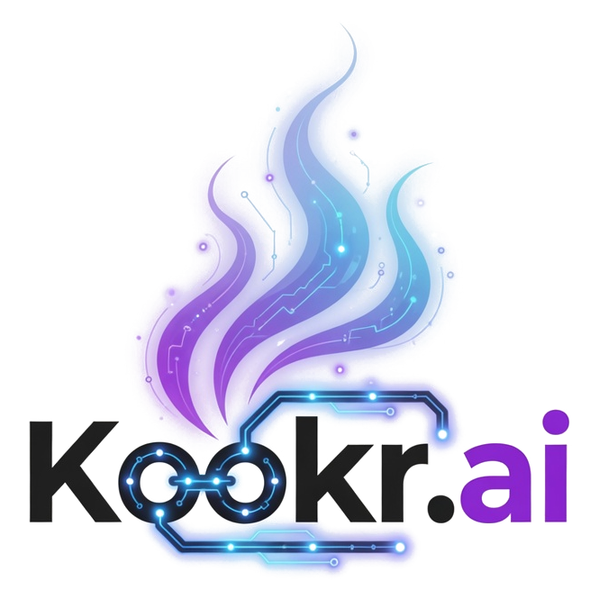

<div align="center">



**A smart attention router for developers running multiple AI coding agents.**

[](https://github.com/kookr-ai/kookr/actions/workflows/ci.yml) [](https://github.com/kookr-ai/kookr/stargazers) [](https://github.com/kookr-ai/kookr/commits/main) [](#) [](#) [](LICENSE)

[Getting Started](docs/getting-started.md) · [User Guide](docs/user-guide.md) · [Architecture](docs/architecture.md) · [API](docs/reference/api.md)

</div>

---

You run several Claude Code, Codex CLI, or Grok Build agents in parallel. One loops on the same failing test. Another is waiting on a permission question. A third finished and needs review.

**Kookr watches the agents, explains what needs attention, and routes you to the most urgent one.**

<a href="https://youtu.be/DHZrO8T_6Xg">
  
</a>

[Watch the narrated demo video on YouTube](https://youtu.be/DHZrO8T_6Xg)

## What Kookr Does

- **Monitors agent sessions in real time** through hooks, transcripts, and managed terminal sessions.
- **Detects common blockers** such as permission prompts, repeated errors, idle/stopped agents, and stuck work.
- **Routes your attention** to the agent that most needs a human response.
- **Lets you reply from one dashboard** without switching terminals.
- **Runs locally** on your machine, with optional integrations for AI suggestions, speech, Telegram, GitHub state, schedules, and playbooks.

## Quick Start

```bash
git clone https://github.com/kookr-ai/kookr.git
cd kookr
pnpm install
pnpm prod:setup
pnpm prod:update
```

Open `http://localhost:4800`.

**Just want a look first?** Run `pnpm dev:demo` for a no-install populated dashboard (fake backend on `4801`, Vite on `5173` — open `http://127.0.0.1:5173`). See [Getting Started](docs/getting-started.md#explore-the-dashboard-with-sample-data).

Use the production-style instance for normal Kookr usage. It runs from the sibling `../kookr-prod` worktree, so it stays stable while you edit this checkout or run another dev server to test changes.

Use `pnpm dev` only when you are actively developing Kookr and need hot reload on your modifications. Dev mode runs on `4801` with Vite on `5173`; because it restarts and can break while source changes are being applied, it is a poor supervisor for real agent work. The usual contributor setup is stable Kookr on `4800` plus a separate `pnpm dev` instance for live verification.

Prerequisites: `git`, Node.js `>=22`, `pnpm >=10`, and build tools for native modules. Claude Code is only required when you want Kookr to launch Claude Code agents.

**Works with Codex CLI** via a maintained fork that adds the Claude-compatible hooks Kookr depends on. See [Codex CLI Setup](docs/codex-cli-setup.md).

**Works with Grok Build** via the official `grok` CLI. Install `@xai-official/grok` and run `grok login --device-code`. See [Getting Started](docs/getting-started.md).

If setup fails, run:

```bash
pnpm run doctor
```

For operating-system install commands and first-agent walkthroughs, see [Getting Started](docs/getting-started.md).

## First Agent

In the dashboard, click **Launch**, choose a working directory, and enter a task prompt (the Manual tab offers a few sample prompts that fill the box without launching). Kookr starts the agent in a persistent dtach session, streams the terminal, and queues findings when the agent needs attention.

Terminal users can launch a task from any project:

```bash
kookr spawn "review the diff since origin/main and summarize risks"
```

The dashboard **Launch** button needs no extra setup. For terminal launches, put `kookr` on your PATH once with a one-time `pnpm build && pnpm link --global` (see [CLI Reference](docs/reference/cli.md)); otherwise the first `kookr spawn` reports `command not found`.

See [CLI Reference](docs/reference/cli.md) for `kookr spawn`, `kookr status`, and related commands.

## Where To Go Next

| I want to... | Read |
| --- | --- |
| Install Kookr and run the first agent | [Getting Started](docs/getting-started.md) |
| Use the dashboard day to day | [User Guide](docs/user-guide.md) |
| Configure optional features | [Configuration](docs/configuration.md) |
| Fix setup or runtime issues | [Troubleshooting](docs/troubleshooting.md) |
| Develop Kookr itself | [Development](docs/development.md) |
| Understand test suites and coverage reports | [Testing](docs/testing.md) |
| Understand the system design | [Architecture](docs/architecture.md) |
| See all API endpoints | [API Reference](docs/reference/api.md) |
| Understand playbook discovery | [Playbook Scoping](docs/playbook-scoping.md) |
| Install or inspect the toolkit plugin | [Kookr Toolkit](plugin/README.md) |

## Core Features

- Real-time monitoring for Claude Code, Codex CLI, and Grok Build agents (Codex CLI requires the maintained [`jeanibarz/codex#feat/claude-compat`](docs/codex-cli-setup.md) fork)
- Anomaly detection and prioritized findings
- Quick replies and response suggestions
- Live terminal access through xterm.js and dtach
- Multi-project tracking
- Project, user, and bundled playbooks
- Scheduled tasks
- GitHub PR, CI, and review awareness
- Cost tracking and session reflection
- Optional speech and Telegram integrations

## Why Kookr?

Running one AI coding agent is simple. Running five creates a new coordination problem: you need to know which agent is blocked, which one is wasting budget, and which one can keep working without you.

Kookr is built for that supervision loop:

- **Local-first:** no telemetry, no cloud service required, state stored under `~/.kookr/`.
- **Multi-agent native:** one dashboard for parallel Claude Code, Codex CLI, and Grok Build sessions.
- **Action-oriented:** findings are ordered by urgency and paired with the terminal context you need to respond.
- **Extensible:** hooks, playbooks, skills, and a Claude Code plugin are part of the repo.

## Architecture In One Screen

```text
Browser dashboard
  -> Hono HTTP/WebSocket server
  -> Core monitor, anomaly detector, attention queue, task store
  -> Local dtach backend plus Claude Code / Codex CLI / Grok Build adapters
  -> Managed AI agent sessions
```

Agents run in interactive dtach sessions. Kookr watches hook events, terminal output, transcripts, GitHub state, and task metadata, then turns that signal into a small queue of findings.

Read [Architecture](docs/architecture.md) and [ADR-014](docs/adr/014-local-dtach-backend.md) for the full design.

## Documentation

The top-level README is intentionally short. Detailed documentation lives under [`docs/`](docs/README.md):

- [Features](docs/features.md) - user-facing capabilities
- [Requirements](docs/requirements.md) - structured acceptance criteria
- [Architecture](docs/architecture.md) - system design and module structure
- [System Models](docs/system-models/) - context, containers, sequences, and state machines
- [Roadmap](docs/roadmap.md) - current direction
- [ADRs](docs/adr/README.md) - durable architecture decisions

## Community

- Bug reports and feature requests: [GitHub issues](https://github.com/kookr-ai/kookr/issues)
- Contributing: [CONTRIBUTING.md](CONTRIBUTING.md)
- Security disclosures: [GitHub Security Advisories](https://github.com/kookr-ai/kookr/security/advisories/new) and [SECURITY.md](SECURITY.md)
- License: [Apache 2.0](LICENSE)

Kookr collects no telemetry. Optional features that call network services are disabled by default and documented in [Configuration](docs/configuration.md).

## Star History

[](https://star-history.com/#kookr-ai/kookr&Date)

## License

Kookr is licensed under the [Apache License 2.0](LICENSE). See [NOTICE](NOTICE) for required attribution.

Copyright 2026 Jean Ibarz.
