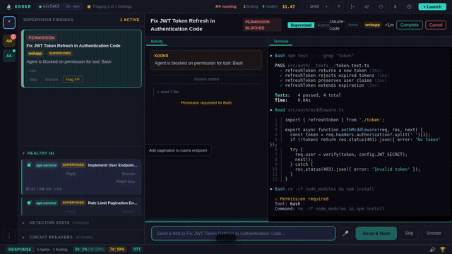

<div align="center">

# Kookr

**A smart attention router for developers running multiple AI coding agents.**

[](#) [](#) [](#) [](#license)

[Features](docs/features.md) · [Architecture](docs/architecture.md) · [Roadmap](docs/roadmap.md) · [ADRs](docs/adr/README.md)

</div>

---

You run 5 Claude Code agents in parallel. One silently loops on the same failing test for the 50th time. Another asks a permission question. A third drifts off-task. Which one needs you?

**Kookr watches them all, detects failure patterns, and routes your attention to the agent that needs you most.**



[Watch the full narrated demo (76s)](https://github.com/kookr-ai/kookr/releases/download/demo-v1/kookr-demo.webm)

## Features

- **Real-time monitoring** — watches all your agents' event streams via Claude Code hooks
- **Anomaly detection** — catches stuck loops, repeated errors, permission blocks, idle agents
- **Attention routing** — prioritizes findings and auto-advances after you respond
- **Quick reply** — send hints or instructions to agents without leaving the dashboard
- **Live terminal** — xterm.js bridged to the agent's persistent dtach session
- **AI suggestions** — Claude Haiku generates response hints for detected anomalies
- **Multi-agent support** — launch Claude Code or Codex CLI agents from the same dashboard
- **Multi-project tracking** — register several project directories and see contributions across all of them
- **Scheduled tasks** — cron-style triggers for recurring agents (nightly scans, periodic supervision)
- **GitHub integration** — PR status, CI checks, and review threads for agent-created PRs
- **Playbooks** — reusable task templates from `.kookr/playbooks/`
- **Cost tracking** — token usage and cost per session
- **Session reflection** — analyze friction patterns across supervision sessions

## Quick Start

### Prerequisites

- **git**
- **Node.js** >= 22 (tested with v24)
- **pnpm** >= 10
- **Build tools** for native module compilation (`node-pty`) and the vendored `dtach` binary
- **Claude Code** CLI (optional — required for launching agents, not needed for running the dashboard)

<details>
<summary>Ubuntu / Debian install commands</summary>

```bash
# Node.js 24 via NodeSource (tested version; v22 is also supported)
curl -fsSL https://deb.nodesource.com/setup_24.x | sudo -E bash -
sudo apt-get install -y nodejs

# Build tools + git — dtach is vendored and compiled via `pnpm build:dtach`
sudo apt-get install -y build-essential git

# pnpm
sudo npm install -g pnpm
```

</details>

<details>
<summary>macOS install commands</summary>

```bash
# Xcode command line tools (provides git + build tools)
xcode-select --install

# Node.js + pnpm via Homebrew — dtach is vendored and compiled via `pnpm build:dtach`
brew install node@22 pnpm
```

</details>

### Install & Run

```bash
git clone https://github.com/kookr-ai/kookr.git && cd kookr
pnpm install
pnpm dev         # backend on :4801 + Vite frontend on :5173
```

Open `http://localhost:5173` in your browser. You're ready to launch and supervise agents.

<details>
<summary>Troubleshooting</summary>

- **`http://127.0.0.1:5173` says "connection refused" but `http://localhost:5173` works** — Vite's dev server binds to IPv6 (`[::1]`) by default. `localhost` resolves to `::1` first on most systems and works; the IPv4 literal does not. Use `localhost`, or run the frontend on IPv4 with `pnpm dev:frontend -- --host 127.0.0.1`.
- **`serveStatic: root path '...dist/frontend' is not found` on first request** — only emitted by older builds (pre-`fix/onboarding-polish`). In dev the backend on `:4801` does not serve frontend assets — Vite does, on `:5173`. Harmless; gone after `pnpm install` on a current checkout.
- **`Ignored build scripts: protobufjs@7.5.4` during `pnpm install`** — pnpm 10's secure-by-default behavior. Current `package.json` allow-lists `protobufjs`, so the warning should not appear after a fresh install. If you still see it, run `pnpm install` again to pick up the allow-list.

</details>

### Launch an Agent

From the dashboard, click **Launch** or use the API:

```bash
# via WebSocket
wscat -c ws://127.0.0.1:4801/ws
> {"type":"launch","prompt":"Fix the auth bug","cwd":"/my/project"}
```

The spawned agent runs under a persistent dtach session (one per agent). Attach through the dashboard terminal panel — the WebSocket bridge replays recent output and streams live bytes.

After you send a response to a finding, Kookr auto-advances to the next one. When nothing needs you — "All clear."

### Terminal Usage: `kookr-spawn`

Create a task for the repository you're already in, without leaving the terminal:

```bash
cd ~/git/my-project
kookr-spawn "review the diff since origin/main and write a summary"
# or pipe:
cat repro.md | kookr-spawn --autonomous
# or from a file (hook-safe — see below):
kookr-spawn --prompt-file /tmp/prompt.md
```

The spawned task uses `$PWD` as the working directory and appears in the dashboard immediately. Output on stdout starts with `task_id=<uuid>` so you can pipe it into other commands.

**Inside a Claude Code session:** the Bash tool's PreToolUse hook inspects the full command line. Prompts containing strings like `gh pr create`, `git push --force`, or `rm -rf` may be blocked when passed as positional arguments or via `--criteria`. Use `--prompt-file` (or piped stdin) for hook-safe prompts — the flag's *value* is just a file path, and the hook cannot see the file contents.

**Install:** `pnpm build && pnpm link --global` adds `kookr-spawn` to `$PATH`. If you previously linked Kookr before this binary existed, re-run `pnpm link --global` — pnpm caches bin symlinks at link time and does not auto-pick-up new `bin` entries. See `kookr-spawn --help` for all options.

### Terminal Usage: `kookr-status`

A read-only CLI that prints a snapshot of the running Kookr instance — server uptime, build version, and a per-agent severity summary pulled from `/api/snapshot` and `/api/health`. Auto-detects port (4800 → 4801) when `KOOKR_PORT` is unset.

```bash
kookr-status        # one-shot snapshot
pnpm status         # equivalent for local dev
```

Bundled with `kookr-spawn` — `pnpm link --global` exposes both binaries.

### Setup for AI agents

If you use Claude Code or Codex CLI to work on this repo, the bundled `.claude/skills/`, `.claude/agents/`, and `.claude/playbooks/` are picked up automatically — no install step required. The repo's git pre-push hook is wired by `pnpm install`'s `prepare` script.

**Optional in-repo Claude Code hook** — install the closed-issue scout gate:

```bash
bash scripts/install-hooks.sh   # installs hooks/oss-stale-scout-gate.sh into ~/.claude/hooks/
```

### Kookr Toolkit (Claude Code plugin)

Kookr ships a curated set of **47 skills + 17 review subagents** as a Claude Code plugin (`kookr-toolkit`). Skills cover code patterns (`typescript-type-safety`, `error-handling-patterns`, `async-flow-control`, `dependency-injection-patterns`, `domain-driven-design`, etc.), workflow (`git-commit-discipline`, `tdd-workflow`, `token-efficiency`), OSS contribution (`oss-pr-{critic,distill,plan,threshold}`, `pr-review-triage`, `find-best-reviewers`), and a reviewer-distillation experiment (`reviewer-distillation-{judge,mutate,predict,prepare,select,meta}`). Review subagents include `boundary-critic`, `design-minimalist`, `failure-mode-analyst`, `delivery-pragmatist`, `socratic-challenger`, and others. See [`plugin/README.md`](plugin/README.md) for the canonical inventory.

**Kookr users get the toolkit automatically.** When Kookr spawns Claude Code against any project, the adapter injects `--plugin-dir <kookr>/plugin` so the toolkit is visible regardless of cwd.

**Other Claude Code users** can install the toolkit standalone:

```
claude
> /plugin marketplace add kookr-ai/kookr
> /plugin install kookr-toolkit@kookr
```

Update with `/plugin marketplace update kookr`. See [`plugin/README.md`](plugin/README.md) for the full skill/agent inventory and the maintainer dev workflow (`claude --plugin-dir ~/git/kookr/plugin`).

**Optional OSS extension** — Several bundled skills (`pre-pr-review`, `oss-pr-distill`, `codex-pr-distill`, `oss-issue-scout`, `oss-repo-recon`) and the `oss-contribute` playbook depend on an OSS contribution layer that lives as user-global scripts and data outside this repo (`~/.claude/reviewer-specialists/`, `~/.claude/skills/pr-contribution-excellence/`, `~/.claude/hooks/{pr-workflow-gate,oss-contribution-gate,…}.sh`). The extension is **not bundled** — its distribution mechanism is still pending. Without it, the affected skills are still safe to invoke — they detect the missing dependencies and stop rather than fabricating output. Read [`docs/hooks-setup.md`](docs/hooks-setup.md) for the full status.

## Why Kookr?

Developer tooling evolved in waves: searching Stack Overflow → asking ChatGPT → IDE-integrated AI (Cursor, Copilot) → autonomous CLI agents (Claude Code, Codex CLI, Gemini CLI). The current frontier: **multiple agents in parallel** to multiply throughput.

But this creates a new bottleneck — **managing the agents themselves:**

- An agent gets **stuck in a loop** — retrying the same broken approach 20 times — and you don't notice for 10 minutes
- An agent **needs something from you** — credentials, a file path, a design decision — and sits idle
- An agent **drifts off-task** — it was supposed to fix auth but started refactoring the database layer
- An agent **burns through budget** on a dead-end approach while a simple hint would have unblocked it

The problem isn't just "which agent needs me" — it's **understanding what each agent is doing well enough to intervene at the right moment**.

### How Detection Works

V1 uses **rule-based heuristics**: repeated error counting, permission block detection, idle/stop detection. These catch the most common failure modes reliably and fast.

A dumb monitor says: *"Agent #3 status: running."*

Kookr says: *"Agent #3 — same error repeated 8 times: `TypeError: token.verify is not a function`. Blocked on tool permission: Bash."*

> **V2 goal:** LLM-powered analysis for nuanced issues — trajectory drift, budget burn, strategic dead ends — with natural-language explanations like: *"Agent #3 keeps editing `auth.ts` but hasn't tried changing the import. It seems to be importing from the wrong module. Want to give it a hint?"*

## Architecture

```
┌─────────────────────────────────────────────────────────────────────┐
│                        Browser (React SPA)                         │
│  Findings Panel · Detail/Terminal Panel · GitHub Panel · Toasts    │
│                         Zustand store                              │
└──────────────────────────┬──────────────────────────────────────────┘
                           │ WebSocket (ws://)
┌──────────────────────────┴──────────────────────────────────────────┐
│                     Hono HTTP + WebSocket Server                    │
│  Hook Watcher · Reconciliation · Terminal Bridge · GitHub Scanner  │
├────────────────────────────────────────────────────────────────────-┤
│                          Core Logic                                │
│  Monitor · Anomaly Detector · Attention Queue · Task Store         │
│  Hook Parser · Token Tracker · Friction Analyzer · Playbooks       │
├────────────────────────────────────────────────────────────────────-┤
│                          Adapters                                  │
│  Local dtach Backend · Claude Code Adapter · Codex CLI Adapter     │
│  GitHub Fetcher · Git Worktree · Circuit Breakers                  │
└──────────────────────────┬──────────────────────────────────────────┘
                           │ Claude Code hooks + dtach sessions
                    ┌──────┴──────────┐
                    │    AI Agents    │
                    │ (Claude Code or │
                    │  Codex CLI)     │
                    └─────────────────┘
```

Agents run in interactive mode inside managed dtach sessions. Monitoring happens via Claude Code hooks (`SessionStart`, `PreToolUse`, `PostToolUse`, `PermissionRequest`, `Stop`) injected through the `--settings` flag. Sessions survive if Kookr crashes — the dtach master keeps the child process alive, and Kookr reconciles via the manifest at startup.

See [Architecture docs](docs/architecture.md) for the full design and [ADR-014](docs/adr/014-local-dtach-backend.md) for the dtach backend decision (supersedes ADR-007).

## Design Principles

1. **Reuse, don't reinvent** — Agent drivers forked from [aegiscore](~/git/aegiscore). Skill format follows Claude Code conventions. Integrates with existing ecosystems rather than replacing them.
2. **Smart supervisor, not coder** — Kookr's AI understands what agents are doing and explains anomalies. It doesn't write code itself.
3. **Simple first** — No plugins, no persistence, no cloud for V1. Single package, in-memory state, spec-driven development.
4. **Local-first** — Runs on the developer's machine. Critical for corporate environments behind VPNs. Linux + macOS.
5. **Managed agents** — Agents run under dtach sessions that survive Kookr crashes. The dashboard terminal panel is the attach surface. See [ADR-014](docs/adr/014-local-dtach-backend.md).

## API Reference

### Health & build
| Endpoint | Description |
|----------|-------------|
| `GET /api/health` | Server status + agent count + build info |
| `GET /api/health/stt` | Bundled STT (speech-to-text) container health |
| `GET /api/startup-summary` | Crash-recovery startup summary (fetched once on UI mount) |

### Tasks & agents
| Endpoint | Description |
|----------|-------------|
| `GET /api/tasks` | All tasks with sessions |
| `POST /api/tasks` | Create and launch a new task |
| `DELETE /api/tasks/:id` | Stop and remove a task |
| `POST /api/agents/:id/message` | Send a message/hint to a running agent |
| `GET /api/agents/:agentId/edit-events/:toolUseId` | Fetch a recorded Edit/Write tool event for diff display |
| `GET /api/sessions/:sessionId/effective-hook-settings` | Resolved per-session hook settings (additive merge of user + Kookr-injected) |

### Supervisor surface
| Endpoint | Description |
|----------|-------------|
| `GET /api/snapshot` | Current agent states + anomalies |
| `GET /api/queue` | Attention queue contents |
| `GET /api/anomaly-stats` | Anomaly counters and detector stats |
| `GET /api/capture/:sessionId` | Snapshot of the dtach session's ring buffer |
| `POST /api/hook-event/:sessionId` | HTTP push surface for hook events (used by Codex CLI hooks) |

### Projects
| Endpoint | Description |
|----------|-------------|
| `GET /api/projects` | Tracked project directories |
| `POST /api/projects/track` | Register a new project directory |
| `POST /api/projects/untrack` | Remove a tracked project |
| `GET /api/projects/contributions` | Contributions summary across projects |
| `GET /api/projects/configs` | Per-project configuration (contribution policy, agent defaults) |
| `POST /api/projects/configs` | Update a project's config |
| `GET /api/projects/discovery-status` | Background project-discovery progress |
| `POST /api/projects/rescan-skills` | Re-scan tracked repos for `.claude/skills/` |

### Playbooks & schedules
| Endpoint | Description |
|----------|-------------|
| `GET /api/playbooks?cwd=` | Discover playbooks at a CWD |
| `GET /api/schedules` | List scheduled tasks |
| `POST /api/schedules` | Create a scheduled task (cron) |
| `POST /api/schedules/preview` | Preview the next-run timestamps for a candidate schedule |
| `PATCH /api/schedules/:id` | Update an existing schedule |
| `DELETE /api/schedules/:id` | Delete a schedule |
| `POST /api/schedules/:id/run` | Trigger a scheduled task immediately |

### Reflection & telemetry
| Endpoint | Description |
|----------|-------------|
| `GET /api/reflect` | Analyze session friction patterns |
| `GET /api/reflect/recommendation` | Top-priority reflection recommendation for the UI banner |
| `GET /api/telemetry/report` | Aggregated telemetry over the session log |
| `GET /api/shadow-report` | Shadow-detection comparison report (`?format=text` for plain text) |

### GitHub
| Endpoint | Description |
|----------|-------------|
| `GET /api/github` | All tracked tasks' PR/issue state |
| `GET /api/github/status` | GitHub scanner active status |
| `GET /api/github/:taskId` | PR/issue state for a task |

### Settings & infrastructure
| Endpoint | Description |
|----------|-------------|
| `GET /api/settings` | Get user/project settings |
| `PUT /api/settings` | Update settings |
| `GET /api/circuit-breakers` | Snapshots of all wrapped-dependency breakers |
| `GET /api/diagnostic` | Latest self-diagnostic report + last error |
| `POST /api/diagnostic/run` | Trigger a self-diagnostic run on demand |
| `GET /api/oss-attempts` | OSS contribution-attempt store snapshot |
| `POST /api/oss-attempts/refresh` | Refresh PR/issue state for tracked OSS attempts |
| `POST /api/oss-attempts/events` | Record an OSS attempt event (used by hooks) |
| `GET /api/deploy/status` | Production-update job status |
| `POST /api/deploy/trigger` | Trigger a `pnpm prod:update` job |

### WebSocket
| Endpoint | Description |
|----------|-------------|
| `ws://host:port/ws` | WebSocket for real-time updates (snapshots, alerts, suggestions, …) |
| `ws://host:port/ws/terminal/:sessionId` | Interactive terminal bridge — binary frames over the dtach session |

**Data directory:** `~/.kookr/` (port 4800) or `~/.kookr-{port}/` (other ports).

## Development

```bash
pnpm dev               # backend (4801) + Vite frontend (5173) with HMR
pnpm dev:server         # backend only
pnpm dev:frontend       # frontend only
pnpm test               # run all tests once (Vitest)
pnpm test:watch         # watch mode
pnpm test:e2e           # Playwright E2E tests
pnpm build              # compile TypeScript to dist/
pnpm build && pnpm start  # production mode on :4800
```

Dev mode uses port 4801 to avoid conflicting with a production instance on port 4800.

Configure via environment variables:

| Variable | Default | Description |
|----------|---------|-------------|
| `KOOKR_PORT` | `4800` | HTTP/WebSocket port (dev defaults to `4801` to avoid conflict with prod) |
| `KOOKR_HOST` | `127.0.0.1` | Bind address |
| `KOOKR_BACKEND` | `dtach` | Terminal backend. Hard-rejected unless `dtach` (V8 escape hatch removed; see [ADR-014](docs/adr/014-local-dtach-backend.md)) |
| `KOOKR_BYPASS_ALL_PERMISSIONS` | `false` | When `true`, spawn agents without permission prompts (`--dangerously-skip-permissions` for Claude Code, `--dangerously-bypass-approvals-and-sandbox` for Codex). Off by default — both flags remove safety guardrails |
| `KOOKR_PLUGIN_DIR` | auto | Override the auto-resolved Kookr Toolkit plugin path injected into spawned `claude`. Empty string disables injection (hermetic mode) |
| `KOOKR_CODEX_BIN` | `codex` | Codex CLI binary path (the forked build at `~/git/codex` ships via `pnpm codex:rebuild`) |
| `ANTHROPIC_API_KEY` | unset | Required for AI task naming (F4.8) and AI response suggestions (F3.9). Falls back to truncated prompt / no suggestions when unset |

### Project Structure

```
src/
  shared/         # Cross-boundary contracts — ServerMessage/ClientMessage
                  #   protocol, repo-slug helpers (imported by both server and frontend)
  core/           # Pure logic — types, parsers, task store, anomaly detection,
                  #   attention queue, monitor, token tracking, friction analysis,
                  #   circuit breakers, GitHub state diff, playbook discovery
  adapters/       # I/O boundaries — LocalDtachBackend, Claude Code adapter,
                  #   Codex CLI adapter, GitHub fetcher, git worktree
  server/         # Hono HTTP + WebSocket server — split route modules,
                  #   ws-handlers, hook watcher, reconciliation, SessionBridge,
                  #   schedule runner, autonomy orchestrator
  frontend/       # React SPA — Zustand store with sliced architecture,
                  #   WebSocket hook, ~30 components (findings, terminal,
                  #   workspace, OSS dashboard, settings)
```

For the canonical file-by-file tree see [docs/architecture.md](docs/architecture.md#module-structure-v1).

### Testing

Dtach-based integration tests are automatically skipped when the vendored binary isn't built. `pnpm install` configures a pre-push hook that runs the test suite.

### Hooks

`pnpm install` wires up the repo pre-push hook automatically — it runs `build:server`, `check:e2e`, and `test` before every `git push`. That's all most contributors need.

If you run Claude Code or Codex CLI agents on this repo and want the PR-workflow / OSS-contribution / stale-scout guardrails as well, see [`docs/hooks-setup.md`](docs/hooks-setup.md). It walks through the full user-global hook stack, minimum install (`bash scripts/install-hooks.sh`), verification, uninstall, and troubleshooting. Those hooks are optional — the repo builds and tests the same with or without them.

## Documentation

| Document | Description |
|----------|-------------|
| [Features](docs/features.md) | What the app does — smart detection, the "loop" UX, MVP scope |
| [Requirements](docs/requirements.md) | Structured requirements — SHALL/SHOULD/MAY, acceptance criteria |
| [Architecture](docs/architecture.md) | System design — supervisor agent, adapters, reuse map |
| [System Models](docs/system-models/) | MBSE-lite diagrams — context, containers, sequences, state machines |
| [Roadmap](docs/roadmap.md) | 4 phases from discovery to multi-agent polish |
| [Hooks setup](docs/hooks-setup.md) | Repo + Claude Code hook install, inventory, verification, troubleshooting |
| [ADRs](docs/adr/README.md) | Accepted decisions — TypeScript, managed dtach sessions, session bridge |

## Contributing

Contributions are welcome! This project uses:

- **TypeScript strict** with full type coverage
- **Vitest** for unit/integration tests, **Playwright** for E2E
- **Conventional Commits** for commit messages

Before submitting a PR, make sure `pnpm test` passes. The pre-push hook enforces this automatically.

## Related Projects

| Project | What we reuse |
|---------|--------------|
| [aegiscore](~/git/aegiscore) | Claude Code & Codex CLI drivers, JSONL parsers, stuck detector |
| [openclaw](~/git/openclaw) | Skill file patterns, gateway protocol inspiration |

## License

TBD
