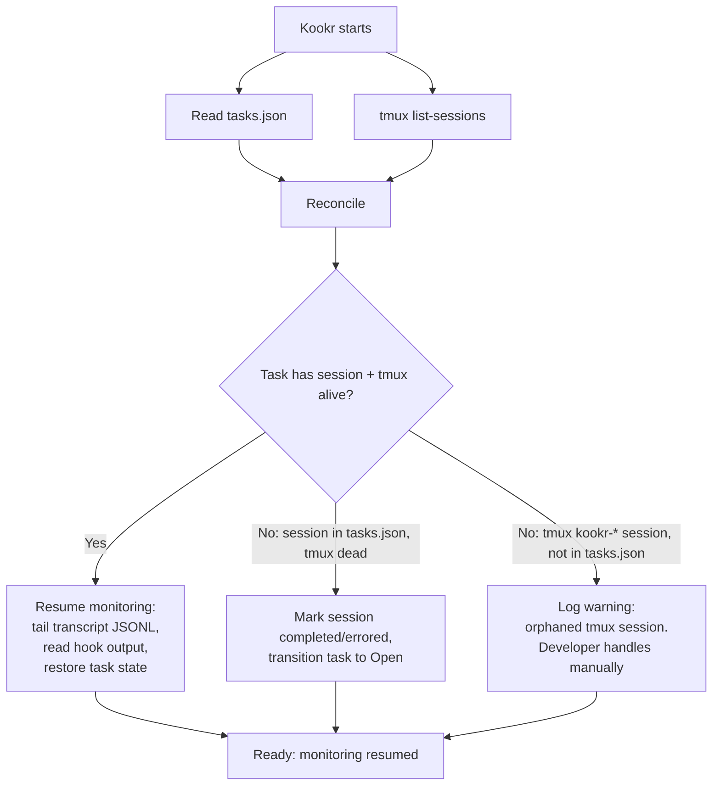

# ADR-008: Tmux Session Management and Persistence

## Status

**Superseded by [ADR-014](./014-local-dtach-backend.md)** (persistence layer; as of 2026-04-22) — originally Accepted 2026-03-24.

> Superseded 2026-04-24: The tmux-specific persistence layer described here was replaced by dtach in ADR-014 (V8 tmux removal). `src/server/start.ts` now hard-rejects `KOOKR_BACKEND=tmux`. (The original `rfc-v8-tmux-removal.md` was archived when `docs/rfc/` was reset for the kookr cutover; ADR-014 carries the load-bearing decision record.) The parts of this ADR that still apply against the new backend are preserved: (1) the **tasks.json-inline session metadata** design (Option A), now holding dtach session metadata; (2) the **startup reconciliation flow** (`src/server/startup-recovery.ts`, `src/server/crash-recovery.ts`), now run against `dtach list-sessions`; (3) the `kookr-<uuid>` naming convention. The `Task.sessions[].tmuxSession` field name is historical — its value is now a dtach session ID.

## Context

ADR-007 decided that agents run in managed tmux sessions. A critical consequence: **tmux sessions survive Kookr crashes**, which is a key benefit — but only if Kookr can **rediscover and reconnect** to those sessions after restart.

The current design has two gaps:

1. **No session registry.** Agent session state is documented as "in-memory" (see `05-state-machine-catalog.md`). When Kookr restarts, it has no record of which tmux sessions it created, what tasks they belong to, or where their monitoring data lives.

2. **No reconnection flow.** The startup sequence assumes a clean state. There is no design for discovering existing tmux sessions and resuming monitoring.

Without a session registry, a Kookr restart means:
- Developer must manually identify orphaned tmux sessions
- No way to re-associate sessions with tasks
- Monitoring (transcript tailing, hook events) is lost
- The "crash recovery" promise of ADR-007 is incomplete — the agent survives, but Kookr forgets about it

### What state needs tracking?

For each managed tmux session, Kookr needs to know:

| Field | Source | Why |
|-------|--------|-----|
| tmux session name | Kookr (assigned at creation) | To address the session (`send-keys`, `capture-pane`, `kill-session`) |
| Task ID | Kookr | To re-associate the session with its task |
| Agent type | Kookr (e.g., `claude-code`) | To select the right adapter for monitoring |
| Working directory | Developer (via GUI) | To set context for the agent |
| Claude Code session ID | Hook events (extracted at runtime) | To locate the transcript file for tailing |
| Transcript JSONL path | Derived from session ID | To resume monitoring after restart |
| ~~Hook output path~~ | ~~Kookr (configured at launch)~~ | ~~To resume reading hook events~~ — **Not stored:** derived at runtime from tmux session name (`~/.kookr/hooks/<tmux-name>.jsonl`) |
| Created at | Kookr | For display, cost tracking, session ordering |
| Last known status | Supervisor | To restore attention queue state |

Some of this is derivable from tmux itself (session exists? -> alive), but most is Kookr-specific metadata that tmux doesn't store.

### Session ID discovery

The transcript JSONL path depends on the Claude Code session ID, which is only known after the agent starts. Hook events include `session_id` in their JSON payload (validated by PoC, ADR-007). Kookr discovers the session ID from the first hook event received for an agent, then updates the task's session metadata with the transcript path. If Kookr crashes before receiving the first hook event, the session ID can be recovered on restart by scanning `~/.claude/projects/<cwd-hash>/` for JSONL files created after the session's `createdAt` timestamp and correlating with the tmux session name.

## Options

### Option A: Extend tasks.json with session metadata (recommended)

Store active session info inline in each task entry.

```json
{
  "tasks": [{
    "id": "task-1",
    "prompt": "Fix auth bug",
    "status": "inProgress",
    "sessions": [{
      "tmuxSession": "kookr-a1b2c3d4",
      "agentType": "claude-code",
      "cwd": "/home/user/project",
      "claudeSessionId": "981a4d10-...",
      "transcriptPath": "~/.claude/projects/.../981a4d10.jsonl",
      "createdAt": "2026-03-24T18:00:00Z",
      "lastStatus": "running",
      "lastEventAt": "2026-03-24T18:05:00Z",
      "crashRecovered": false,
      "relaunchCount": 0
    }]
    // Note: hookOutputPath is not stored — derived at runtime as
    // ~/.kookr/hooks/<tmuxSession>.jsonl
  }]
}
```

**Pros:**
- Single file — simple to read, write, and reason about
- Session metadata is always colocated with its task — no cross-referencing needed
- No new persistence mechanism
- Consistent with "Simple first" principle for V1

**Cons:**
- tasks.json becomes a mixed-concern file (task lifecycle + session runtime state)
- Read-modify-write on the whole file for every session state change
- If tasks.json corrupts, both task history and session registry are lost

**Why the cons are acceptable for V1:** At V1 scale (a handful of tasks with 1-2 sessions each), tasks.json is a small file. Status updates happen on significant state changes only (started, stuck, completed), not on every event — a few writes per minute at most. The corruption risk is identical whether data lives in one file or two; atomic writes (write to temp file, then `rename()`) mitigate this regardless.

### Option B: Separate session registry directory (one file per session)

```
~/.kookr/
  tasks.json              # task lifecycle (stable, infrequent writes)
  sessions/
    kookr-task-1-s1.json # per-session metadata (frequent writes)
    kookr-task-2-s1.json
```

Each session file:
```json
{
  "tmuxSession": "kookr-task-1-s1",
  "taskId": "task-1",
  "agentType": "claude-code",
  "cwd": "/home/user/project",
  "claudeSessionId": "981a4d10-...",
  "transcriptPath": "~/.claude/projects/.../981a4d10.jsonl",
  "hookOutputPath": "~/.kookr/hooks/task-1-s1.jsonl",
  "createdAt": "2026-03-24T18:00:00Z",
  "lastStatus": "running"
}
```

**Pros:**
- Clean separation: tasks own goals, sessions own runtime state
- Atomic writes per session (no read-modify-write race)
- Independent failure — corrupting one session file doesn't affect others or tasks

**Cons:**
- Two persistence locations to manage
- Must keep task <-> session references consistent
- More architecture than V1 needs

**Note:** Any reasonable implementation of Option B would also check tmux liveness on startup (query `tmux list-sessions` to verify sessions are still alive). This is standard validation, not a separate option.

### Option C: Derive everything from tmux + convention

No explicit session registry. Kookr discovers sessions by:
1. `tmux list-sessions` filtered by a naming prefix (e.g., `kookr-*`)
2. Parse the session name for task ID
3. Find the transcript JSONL by scanning `~/.claude/projects/`

**Pros:**
- No persistence to manage — tmux IS the registry
- Zero risk of registry/tmux state divergence

**Cons:**
- **Cannot store Kookr-specific metadata** (hook output paths, agent type beyond what tmux knows)
- Transcript file discovery requires scanning and heuristic matching (which file belongs to which session?)
- Session name must encode all needed info — fragile
- Cannot track sessions that have ended (no history)
- Slower startup (must scan and correlate)

## Decision

**Option A: Extend tasks.json with inline session metadata.**

Session data is stored inline in each task entry. tmux is queried on startup to verify liveness (standard validation). This keeps V1 simple — one file, one persistence mechanism, session data colocated with its task.

When V1 outgrows this approach (many concurrent tasks, frequent writes causing contention), session data can be extracted to per-session files (Option B) without changing the data model — only the storage layer moves.

## Tmux Session Naming Convention

> **Implementation note:** The original proposal used `kookr-<taskId>` naming. The actual implementation uses `kookr-<random-8-char-uuid>` — shorter, avoids task ID leakage, and the `kookr-` prefix still enables discovery. The mapping from tmux session name to task ID is maintained in-memory by the adapter.

Sessions use a random 8-character UUID suffix with the `kookr-` prefix:

```
kookr-<random-uuid-prefix>
```

Examples:
- `kookr-a1b2c3d4` — a managed agent session
- `kookr-e5f6g7h8` — another managed session

The `kookr-` prefix enables discovery via `tmux list-sessions -F '#{session_name}' | grep '^kookr-'`.

## Startup Reconnection Flow

On startup, Kookr reads tasks.json and queries tmux to reconcile:



The orphan case (tmux session alive, not in tasks.json) is unlikely in normal operation — it requires tasks.json to lose data while tmux sessions survive. V1 logs a warning; the developer can `tmux kill-session` manually.

## Write Strategy

- **When to write:** On significant status changes only (session started, session ID discovered, stuck, completed). Not on every event.
- **Atomic writes:** Always write to a temp file first, then `rename()` to `tasks.json`. This prevents corruption from mid-write crashes.
- **Session ID update:** The `claudeSessionId` and `transcriptPath` fields are initially null. They are populated when the first hook event is received (hook events include `session_id` in their JSON payload). This is the only "frequent" write — it happens once per session, shortly after launch.

## File Locations

```
~/.kookr/
  tasks.json                    # Task lifecycle + inline session metadata
  hooks/
    kookr-task-abc123.jsonl    # Hook output for session (append-only JSONL)
    kookr-task-def456-s2.jsonl
```

**Why `~/.kookr/` and not project-local?**
Tasks and sessions may span multiple working directories. A global Kookr data directory is simpler and avoids scattering `.kookr/` directories across the filesystem. Project-local storage can be added later if multi-user or project-scoped isolation is needed.

## Impact on System Decomposition

No new module is needed. Session metadata lives inside tasks.json, managed by existing `tasks.ts`:

- `tasks.ts` gains session CRUD methods: `addSession()`, `updateSession()`, `removeSession()` alongside existing task lifecycle methods
- The adapter calls `tasks.addSession()` after creating a tmux session and `tasks.updateSession()` when status changes
- Startup reconciliation is a method on `tasks.ts` that cross-references in-memory task state with tmux liveness

This avoids introducing a `sessions.ts` module for V1. If session management grows complex enough to warrant its own module, it can be extracted later.

### Module structure

> Updated 2026-03-29: File paths updated to match current implementation.

```
kookr/
  src/
    core/
      tasks.ts              # Task lifecycle + session metadata (extended)
      anomaly-detector.ts   # Anomaly detection (split from original supervisor.ts)
      attention-queue.ts    # Priority queue (split from original supervisor.ts)
      monitor.ts            # Supervisor orchestration (split from original supervisor.ts)
      task-persistence.ts   # Atomic JSON file persistence for tasks
      types.ts              # Shared types
    adapters/
      claude-code-adapter.ts # Tmux operations + monitoring for Claude Code
    server/
      index.ts              # Entry point: startup reconciliation happens here
      reconciliation.ts     # Reconciliation logic (factored from index.ts)
      crash-recovery.ts     # Startup relaunch of agents dead after a crash
      ws.ts                 # WebSocket handler
```

### Startup sequence change

The server's startup sequence gains a reconciliation step:

```
1. Read tasks.json (includes session metadata)
2. Query tmux for alive sessions
3. Reconcile: reconnect alive sessions, mark dead ones, log orphans
4. Restore supervisor state + attention queue from reconciled data
5. Start HTTP/WS server
6. Open browser
```

## Consequences

- Agent session state is now **persisted** (was in-memory), inline in tasks.json
- Kookr can recover after crash: reconnect to alive tmux sessions, update state for dead ones
- No new persistence mechanism or module — tasks.ts is extended
- Hook output files in `~/.kookr/hooks/` give Kookr a known location for structured events (avoiding conflicts with user's own hook configuration)
- Snooze timers remain in-memory (ephemeral by nature — if Kookr restarts, snoozes are lost, which is acceptable)
- Attention events remain in-memory (rebuilt from current session states on startup)
- When V1 outgrows tasks.json (many concurrent tasks, write contention), session data can be extracted to per-session files without changing the data model

## Open Questions

| Question | Notes |
|----------|-------|
| Should ended sessions be kept in tasks.json or removed? | Keeping them enables session history per task; removing keeps the file small. V1: keep completed sessions in tasks.json (they're small). Prune on task delete |
| ~~How to configure hooks per managed agent?~~ | **Answered (2026-03-24):** Kookr generates a per-agent settings JSON file with hook definitions that append events to `~/.kookr/hooks/<tmux-session-name>.jsonl`. Passed via `--settings <path>` at agent launch. Hooks are additive to user's own hooks. The first hook event (`SessionStart`) provides `session_id` and `transcript_path`, eliminating the need for transcript file scanning. See [PoC 001](../poc/001-hook-mechanism-validation.md) |
