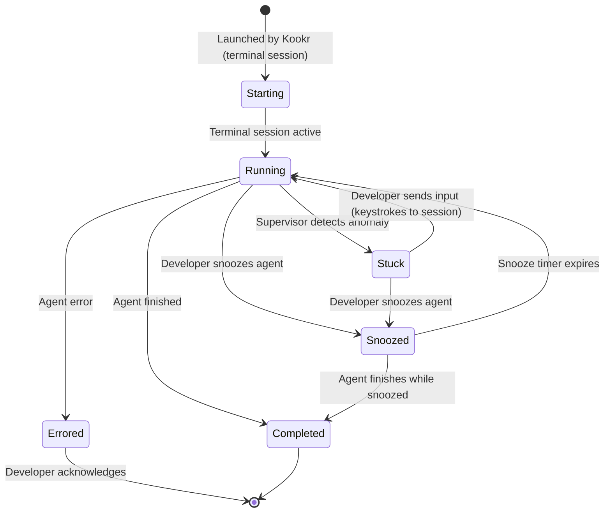

# System Architecture

> **Design principle:** Reuse existing solutions. Don't reinvent what exists in aegiscore or openclaw. Build only what's unique to Kookr: **intelligent attention routing powered by an AI supervisor agent**.

## Overview

Kookr is a **supervisor agent + GUI** that sits on top of existing agent processes. The supervisor is itself an AI — it reads the coding agents' output, understands what they're doing, detects anomalies, and explains to the developer what needs attention and why.

```
┌──────────────────────────────────────────────────────┐
│              KOOKR                                   │
│                                                      │
│  ┌──────────┐    ┌─────────────────────────────┐     │
│  │ Frontend  │◄──► Backend (local)             │     │
│  │ (Browser) │ WS │                            │     │
│  └──────────┘    │  ┌───────────────────────┐  │     │
│                  │  │ Supervisor Agent (AI)  │  │     │
│                  │  │ - reads agent streams  │  │     │
│                  │  │ - detects anomalies    │  │     │
│                  │  │ - explains problems    │  │     │
│                  │  │ - prioritizes attention │  │     │
│                  │  └───────────────────────┘  │     │
│                  │  Adapter Layer               │     │
│                  └──────────────┬──────────────┘     │
│                                │                     │
│               ┌────────────────┴───────────────┐     │
│               │  Coding Agent Processes         │     │
│               │  (managed terminal sessions)    │     │
│               └────────────────────────────────┘     │
└──────────────────────────────────────────────────────┘
```

---

## The Supervisor Agent

This is Kookr's core differentiator. It's not a hardcoded scoring function — it's an **AI agent that understands context**.

### What it does

The supervisor agent continuously reads structured events from all managed coding agents (primarily via hook JSONL files) and:

1. **Detects anomalies** — patterns that indicate a coding agent needs human help:
   - Agent is repeatedly hitting the same error without changing approach
   - Agent is asking the user a question (via `AskUserQuestion` tool call)
   - Agent crosses a configured budget threshold
   - Agent is blocked on a permission prompt
   - Agent stops and needs user input

2. **Explains the situation** — generates a human-readable summary:
   - *"Agent #3 has repeatedly hit `TypeError: token.verify is not a function` while editing `auth.ts`. It likely needs a hint about the correct module."*

3. **Prioritizes** — which agent needs the developer most urgently, and why

### Monitoring policy

The supervisor uses an **event-driven** strategy: `HookFileWatcher` uses `fs.watch()` on per-agent JSONL hook files and immediately processes new lines as they appear. This provides near-instant anomaly detection without polling overhead.

On each hook event, the supervisor:
1. Appends the event to the agent's sliding event window (capped at `windowSize`)
2. Runs anomaly detection patterns against the accumulated events
3. If an anomaly is detected, enqueues the agent and generates an explanation
4. Broadcasts an updated snapshot to all connected frontends

A separate 5-second liveness interval reconciles session state against the dtach backend (detecting dead sessions), but event monitoring is purely event-driven. The `SessionHealthService` composes that backend state with PTY/ring progress, hook freshness, transcript mtime, task turn state, browser bridge replay/live timing, and the server restart epoch. It publishes the same versioned projection to `AgentState.sessionHealth` and `GET /api/diagnostics/session-health`; `detectCoordinatedStall` adds one fleet-level root diagnostic when independent sessions stop advancing together.

**Ralph-loop startup probe:** `RalphLoopService.reconcileStartupLoops` runs once at server boot for each task whose `ralphLoop.status === 'running'`. It calls `probeStartupLiveness`, a startup-only helper that asks `terminalBackend.isAlive` per session with a 500 ms per-probe timeout. Loops with a probe-confirmed-alive session are preserved; the rest are marked `failed` with `exitReason: 'kookr_crash'`. The probe catches the dtach-master-killed phantom shape (WSL/OS crashes) but not the agent-child-exited shape; the latter still goes through the user-facing Replace dialog (`POST /api/tasks/:taskId/ralph-loop/replace-with-new`). See `docs/rfc/rfc-ralph-loop-crash-restart-recovery.md`.

**Startup replay:** On startup, after reconciliation identifies resumed sessions, hook files are replayed from offset 0 via `HookFileWatcher.watch(sessionId, { replayExisting: true })` to rebuild anomaly state from persisted hook history. This ensures anomalies (e.g., a permission block) are not lost across Kookr restarts. Each resumed session is also registered with the monitor via `monitor.registerAgent(sessionId)` before hook replay begins.

**Stop event suppression:** When an agent's last event is `stop` (indicating the agent finished its turn and is waiting for input), the detector skips `permission_blocked` and `repeated_error` checks. Only `needs_input` detection proceeds after a stop event. This prevents false positives from errors encountered during prior work phases that completed successfully.

**Resource watchdog (host-pressure actuator):** The supervisor watches agent *behavior*; the resource watchdog watches the *machine* they run on. When enabled (`KOOKR_RESOURCE_WATCHDOG=1`, off by default), a periodic sampler reads swap %, MemAvailable, `/proc/vmstat` `oom_kill` deltas, per-agent-family process counts, and the session reaper's orphan counts. Each readable OOM counter becomes the durable comparison baseline in `{dataDir}/resource-watchdog.state.json`, so an increase between the last completed sample and the first sample after a daemon restart still triggers; legacy state establishes a baseline without firing, and a lower counter after reboot/cgroup recreation safely rebaselines. On pressure it spawns one unattended investigation task briefed with the snapshot (hard-rules block: no interactive prompts, reversible kookr-owned remediation only), throttled to at most one spawn per 30 minutes (persisted in the same state file). The pre-launch throttle save is a fail-closed durability barrier: a failed write leaves the in-memory reservation armed, emits `spawn_persist_failed`, and skips the external launch. When an OOM delta caused the trigger, its baseline advances in the same atomic write as the reservation, so a failed write cannot consume that one-shot signal. A later successful watchdog check inside the throttle interval makes the reservation durable without launching; the next launch remains ineligible until the normal throttle expires. Failed meta-reflection reservations retain their prior meta timestamp so they remain eligible after recovery. The post-launch task-ID patch is best-effort because the worker already exists. After a rolling 24h spawn budget is exhausted, the next trigger spawns a *meta-reflection* task instead of another investigation. Spawns use the normal launch path so capacity/backpressure and reserved-slot posture apply; every trigger/suppression/spawn is appended to `resource-watchdog-audit.jsonl`. The `resourceWatchdog` field on `GET /api/health` surfaces the last sample/throttle state, cached OOM-baseline age/source, and bounded state-persistence health from memory only (no `/proc` or disk read on the health hot path — issue #1553). This is the safety net for the *next* unknown leak class; the deterministic orphan reaper (issue #1720) remains the fix for the known one.

**Health-path background publications:** Diagnostics that require unbounded historical scans publish process-scoped snapshots instead of running from `GET /api/health`. The queue-feeder invent-class rollup refreshes immediately at boot and every 60 seconds through one single-flight `InventPriorityHealthRefresher`; health reads only its last completed counts, `generatedAt`/`ageMs`, and `lastRefreshError`. The ledger scan streams JSONL, yields to the event loop every 1,000 lines, and has a 30-second abort budget, so moving the scan out of the request path does not let its parser stall other requests. A failed refresh retains the last successful counts, and shutdown stops the cadence (issue #2912).

**Stopped-agent guard:** When an agent is explicitly stopped (via the UI stop button), the monitor marks it in a `stoppedAgents` set and the hook file watcher is stopped. `processEvents()` silently drops events for stopped agents, preventing a race condition where buffered hook events arriving after `unregisterAgent()` could resurrect the agent in the snapshot. The stopped flag is cleared by `registerAgent()` so that relaunched agents work correctly.

Agents flagged as needing attention are surfaced to the developer in priority order (see F2.8 in [features.md](features.md)).

**GitHub PR/issue awareness:** In addition to agent event monitoring, a periodic scanner detects GitHub references in agent `tool_result` events (e.g., `gh pr create` output containing a PR URL). Extracted references are tracked per task, and the scanner periodically polls GitHub via `gh` CLI for state changes (new review comments, CI failures, review decisions). State changes are diffed against previous snapshots; actionable changes trigger attention alerts through the same attention queue used by agent anomalies. The association between a PR and a task is established at extraction time — the agent's session id maps to its owning task, so all subsequent GitHub events for that PR are routed back to the originating task. See [ADR-012](adr/012-github-pr-awareness.md) and F7 in [features.md](features.md).

> **V2 enhancement:** Transcript-derived anomaly events (`transcript-parser.ts` exists but is not wired into the monitor event stream) will provide richer event data including full assistant messages. Current anomaly event delivery relies on hooks; transcript parsing is used by token/cost and freshness tracking.

### How it works

The supervisor agent can be implemented in two tiers:

**Tier 1 (V1 — rule-based with templates):** Heuristic anomaly detection using hardcoded patterns co-located with tests. No LLM calls for detection — just pattern matching on structured hook events (permission requests, stops, repeated tool errors, hook health, budget thresholds). PoC validation ([PoC 001](poc/001-hook-mechanism-validation.md)) confirmed that Claude Code in interactive mode (running in a managed dtach session) provides structured data through **hooks** (`SessionStart`, `PreToolUse`, `PostToolUse`, `PermissionRequest`, `Stop` — real-time structured JSON events with session_id, tool_name, tool_input, tool_response). Transcript JSONL files (`~/.claude/projects/<project>/<session_id>.jsonl`) are available for session history and are used by token/cost tracking, but they are not the current monitor event source. The `Stop` hook signals "agent waiting for input"; the `PermissionRequest` hook signals "agent blocked on permission." No ANSI terminal parsing is needed. The "explanation" is a template filled with context.

**Tier 2 (V2 — LLM-powered):** Feed recent parsed agent output to a configured lightweight LLM provider and ask: "Is this agent behaving normally? If not, explain what's wrong and what the developer should do." This enables nuanced detection that rules can't catch (trajectory drift, subtle errors, strategic dead ends).

### Anomaly detection patterns

> **V1 implementation:** Detection patterns are pure functions in `anomaly-detector.ts`, co-located with tests for simplicity. The SKILL.md approach described below is a V2 direction for community-contributable patterns.

Patterns could be defined as skill files (following the SKILL.md convention), making them discoverable and community-contributable:

```markdown
# Example: .claude/skills/detect-stuck-loop/SKILL.md
---
name: detect-stuck-loop
description: Detect when a coding agent is repeating the same action without progress
---

## Pattern
Agent has executed the same tool (e.g., Bash with `npm test`) more than 5 times
in the last 10 minutes with similar or identical output each time.

## Signals
- Same tool name repeated N times (threshold: 5)
- Output similarity > 80% across repetitions
- No file edits between repetitions, OR edits are reverted

## Explanation template
"Agent {name} has run `{tool}` {count} times in {duration}. The output is
nearly identical each time: {truncated_output}. It appears stuck in a loop
without changing its approach."

## Suggested developer action
Review the error output and provide a hint about an alternative approach.
```

Other anomaly patterns: `detect-budget-burn` (V2), `detect-trajectory-drift` (V2), `detect-repeated-error`, `detect-idle-agent`.

> **Updated 2026-08-01 — current anomaly catalogue.** The live `AnomalyType` union is defined in `src/shared/contracts/anomalies.ts` and mirrored in `src/core/anomaly-types.ts` (re-exported through `src/core/types.ts`):
> `needs_input`, `permission_blocked`, `repeated_error`, `merge_conflict`, `stale_agent`, `hook_disconnected`, `hook_missing`, `hook_parse_degraded`, `backend_unreachable`, `api_error`, `budget_exceeded`.
> `needs_input` subsumes both `stop` and `ask_user_question` (via `Anomaly.subType`). `budget_exceeded` is emitted by `src/core/budget-checker.ts` when a task crosses its configured per-task USD threshold (F4.9). `stuck_loop` was removed; the aspirational `detect-stuck-loop` and `detect-trajectory-drift` patterns above remain V2 directions, not V1 code. `backend_unreachable` is the canonical name for an unreachable terminal backend (dtach); the pre-rename wire alias `tmux_unresponsive` is still accepted at contract edges via `DEPRECATED_ANOMALY_TYPE_ALIASES` / `canonicalizeAnomalyTypeKey`.

---

## Components

### 1. Backend (Node.js local process)

**What it does:**
- Manages coding agents in terminal sessions (see [ADR-007](adr/007-managed-terminal-sessions.md))
- Reads structured hook events for each agent; transcript JSONL is parsed separately for token/cost and freshness tracking
- Feeds normalized events to the supervisor agent
- Receives anomaly detections + explanations from the supervisor
- **Stores task metadata** locally: task description (the launch prompt), optional completion criteria, agent ID, timestamps. Persisted in an embedded **SQLite** database (`~/.kookr/tasks.sqlite`, WAL) by default since #1755; a pre-existing `~/.kookr/tasks.json` is imported once on first boot and renamed to a `.pre-sqlite-*` backup. `KOOKR_TASK_STORE=json` selects the legacy JSON-file path. Data directory is `~/.kookr/` for the default port (4800) or `~/.kookr-{port}/` for non-default ports, enabling isolated dev/production instances
- **Persists agent session state** inline with each task record (a per-task JSON blob in `tasks.sqlite`, or inline in `tasks.json` under the legacy backend). On startup, reconciles session data with live dtach sessions the backend reports in its manifest to recover after crashes. Hook output files are written to `~/.kookr/hooks/` as append-only JSONL
- Serves the frontend SPA
- Pushes real-time updates + supervisor insights via WebSocket

### 2. Frontend (SPA served by backend, opened in browser) — [Proposal 33](spikes/gui-proposals/33-supervisor-first-triage.html)

**Chosen design:** Supervisor-first triage layout. The UI is organized around the supervisor's **findings** (anomalies detected) rather than a flat agent list. Two-panel layout: findings feed (left), interactive terminal (right).

**What it does:**
- Displays supervisor findings as rich cards with severity, explanation, and inline quick-reply — findings are the primary UI element, not the agent list
- Shows the selected agent's interactive terminal (xterm.js bridged to the agent's dtach session via `SessionBridge`) as the main content area
- Provides "Send" (respond and stay, Enter) as the primary action, with "Send & Next" (respond and auto-advance to the next finding, Ctrl/Cmd+Enter) alongside
- Tracks triage progress with queue dots in the top bar
- Collapses healthy agents into a compact section below findings
- Shows "all clear" when no agents need attention

### 3. Agent Adapter Layer

**What it does:**
- Wraps each agent type (Claude Code, Codex CLI, and the experimental flag-gated Grok Build) behind a common `AgentAdapter` interface. `RoutingAgentAdapter` dispatches to the concrete adapter by `agentType` (`claude-code-adapter.ts`, `codex-cli-adapter.ts`, or `grok-build-adapter.ts`)
- Spawns and controls agent sessions through `LocalDtachBackend` — creation, byte-level write for input delivery, termination. The backend owns one persistent attach per session, a 64 KB ring buffer, a per-session write mutex, and lazy re-attach with a 3-per-60-s cap. Transport-level failures surface as structured `BackendError` events wired into the anomaly queue and `/api/health`
- Registers the agent's **transcript JSONL path** for token/cost and freshness tracking; transcript-derived `AgentEvent` ingestion remains a V2 enhancement
- Receives **hook events** via per-session JSONL files in `~/.kookr/hooks/`. Full event set is `SessionStart`, `PreToolUse`, `PostToolUse`, `PostToolUseFailure`, `Stop`, `StopFailure`, `PermissionRequest`, `Notification`, `UserPromptSubmit`, `SubagentStart`, `SubagentStop`, `SessionEnd` — see `HookEventName` in `src/core/hook-events.ts`. Codex CLI advertises its supported subset via `codexHookCapabilities` on `session_start`. Hooks are configured per agent via a Kookr-generated settings file (Claude Code `--settings`, Codex CLI config file); they are additive to the user's own hooks. See [PoC 001](poc/001-hook-mechanism-validation.md)
- Uses **`backend.captureBytes`** for clean terminal display snapshots (shown in the GUI, not used for anomaly detection)
- Delivers developer input as byte-level writes to the managed dtach session via `backend.write` / `backend.writeSequence`

**Five data channels per agent:**

| Channel | Purpose | Mechanism |
|---------|---------|-----------|
| Transcript JSONL | Structured session history, token/cost and freshness tracking; future anomaly-event enrichment | Incremental file reads from the agent transcript path |
| Hooks | Real-time event notifications (session start, tool use, permission requests, stop) | Claude Code hook scripts invoked per event, configured via `--settings` flag |
| `backend.captureBytes` | Terminal display for GUI | Lock-free snapshot of the 64 KB ring buffer |
| GitHub state | PR/issue status, review comments, CI checks | Periodic polling via `gh` CLI ([ADR-012](adr/012-github-pr-awareness.md)) |
| Interaction log | Developer actions (inputs, skips, snoozes) for reflection | Append-only JSONL per session ([ADR-010](adr/010-session-reflection-workflow.md)) |

**Reuse strategy:**
- Fork aegiscore's `StuckDetector` as a baseline for rule-based anomaly detection — detection concepts apply directly since input is now structured events (same as aegiscore's JSONL-based approach)
- Adapt aegiscore's driver patterns for dtach session management (spawning, signal handling)

---

## Agent Session Lifecycle

> **Model: task = goal, session = attempt.** A task usually has one live managed session, but its persisted `sessions[]` history may contain multiple attempts from crash recovery or looped-playbook recovery. User-initiated relaunches create successor tasks for history. Completing or cancelling a task terminates live sessions.



> **Diagram is conceptual, not a live enum.** The states above are a mental model, not an executable `AgentStatus` state machine. In code, `AgentStatus` is retained only as `SessionInfo.lastStatus` metadata; live agent state is expressed through `AgentState.anomaly` / `AgentState.snoozedUntil` in `monitor.ts` (there is no `Stuck` status — a `repeated_error` anomaly stands in), and `TurnState` (see below) is the separate current-turn dimension. See [`docs/system-models/05-state-machine-catalog.md`](system-models/05-state-machine-catalog.md#2-agent-session-lifecycle) for the authoritative discussion of what is and isn't implemented.

> **Note:** `AskUserQuestion` is blocking in interactive mode — the agent waits for input naturally. This makes it a reliable "needs input" signal: when an agent emits a question and stops producing output, the supervisor can detect this as an attention-needed event. The developer can respond via Kookr's GUI (which sends keystrokes to the terminal session) or by attaching to the session directly. See [ADR-007](adr/007-managed-terminal-sessions.md).

---

## Communication

### Backend ↔ Frontend: WebSocket

> **Canonical source: `src/shared/contracts/messages.ts`** (re-exported from `src/shared/protocol.ts`). The inline type snippet that used to live here drifted from code; rather than keep two copies in sync, the doc defers to the contract file. The protocol is a tagged-union of messages keyed by a short `type` string.
>
> **ServerMessage families** (roughly grouped):
>
> - Core state push: `snapshot`, `update`, `alert`, `suggestion`
> - Playbook surface: `playbooks`
> - Multi-project surface: `projectSummaries`, `contributionWarning`
> - Achievements: `achievement:unlocked`, `achievement:reset:ack`
> - Infrastructure health: `quotaStatus`, `resourceStatus`, `circuitBreakerStatus`, `diagnosticReport`
> - Scheduled tasks: `schedules`, `scheduleFired`
> - GitHub PR/issue awareness: `githubUpdate`
> - Workspace / contribution workspace: `workspaceView`, `workspaceCleanupDetail`, `workspaceSweepProgress`, `workspaceSweepComplete`, `workspaceSweepBusy`, `workspaceSweepReport`
> - OSS attempts: `ossAttempts`
> - Dashboard fan-out health (issue #1725): `wsBackpressureNotice`
>
> **ClientMessage families:**
>
> - Respond / triage: `respond`, `respondAll`, `directReply`, `navigate`, `getNext`, `skip`, `skipAll`, `snooze`, `cancelSnooze`, `stop`, `findingFeedback`
> - Task lifecycle: `launch`, `completeTask`, `setTaskFeedback`, `requestTaskReflect`, `relaunch`, `cancelTask`, `batchAbortTasks`, `reopenTask`, `deleteTask`, `renameTask`, `clearCompleted`, `ackTerminatedTask`, `permissionChoice`
> - Playbooks: `listPlaybooks`, `launchPlaybook`
> - Session reflection: `reflect`
> - Projects: `setProjectConfig`, `selectProject`
> - Achievements: `achievement:reset`, `achievement:setEnabled`
> - Infrastructure: `rearmCircuitBreaker`, `telemetry`
> - Workspace: `workspace:getView`, `workspace:getCleanupDetail`, `workspace:cleanupCandidate`, `workspace:bulkSafeCleanup`, `workspace:runCleanupDiagnostic`, `workspace:sweep`, `workspace:requestSweepReport`

The `alert` message carries the supervisor's **explanation** of what's wrong with an agent. The `suggestion` message provides AI-generated response predictions and quick-action buttons when an agent needs input. The `playbooks` message returns discovered playbook templates for a given CWD. The `projectSummaries` message broadcasts per-project aggregated state (PRs, agents, contribution limits). The `contributionWarning` message alerts when a project approaches or exceeds its contribution rate limit. The `quotaStatus` and `circuitBreakerStatus` messages expose infrastructure health; the `workspaceView` family drives the contribution workspace UI.

**Outbound snapshot size guard:** Full-state push frames (`snapshot` and `coordinator.snapshot`) pass through a serialized-byte size policy before send (`src/server/snapshot-payload-size-policy.ts`, wired via `snapshotPayloadSizePolicy` on the realtime broadcaster). Production defaults come from `DEFAULT_SNAPSHOT_PAYLOAD_SIZE_LIMITS` in `src/server/bootstrap/create-realtime-services.ts`:

- **Warn at 2 MiB** — frame is still delivered; server logs `[websocket] outbound snapshot payload exceeds warning threshold`.
- **Drop at 8 MiB** — frame is not sent (`shouldSendSerializedSnapshotFrame` returns `false`); server logs `[websocket] outbound snapshot payload exceeds hard cap; dropping frame`. Clients retain their last good snapshot and can appear blank or stale.

These thresholds are compile-time constants today (not env-tunable). They are distinct from per-socket `bufferedAmount` backpressure and event-loop load-shed (`wsBackpressureNotice`, issue #1725), which protect fan-out saturation rather than a single oversized JSON payload. Operator symptoms and log search strings: [Troubleshooting — Dashboard looks blank or stale under a large fleet](troubleshooting.md#dashboard-looks-blank-or-stale-under-a-large-fleet).

### Backend ↔ Coding Agents: Managed Terminal Sessions + Structured Data

Agents run in managed dtach sessions (see [ADR-014](adr/014-local-dtach-backend.md)). The adapter layer reads structured data through three channels: **hooks** (real-time event callbacks for anomaly detection), **transcript JSONL** (session history plus token/cost and freshness tracking), and **`backend.captureBytes`** (ring-buffer snapshot for the GUI). Input is delivered as byte-level writes to the session via `backend.write` / `backend.writeSequence`.

> **Canonical source: `src/core/types.ts`.** The `AgentEvent` union has grown and is no longer mirrored inline here. The current variants are: `session_start`, `tool_use`, `tool_result`, `tool_error`, `subagent_start`, `subagent_stop`, `stop`, `stop_failure`, `permission_request`, `notification`, `user_prompt`, `session_end`, `error`, `input_received`. The `session_start` variant carries optional `codexHookCapabilities` so the monitor can adapt hook-missing detection to the Codex CLI subset.
>
> Monitor events are derived from per-session hook JSONL files (`~/.kookr/hooks/<session>.jsonl`). Transcript JSONL files use the same structured history format as headless output and feed cost/freshness paths today, with broader event ingestion deferred. No terminal output parsing is needed.
>
> **Event routing:** the active adapter emits `(sessionId, event)` — the server routes by `sessionId` (stable across restarts, the same value used as the dtach socket filename and as the `tmuxSession` field retained for legacy-schema reasons), not by agent-supplied session IDs (which require `SessionStart` to be processed first). The monitor owns anomaly detection and attention queue. Session metadata (task ID, agent type, paths, last status) is persisted inline in `tasks.json` alongside task data. Attention events remain in-memory and are rebuilt on startup from reconciled session states via hook replay; snoozes are serialized in the task-file envelope and re-imported into the queue.
>
> **`AgentStatus` note:** `AgentStatus = 'starting' | 'running' | 'stuck' | 'errored' | 'completed' | 'snoozed'` is kept for metadata on persisted sessions (`SessionInfo.lastStatus`) but is **not** used as a live state machine. Live agent state is expressed through `AgentState.anomaly` and `AgentState.snoozedUntil` in `monitor.ts`. See [`docs/system-models/05-state-machine-catalog.md`](system-models/05-state-machine-catalog.md#2-agent-session-lifecycle) for the authoritative discussion.

### Task lifecycle — `completed` vs `terminated`

`TaskStatus` has two distinct end states for a non-cancelled task:

- **`completed`** — user-acknowledged done. Reached via `completeTask()` (user clicks Complete / Mark as done), via crash-recovery reopen-then-complete, or via the upcoming OSS-playbook flow. Tasks in this state are what the "Clear completed" button sweeps by default.
- **`terminated`** — all sessions died without an explicit user acknowledgement. Reached via `reconcile()` when every session for an `inProgress` / `open` task is no longer alive. Tasks in this state are NOT swept by "Clear completed" unless the user opts in via the confirmation checkbox. The user can `ackTerminatedTask` (→ completed), reopen (→ open), or cancel (→ cancelled).

The split exists so that silent session deaths — WSL glitches, OOM kills, the dtach attach child being reaped out from under the backend — cannot propagate through a single "Clear completed" click and permanently delete work the user never saw. The Stop-hook signal was considered as a "user acknowledgement" proxy and rejected as unreliable.

### Dependency-aware launch admission

`launch-service.ts` collects bounded dependency health evidence before task creation. Confirmed degradation creates exactly one `pending` task with a durable `launchAdmission.status: "parked"` marker and an immutable `launchIntent`; no adapter launch or worker slot is consumed. The intent retains raw user identity fields, while replay launches the durable `Task.prompt` that already contains worktree and delivery-policy guardrails. Unknown collection evidence is distinct and fail-open only when no stronger degraded or half-open circuit state exists. Active-prompt dedup includes dependency and Ralph-verdict wiring, while the idempotency ledger remains the durable retry identity.

`agent-lifecycle.ts` reserves a pending task before its asynchronous preflight, then allows one half-open recovery probe. The task carries `launchAdmission.status: "probing"` with an exact preallocated session id while that worker attempt is in flight. Success clears the marker only if the same non-terminal task still owns that exact live session after persistence. Failure first proves the exact partial session stopped, then moves the same task back to parked pending state while it remains non-terminal. A rejected stop retains the exact marker and process-local busy token across direct launch, promotion, and crash recovery; the possibly-live session remains active/owned instead of being labeled aborted. A timeout before the creation callback retains the same marker even with zero session rows; the late callback links and reaps the exact id. Completion, cancellation, or termination still wins the work outcome. When the owning failure path proves the exact session stopped, it settles the circuit and clears a terminal task's marker immediately. If cleanup, creation, or circuit settlement remains unresolved, the terminal task retains the marker until reconciliation settles both durable and process-local ownership. The marker is not by itself proof of a live or uncertain process, and deletion refuses/skips it while reopen is blocked. Runtime reconciliation or startup clears a retained fence only after the exact session is absent, degrading/re-parking a non-terminal owner or releasing a terminal owner to one unclaimed half-open probe. Confirmed degradation recorded during cleanup keeps the circuit degraded after settlement. Scheduled and looped playbook paths preserve the same dependency declaration; an armed Ralph loop claims its owner session only after promotion and catches up any Stop replayed during the ownership handoff.

Capacity and launch-dependency diagnostics separate launchable pending work, dependency-parked backlog, confirmed degradation, and unknown evidence. Dependency-blocked/no-slot parked tasks do not expire through the ordinary pending TTL or the schedule staleness gate and do not suppress unrelated idle-capacity refill; `half_open_waiting_for_capacity` remains launchable pending work and retains the ordinary TTL.

### Issue-ownership claims (`KOOKR_ISSUE_CLAIMS`)

RFC `rfc-issue-ownership-lock` (PR 1a). An in-process `IssueClaimRegistry`
(`src/core/issue-claim-registry.ts`, modeled on `WorktreeLeaseService`) holds
an in-memory map — the live authority — of which task owns which GitHub issue,
keyed `(canonical repo, issue number)`. `Task.issueClaim` is the durable
projection, written only via `TaskStore.setIssueClaim`/`clearIssueClaim`
(single-writer, guard-tested), rebuilt into the map at boot before the HTTP
listener serves.

- **Claim**: `kookr issue claim <n>` → `POST /api/issue-claims` (repo resolved
  from the caller's cwd, fork-aware via `resolve-claim-repo.ts`). The registry's
  `claim()` is fully synchronous — atomic in the single server process. Losers
  get a structured 409/exit-6 owner block (task, session, status, `doing`).
- **Release**: automatic on terminal transitions (the three `agent-lifecycle`
  wrappers) and additively at both `reconcile()` call sites for dead-session
  tasks; holder-checked; every decision lands in the append-only audit log
  `~/.kookr/issue-claims-audit.jsonl` (single-author sink).
- **Flag**: `KOOKR_ISSUE_CLAIMS` (read at startup; restart to change; boot log
  prints the resolved value). Off = registry not constructed, routes absent
  (404 → clients proceed as pre-lock), release calls no-op.
- **Single-writer assertion**: boot takes an OS-backed data-directory lock
  (`server.lock.sqlite`) and records its versioned ownership identity in
  `server.pid`, so a second server process fails loudly instead of silently
  interleaving writes (R27). The record binds the PID to its OS process start
  time and a unique acquisition ID; legacy PID-only records remain readable.
  A planned `prod:restart` waits for the outgoing process to drop that lock
  without signaling the listed pid (and retries for a few seconds on acquire)
  because the old server frees the listen port before it releases ownership.

### `tasks.json` snapshots

The task-persistence layer writes two kinds of JSON recovery snapshot alongside the primary task store (`tasks.sqlite` by default; these snapshots remain `tasks.json.*`-named regardless of backend):

- `tasks.json.daily.YYYYMMDD` — first successful save of each local day, 7-day retention.
- `tasks.json.predelete.YYYYMMDDTHHMMSS` — taken immediately before `clearCompleted` deletes any task, last 5 retained.

Under the SQLite backend the snapshot is a JSON export of the live task store written after a successful flush (under the legacy JSON backend it is copied from the durable file), so a failed save never overwrites a snapshot with stale content. Snapshot errors are logged at warn level and swallowed — the primary save path must never fail because of a snapshot error.

**Restore procedure** (server must be stopped first). Because the one-shot `tasks.json → tasks.sqlite` import only runs when `tasks.sqlite` is **absent**, restoring a JSON snapshot under the default SQLite backend requires moving the live DB aside first (or run with `KOOKR_TASK_STORE=json` to read the JSON directly):

```
ls -lt ~/.kookr/tasks.json.daily.* ~/.kookr/tasks.json.predelete.*
# Pick the desired snapshot, then (SQLite default backend):
mv ~/.kookr/tasks.sqlite ~/.kookr/tasks.sqlite.bak   # also *.sqlite-wal / *.sqlite-shm if present
cp ~/.kookr/tasks.json.predelete.YYYYMMDDTHHMMSS ~/.kookr/tasks.json
# Restart the server — the snapshot is re-imported into a fresh tasks.sqlite
```

**Rollback caveat:** rolling back the backend to a pre-RFC version with persisted `'terminated'` tasks leaves them un-actionable by the old code. Prefer forward-fix or restore from a pre-upgrade `tasks.json.daily.*` over a `jq` status rewrite, because the rewrite replays the original data-loss pipeline on the rolled-back codebase.

---

## Module Structure (V1)

> **Rewritten 2026-04-10** to match the current code. The tree below groups files by capability instead of listing every module individually — use the source tree as the authoritative file list. Major subsystems that were missing in the previous version: Codex CLI support, circuit breakers, workspace-cleanup / worktree leases, scheduled tasks, split route modules, the server `use-cases/` layer, and the Zustand slice architecture on the frontend.
>
> **Drift-reconcile 2026-04-22** added the OSS-attempts cluster: `oss-attempts-routes.ts` (server route), `oss-attempts-slice.ts` (Zustand slice), `oss-trends.ts` (frontend aggregation), and the OSS-dashboard components `OssProductivityView`, `OssWeeklyBars`, `OssTrendsErrorBoundary`, plus `DiffPane` and `markdown.ts`, which were live in code but missing from the tree.
>
> **Drift-reconcile 2026-05-09** refreshed the grouped inventory for Ralph loops, checkpoint cycling, workspace cleanup, Telegram/STT integration, frontend onboarding/effective-hooks controls, and shared contract modules. The tree remains capability-grouped; it is not an exhaustive file manifest.
>
> **Drift-reconcile 2026-05-19** added the remote session-sharing module, newer route/event-processor files, dtach manifest/ring stores, frontend audio/task-sharing controls, and removed stale component/file names that no longer exist (`ralph-stop.ts`, `LaunchDialog`, `AgentExecutionConfig`, `CapacityGauge`).
>
> **Drift-reconcile 2026-08-13** relocated the LLM provider clients (Anthropic/Google/Groq/OpenRouter + new Baseten/OpenAI-compatible/Requesty) to `src/adapters/llm/` where they now live (core keeps only the neutral interface + fallback policy), and added grouped entries for major subsystems that were live in code but absent from the tree: the **task coordinator** (`src/server/coordinator/`), the **operator signal-delivery** outbox (`src/observability/signal-delivery/`), the **collaboration** cluster (`src/server/collaboration-*.ts`), the **CLI** surface (`src/cli/`), the **PR-checklist** engine (`src/pr-checklist/`), the **webhook** integration (`src/integrations/webhook/`), and the **core ports** seam (`src/core/ports/`). The tree remains capability-grouped; it is not an exhaustive file manifest (~950 `.ts` files) — use the source tree as the authoritative list.

```
kookr/
├── src/
│   ├── shared/                            # Cross-boundary contracts (server + frontend both import here)
│   │   ├── protocol.ts                    # Re-exports ServerMessage/ClientMessage + shared core types
│   │   ├── contracts/messages.ts          # Canonical WS protocol tagged-union
│   │   ├── contracts/client-message-schema.ts # Runtime client-message validation helpers
│   │   ├── contracts/agent-*.ts           # Shared agent event/state/type contracts
│   │   ├── contracts/anomalies.ts         # Canonical AnomalyType/Anomaly contract
│   │   ├── contracts/task*.ts             # Task, task-status, and completion contracts
│   │   ├── contracts/playbook.ts          # Shared playbook DTOs
│   │   ├── contracts/ralph.ts             # Ralph loop request/response contracts
│   │   ├── contracts/ralph-iteration-log.ts # Ralph iteration-log DTOs
│   │   ├── contracts/session-sharing-*.ts # Public/owner/recovery sharing contracts
│   │   ├── contracts/relay-connection.ts  # Hosted relay connection contract
│   │   ├── contracts/workspace.ts         # Workspace cleanup/start-work contracts
│   │   └── repo-slug.ts                   # GitHub `owner/repo` normalization
│   │
│   ├── server/                            # HTTP (Hono) + WebSocket server
│   │   ├── index.ts                       # Bootstrap: HTTP/WS, graceful shutdown
│   │   ├── start.ts                       # Startup, config parsing, signal handling
│   │   ├── config.ts                      # Server config surface
│   │   ├── bootstrap/                     # Background-service startup sequencing
│   │   ├── startup-recovery.ts            # Reconcile crashed-state on boot
│   │   ├── crash-recovery.ts              # Relaunch agents that died after a crash
│   │   ├── routes.ts                      # Hono app assembly
│   │   ├── routes/                        # Split route modules:
│   │   │   ├── task-routes.ts             #   task CRUD + lifecycle
│   │   │   ├── project-routes.ts          #   project summaries
│   │   │   ├── schedule-routes.ts         #   scheduled-task CRUD
│   │   │   ├── settings-routes.ts         #   settings / prefs
│   │   │   ├── deploy-routes.ts           #   prod-update helpers
│   │   │   ├── diagnostics-routes.ts      #   self-diagnostic
│   │   │   ├── contact-share-routes.ts    #   contact-share management
│   │   │   ├── relay-connection-routes.ts #   hosted relay connection state
│   │   │   ├── share-routes.ts            #   task/session sharing endpoints
│   │   │   ├── session-sharing-recovery-routes.ts # recovery/status endpoints
│   │   │   ├── oss-attempts-routes.ts     #   OSS contribution attempts + trends API
│   │   │   └── shared.ts                  #   common helpers
│   │   ├── use-cases/                     # Server business logic (agent-input, delete-task,
│   │   │                                  #   get-snapshot, playbook-launch,
│   │   │                                  #   umbrella-chain-advancer (D2, default-off),
│   │   │                                  #   workspace-cleanup-*, workspace-context, ...)
│   │   ├── ws.ts                          # Thin WS dispatcher (delegates to ws-handlers/*)
│   │   ├── ws-connection-handler.ts       # Per-connection lifecycle
│   │   ├── ws-handlers/                   # Per-message-type WS handlers (split from ws.ts):
│   │   │   ├── anomaly-handler.ts         #   respondToAnomaly / skip / snooze / cancelSnooze
│   │   │   ├── config-handler.ts          #   settings + config updates
│   │   │   ├── launch-result.ts           #   launch acknowledgements
│   │   │   ├── lifecycle-handler.ts       #   task start/stop/complete/cancel/reopen/ack
│   │   │   ├── playbook-handler.ts        #   listPlaybooks / launchPlaybook
│   │   │   ├── reflection-handler.ts      #   reflection request/ack
│   │   │   ├── sweep-handler.ts           #   cross-project workspace cleanup sweep
│   │   │   └── workspace-handler.ts       #   workspace cleanup messages
│   │   ├── event-processors/              # Per-event side effects:
│   │   │                                  #   GitHub events,
│   │   │                                  #   permission quick actions/alerts,
│   │   │                                  #   response assist, session activity,
│   │   │                                  #   stop-token scanning, token accounting
│   │   ├── coordinator/                    # Cross-task coordination detectors (parallel to
│   │   │   ├── detectors.ts                #   the per-agent supervisor): declared_edge / stale /
│   │   │   └── suppression-store.ts        #   duplicate / done_not_cleared → coordinator.snapshot WS
│   │   ├── collaboration-*.ts              # Real-time collaboration pairing/share/audit/poller
│   │   ├── event-projection.ts            # Strip transport-unused AgentEvent fields
│   │   ├── oss-attempts-snapshot.ts       # Serialize OSS attempts for WS snapshot
│   │   ├── hook-watcher.ts                # Tail per-session hook JSONL files
│   │   ├── reconciliation.ts              # Startup reconciliation of tasks vs live backend sessions
│   │   ├── session-bridge.ts              # Bridge xterm.js ↔ TerminalBackend byte stream
│   │   ├── fake-terminal-bridge.ts        # Fake terminal for E2E / demo mode
│   │   ├── agent-lifecycle.ts             # Agent launch/stop/cleanup + pending-task promotion
│   │   ├── agent-preflight.ts             # Agent binary availability/version preflight
│   │   ├── launch-service.ts              # High-level launch orchestration
│   │   ├── event-pipeline.ts              # Wires adapter events into monitor/tracker/watchdog
│   │   ├── lifecycle-timers.ts            # Thin scheduler: registers/clears periodic timers (token-scan, watchdog, liveness, save, snooze, maintenance)
│   │   ├── completion-ready-sweep.ts      # Job body: auto-close stale completion-ready tasks
│   │   ├── pending-ttl-sweep.ts           # Job body: expire pending tasks past the TTL
│   │   ├── snooze-restore.ts              # Job body: restore attention-queue entries whose snooze elapsed
│   │   ├── persistence-save-tick.ts       # Job body: periodic task-state + detection-stats save
│   │   ├── maintenance-prune-schedule.ts  # Job bodies: scheduled data-dir prune + relay-orphan sweep
│   │   ├── ralph-loop-service.ts          # Ralph iteration-loop orchestration
│   │   ├── ralph/                         # Ralph HTTP routes and stop-event ownership
│   │   │   ├── routes.ts
│   │   │   ├── stop-event-ownership.ts
│   │   │   └── stop-event-processor.ts
│   │   ├── schedule-runner.ts             # Cron-driven scheduled tasks
│   │   ├── schedule-service.ts            # Schedule CRUD + persistence
│   │   ├── schedule-validator.ts          # Cron / schedule validation
│   │   ├── reflection-task.ts             # Session reflection background task (ADR-010)
│   │   ├── diagnostic-runner.ts           # Self-diagnostic job runner
│   │   ├── oss-refresh.ts                 # OSS contribution PR/linked-issue refresh
│   │   ├── oss-source-watcher.ts          # Watches OSS source files for refresh triggers
│   │   ├── achievement-watcher.ts         # Detect achievement unlocks, persist
│   │   ├── ledger-watcher.ts              # Watch OSS contribution ledger
│   │   ├── resource-status-service.ts     # System resource sampling surface
│   │   ├── system-resource-sampler.ts     # CPU/memory/disk sampling
│   │   ├── resource-watchdog-service.ts   # Host-pressure actuator (issue #1724; opt-in)
│   │   ├── resource-watchdog-sampler.ts   # Swap/oom_kill/process-count sampler
│   │   ├── task-share-service.ts          # Task sharing service boundary
│   │   ├── relay-*.ts                     # Hosted relay lifecycle/client/connection stores
│   │   ├── remote-*.ts                    # Remote command/input adapters
│   │   ├── share-*.ts                     # Share projection/diagnostics services
│   │   ├── worktree-guardrails.ts         # Enforce worktree safety invariants
│   │   ├── settings-side-effects.ts       # React to settings changes
│   │   ├── hash-prompt.ts                 # Prompt hashing helper
│   │   ├── prompt-file-paths.ts           # Per-agent prompt file resolution
│   │   ├── stt-manager.ts                 # Docker lifecycle for bundled STT
│   │   └── tts-manager.ts                 # Docker lifecycle for bundled TTS
│   │
│   ├── core/                              # Domain logic, contracts, and lightweight local persistence/helpers
│   │   # Types + contracts
│   │   ├── types.ts                       # AgentEvent, AgentStatus, TaskStatus, Anomaly, HookEventName
│   │   ├── agent-types.ts                 # AgentType + AVAILABLE_AGENT_TYPES
│   │   ├── activity-summary.ts            # Activity summarizer + tool categorization (frontend-facing)
│   │   ├── completion-digest.ts           # Task completion summary
│   │   ├── build-info.ts                  # Build metadata (commit, branch, timestamp)
│   │   ├── ports/                         # Ports-and-adapters interfaces owned by core:
│   │   │                                  #   agent-interaction, terminal-input-writer, terminal-session-stream
│   │   # Tasks + sessions
│   │   ├── tasks.ts                       # In-memory task store + state machine
│   │   ├── task-persistence.ts            # Task store open/migrate (sqlite default, json legacy)
│   │   ├── task-sqlite-store.ts           # Default SQLite (WAL) task backend (#1755)
│   │   ├── task-read-model.ts             # Read DTOs for tasks
│   │   ├── task-status.ts                 # TaskStatus / AgentStatus / TurnState unions
│   │   ├── session-read-model.ts          # Session DTOs
│   │   ├── task-naming.ts                 # AI task naming via LLM (F4.8)
│   │   ├── token-tracker.ts               # Token/cost tracking per session (F4.9)
│   │   # Supervisor: detection + queue
│   │   ├── monitor.ts                     # Event-driven supervisor orchestrator
│   │   ├── anomaly-detector.ts            # Pure detection patterns
│   │   ├── detection-stats.ts             # Detector counters, suppression stats, false-positive feedback
│   │   ├── attention-queue.ts             # Priority queue, snooze, cancelSnooze
│   │   ├── snooze-suppression.ts          # Suppress re-alerts during snooze
│   │   ├── budget-checker.ts              # Emits budget_exceeded anomalies
│   │   ├── watchdog.ts                    # Heartbeat watchdog for stale agents
│   │   ├── process-liveness.ts            # Process liveness / crash detection
│   │   ├── hook-parser.ts                 # Parse hook JSON → AgentEvent
│   │   ├── transcript-parser.ts           # Transcript JSONL → AgentEvent[] (not wired into monitor event stream)
│   │   ├── pane-patterns.ts               # Terminal pane semantic cross-validation
│   │   ├── permission-actions.ts          # Permission-prompt quick-action extraction
│   │   ├── http-push-tracker.ts           # HTTP push latency tracker for shadow detection
│   │   ├── shadow-detector.ts             # Shadow mode for detection strategies
│   │   ├── combined-shadow-strategy.ts    # Shadow strategy orchestrator
│   │   ├── shadow-report.ts               # Offline shadow report generator
│   │   ├── self-diagnostic.ts             # Runtime self-diagnostic
│   │   ├── turn-state.ts                  # Current-turn state derivation
│   │   ├── activity-ledger.ts             # Persistent activity log
│   │   ├── attention-miss-review.ts       # Attention miss review helpers
│   │   ├── finding-evidence-audit.ts      # Evidence audit model
│   │   ├── finding-evidence-review.ts     # Finding evidence review logic
│   │   # Response assist + suggestions
│   │   ├── context-feedback.ts            # Context-window feedback helpers
│   │   ├── response-assist.ts             # Quick-action extraction (F3.8)
│   │   ├── response-suggest.ts            # AI response suggestions (F3.9)
│   │   ├── suggestion-telemetry.ts        # Suggestion telemetry aggregation
│   │   ├── feedback-bundle.ts             # Immutable per-task reflection bundle
│   │   # Reflection + friction
│   │   ├── interaction-log.ts             # User interaction event log (F8, ADR-010)
│   │   ├── friction-analyzer.ts           # Rule-based friction pattern detection (F8)
│   │   ├── reflection-recommendation.ts   # Recommendations emitted by reflection
│   │   # LLM clients (core = provider-neutral interface + policy;
│   │   #   provider implementations live in src/adapters/llm/ — see below)
│   │   ├── llm-client.ts                  # Provider-agnostic LLM interface (re-export shim)
│   │   ├── llm-factory.ts                 # Fallback / audit / diagnostics policy for LLM clients
│   │   ├── llm-types.ts                   # Provider DTOs
│   │   ├── circuit-breaker.ts             # Generic circuit-breaker primitive
│   │   ├── circuit-breaker-llm-client.ts  # LLM client wrapped in a breaker
│   │   # GitHub awareness (F7 / ADR-012)
│   │   ├── github-types.ts
│   │   ├── github-reference-scanner.ts
│   │   ├── github-state-store.ts
│   │   ├── github-state-differ.ts
│   │   ├── github-scanner-service.ts
│   │   ├── github-alerts.ts
│   │   ├── launch-dependency-preflight.ts # Launch dependency checks
│   │   ├── contact-share.ts               # Contact-share domain model
│   │   # Telemetry + training data
│   │   ├── telemetry.ts                   # Session telemetry event log
│   │   ├── telemetry-report.ts            # Telemetry aggregation
│   │   ├── training-data-logger.ts        # JSONL logger for future local model
│   │   # Projects + contributions
│   │   ├── project-summary.ts             # Per-project aggregated state
│   │   ├── project-identity.ts            # Git remote → canonical project ID
│   │   ├── project-config-store.ts        # Per-project configuration persistence
│   │   ├── oss-attempt-store.ts           # OSS contribution attempt records + ledger
│   │   ├── ledger-analytics.ts            # Analytics over OSS contribution ledger
│   │   ├── repo-policy-resolver.ts        # Per-repo contribution policy resolver
│   │   ├── repo-tags.ts                   # Repo tag helpers
│   │   ├── project-sidebar-store.ts       # Project sidebar persisted state
│   │   ├── skill-tracked-repo-discovery.ts# Skill-tracked repo sidebar source
│   │   ├── pr-lessons-discovery.ts        # Discover PR-lesson playbooks
│   │   # Playbooks + scheduling
│   │   ├── playbook.ts                    # Playbook type definitions (F6)
│   │   ├── playbook-parser.ts             # Frontmatter parse + parameter interpolation
│   │   ├── playbook-discovery.ts          # Scan .kookr/playbooks/ and repos for playbooks
│   │   ├── schedule.ts                    # Schedule types
│   │   ├── cron.ts                        # Cron expression helpers
│   │   # Workspace cleanup + worktree leases
│   │   ├── workspace-types.ts             # Shared workspace contracts
│   │   ├── workspace-attempt-repository.ts# Persistent attempt records
│   │   ├── workspace-cleanup-policy.ts    # Cleanup safety policy
│   │   ├── worktree-lease-service.ts      # Worktree lease allocation
│   │   ├── worktree-protection.ts         # Worktree safety enforcement
│   │   ├── git-helpers.ts                 # Git helpers shared by server
│   │   ├── persistence-utils.ts           # Atomic/persistent file utilities
│   │   ├── settings-store.ts              # Server settings persistence
│   │   ├── achievement-catalog.ts         # Achievement definitions
│   │   ├── pricing-tables.ts              # Provider pricing metadata
│   │   ├── plugin-paths.ts                # Plugin path resolution helpers
│   │   ├── hook-*.ts                      # Hook event/spec/path helpers
│   │   └── kb-*.ts                        # KB context injection + lesson classification
│   │
│   ├── adapters/                          # I/O boundaries (ports-and-adapters pattern)
│   │   ├── terminal-backend.ts            # TerminalBackend interface (dtach-only post-V8)
│   │   ├── local-dtach-backend.ts         # TerminalBackend façade (lifecycle + wiring)
│   │   ├── local-dtach-shared.ts          # Dtach constants, types, buildDtachSpawn
│   │   ├── local-dtach-process-identity.ts # Master/agent pid + ownership checks
│   │   ├── local-dtach-stream.ts          # Attach / ring / write path
│   │   ├── local-dtach-recovery.ts        # Startup recovery + reconnect transport
│   │   ├── fake-terminal-backend.ts       # In-memory fake for tests
│   │   ├── keystroke.ts                   # Keystroke encoding helpers for terminal input
│   │   ├── agent-adapter.ts               # Common AgentAdapter interface
│   │   ├── routing-agent-adapter.ts       # Dispatches by agentType
│   │   ├── claude-code-adapter.ts         # Managed Claude Code sessions
│   │   ├── codex-cli-adapter.ts           # Managed Codex CLI sessions
│   │   ├── codex-config.ts                # Codex CLI config/settings emission
│   │   ├── codex-rollout-scanner.ts       # Codex rollout metadata discovery
│   │   ├── effective-hook-settings.ts     # Persist/read effective hook settings per session
│   │   ├── agent-launch-context.ts        # Per-launch env + paths
│   │   ├── dtach-manifest-store.ts        # Durable dtach manifest
│   │   ├── dtach-ring-store.ts            # Durable ring-buffer state
│   │   ├── file-based-agents.ts           # File-backed agent inventory helpers
│   │   ├── probe-agent-binary.ts          # Agent binary probe helpers
│   │   ├── quota-adapter.ts               # Usage-quota surface for LLM providers
│   │   ├── llm/                           # LLM provider implementations + selection:
│   │   │   ├── factory.ts                 #   env-driven provider construction/selection
│   │   │   ├── anthropic-client.ts        #   Anthropic SDK implementation
│   │   │   ├── google-client.ts           #   Google Gemini implementation
│   │   │   ├── groq-client.ts             #   Groq implementation
│   │   │   ├── openrouter-client.ts       #   OpenRouter implementation
│   │   │   ├── openai-compatible-client.ts #   Shared OpenAI-compatible base client
│   │   │   ├── baseten-client.ts          #   Baseten implementation
│   │   │   └── requesty-client.ts         #   Requesty gateway implementation
│   │   ├── grok-build-instrumentation/    # Grok Build monitoring-hook instrumentation
│   │   ├── github-fetcher.ts              # `gh` CLI wrapper (REST + GraphQL)
│   │   ├── circuit-breaker-github-fetcher.ts    # Circuit-breaker wrapper
│   │   ├── git-info.ts                    # Git branch/commit from filesystem
│   │   ├── git-worktree-registry.ts       # Worktree registry
│   │   ├── git-worktree.ts                # Git worktree create/cleanup
│   │   └── worktree-marker.ts             # Protected-worktree markers
│   │
│   ├── integrations/                      # Optional integration surfaces
│   │   ├── webhook/                       # Outbound finding-delivery webhook (WebhookNotifier → KOOKR_WEBHOOK_URL)
│   │   └── telegram/                      # Telegram voice/text ingestion and STT bridge
│   │       ├── index.ts                   # Integration entrypoint
│   │       ├── api-client.ts              # Telegram API wrapper
│   │       ├── parse-task.ts              # Message -> launch-task parsing
│   │       ├── transcribe.ts              # Voice transcription bridge
│   │       ├── rephrase.ts                # Prompt rephrasing
│   │       ├── safety.ts                  # Launch safety checks
│   │       ├── audit.ts                   # Audit logging
│   │       ├── warmup.ts                  # STT warmup
│   │       └── fake-telegram-server.ts    # Test/dev fake server
│   │
│   ├── remote/                            # Session-sharing / hosted-relay domain
│   │   ├── share-policy.ts                # Share/mutation policy
│   │   ├── grants.ts                      # Access grants
│   │   ├── handshake.ts                   # Relay handshake
│   │   ├── launch-allowlist.ts            # Remote launch allowlist
│   │   ├── launch-broker.ts               # Supervised remote launches
│   │   ├── command-pipeline.ts            # Remote command validation + dispatch
│   │   ├── command-journal.ts             # Durable command journal
│   │   ├── permission-broker.ts           # Remote permission decisions
│   │   ├── session-stream-publisher.ts    # Terminal/event publication
│   │   ├── terminal-frame-crypto.ts       # Terminal frame encryption
│   │   ├── terminal-publication-gate.ts   # Publication policy gate
│   │   ├── policy-*.ts                    # Policy cache/sync
│   │   ├── projections.ts                 # Public/private projections
│   │   ├── push.ts                        # Push transport helpers
│   │   └── stream-events.ts               # Remote stream event contracts
│   │
│   ├── cli/                               # `kookr` operator CLI surface (doctor, signal-emit,
│   │                                      #   queue-feeder, pr-checklist, github, lesson, logs, …)
│   ├── pr-checklist/                      # PR Checklist Contract engine (rfc-pr-checklist-contract)
│   │   └── adapters/                      #   gh/git adapters for the checklist engine
│   ├── observability/                     # Cross-cutting observability
│   │   └── signal-delivery/               #   Operator-signal outbox → Discord/Telegram push (issue #1716)
│   ├── test-utils/                        # Shared test helpers (e.g. dtach reaper)
│   │
│   └── frontend/                          # SPA (React + Vite — ADR-002)
│       ├── App.tsx                        # Root component with keyboard shortcuts
│       ├── main.tsx                       # Entry point
│       ├── index.html                     # HTML shell
│       ├── styles.css                     # Dark theme CSS
│       ├── presentation.ts                # Pure presentation helpers
│       ├── telemetry.ts                   # Frontend telemetry client
│       ├── agent-buckets.ts               # Agent grouping helpers
│       ├── derive-project-cwd.ts          # Project CWD helpers
│       ├── resource-status.ts             # Resource status presentation
│       ├── terminal-send.ts               # Terminal send helpers
│       ├── terminal-paste.ts              # Terminal paste helpers
│       ├── api/                           # Typed data-access client (issue #1826) — the single fetch() seam for components
│       ├── audio/                         # Browser sound preferences + alert log
│       ├── group-findings.ts              # Finding grouping for FindingsPanel
│       ├── markdown.ts                    # Markdown rendering helpers
│       ├── oss-trends.ts                  # OSS contribution trend aggregation for the dashboard
│       ├── components/                    # React components — see `src/frontend/components/`
│       │   # Triage surface: FindingsPanel, DetailPanel, TerminalPanel, TopBar, StatusBar,
│       │   #                 SnoozeDialog, SnoozeGroup, SentOverlay, Toasts, Tooltip,
│       │   #                 ConfirmDialog, CompleteDialogFooter, ShortcutsHelp, AchievementToast,
│       │   #                 DiffPane, DndPill
│       │   # Launch / playbooks: LaunchTaskDialog, PlaybookBrowser, PlaybookSelector,
│       │   #                     PlaybookParameterForm, QuickLaunch,
│       │   #                     AgentTypeSelector
│       │   # Projects + GitHub: ProjectSidebar, ProjectSidebarManager, ProjectDetailDrawer,
│       │   #                    GitHubPanel, ContributionWorkspace, CleanupCandidateTable
│       │   # Sharing: TaskShareModal, TaskIdCopyButton
│       │   # OSS trends dashboard: OssProductivityView, OssWeeklyBars, OssTrendsErrorBoundary
│       │   # Ralph + onboarding: RalphLoopPanel, OnboardingTour, OnboardingLayoutDiagram
│       │   # Infra + diagnostics: OperationsPanel, AudioAlertsPanel, CircuitBreakerPanel, DetectionStatsPanel,
│       │   #                      ActivityPanel, AchievementsPanel, SettingsDialog,
│       │   #                      ScheduleSection, SchedulesDialog, VoiceInputButton,
│       │   #                      EffectiveHookSettingsModal, HookInventorySection,
│       │   #                      SweepButton, FilterableSelect
│       │   # Component helpers: cleanup-row-format, detail-panel-focus,
│       │   #                    detail-panel-visibility, onboarding-tour-targets
│       ├── hooks/                         # useWebSocket, useNotifications, useAudibleAlert,
│       │                                  # useSTT, useEscapeToClose, useDnd, usePersistedCollapsed
│       └── store/                         # Zustand store
│           ├── useStore.ts                # Root store composed of slices
│           ├── store-types.ts             # Store-wide types
│           ├── slices/                    # achievements-system, project-sidebar,
│           │                              # transport-session, triage-navigation, workspace,
│           │                              # oss-attempts, system-status
│           ├── onboarding-store.ts        # Onboarding tour state
│           ├── onboarding-status.ts       # Onboarding persistence state
│           ├── launch-task-dialog-draft.ts# Launch dialog draft persistence
│           ├── finding-helpers.ts         # Finding-related selectors
│           ├── playbook-params.ts         # Playbook parameter form state
│           ├── playbook-source-resolver.ts# Resolve playbook source URLs
│           ├── playbook-usage.ts          # Playbook recency/pinning tracker
│           ├── project-sidebar-prefs.ts   # Sidebar prefs (localStorage)
│           └── recent-paths.ts            # MRU path list
├── package.json
├── tsconfig.json
└── vite.config.ts
```

> **Note on `src/shared/`:** The `shared/` layer contains the `ServerMessage`/`ClientMessage` protocol types used by both the server and frontend. The canonical definitions live in `src/shared/contracts/messages.ts` and are re-exported from `src/shared/protocol.ts`. The frontend also imports some pure `src/core/*` types/helpers directly (`Task`, `AgentEvent`, playbook DTOs, workspace DTOs, etc.); what remains forbidden is importing server or adapter I/O internals into the SPA.
>
> **Note on `GitInfo`:** The `GitInfo` interface lives in `src/core/types.ts`. The `src/adapters/git-info.ts` module re-exports it alongside the I/O function `getGitInfo()`, keeping the core layer free of adapter dependencies.
>
> **Note on agent adapters:** Kookr supports three production coding-agent CLIs — Claude Code, the forked Codex CLI, and xAI's Grok Build — through a `RoutingAgentAdapter` that dispatches by `agentType`. The Codex fork lives at `~/git/codex` and is rebuilt via `pnpm codex:rebuild`. The **Grok Build** adapter (`grok-build-adapter.ts`, issue #1339) is registered whenever its binary is present and then appears in the frontend picker / round-robin; new launches can be halted via the `KOOKR_GROK_BUILD_DISABLE_NEW_LAUNCHES` kill switch, and build qualification against the reviewed compatibility manifest is advisory. See the project `CLAUDE.md` for the build/deploy workflow.

> **Design note:** The original architecture envisioned a monolithic `supervisor.ts` module. In implementation, the supervisor logic was split into three focused modules — `anomaly-detector.ts` (detection), `attention-queue.ts` (prioritization), and `monitor.ts` (orchestration). This separation improves testability (each module is a pure function or small class) and follows the single-responsibility principle.
>
> **Design note:** Anomaly detection patterns are implemented as pure functions in `anomaly-detector.ts` rather than as SKILL.md files. The SKILL.md approach (community-contributable, discoverable patterns) remains a valid V2 direction, but V1 keeps detection logic co-located with its tests for simplicity.

## Redeploy resilience

Production-style deploy (`pnpm prod:update` / `pnpm prod:restart`) still uses
**sequential stop/start on one port**. Speech sidecars may outlive the Node
process (PR #1950), and listen-early binds HTTP before deferred recovery finishes
(PR #1747), but clients still see a short **API blackout** while the port is free.

| Clock | Meaning | Operator expectation |
| --- | --- | --- |
| API blackout | Port free → first `/api/health` 200 | Ideal **&lt;1s**, SLO max **&lt;5s** |
| M2 deploy-ready | `/api/ready` no longer `startup-in-progress` | May remain multi-minute on large corpora **after** the API is live |

On script-managed restart, “port free” is recorded only after
`wait_for_writer_lock_clear` (issue #2501). Wall-clock API darkness can
include that wait; `apiBlackoutSeconds` does not.

Client surfaces are designed for that window: spawn returns **503** `draining`
when operator drain is on; `kookr signal` spools offline; schedules record
`skipped_draining`; the dashboard reconnects with redeploy-aware banner copy.
Orchestrators should **retry ≤60s** and not open incident issues for planned
restarts. Full procedure and contracts:
[Low-downtime redeploy runbook](runbooks/low-downtime-redeploy.md).

Blue-green / dual-instance for near-zero blackout is an explicit non-goal of
[`rfc-fast-prod-restart`](rfc/rfc-fast-prod-restart.md) v1.

## OSS tracking: manual recovery

The OSS refresher (`src/server/oss-refresh.ts`) caches the verified state of each PR's linked issue in `~/.kookr/oss-attempts.json` under `linkedIssue.state`. Once a linked issue is cached as `closed`, the refresher never re-polls it — a rare reopen is accepted latency in exchange for bounded `gh api` cost.

If you need to force a re-check (e.g. a linked issue was reopened and a PR is still legitimately in flight), edit the snapshot directly with `jq` and trigger a refresh:

```bash
# Clear linkedIssue on ONE record (owner/repo#NNN → the attempt id):
jq '(.attempts[] | select(.id == "owner/repo#1234") | .linkedIssue) = null' \
  ~/.kookr/oss-attempts.json > /tmp/x && mv /tmp/x ~/.kookr/oss-attempts.json

# Clear linkedIssue on EVERY record:
jq '.attempts |= map(.linkedIssue = null)' \
  ~/.kookr/oss-attempts.json > /tmp/x && mv /tmp/x ~/.kookr/oss-attempts.json
```

Then hit the dashboard's **Refresh** button (or restart the server). The refresher re-populates `linkedIssue` for every `pr_open` record that has a `Fixes/Closes/Resolves #N` in its body.

The dashboard also surfaces an amber warning banner whenever the last refresh had one or more issue-state fetch errors. The banner is sourced from the store snapshot's `lastRefreshIssueCheckErrors` field, so it is visible regardless of which refresh path (manual button, startup refresh, future timer) produced the errors.

---

## What We Deferred (and why)

| Element | Why deferred | When to add |
|---------|-------------|-------------|
| Agent discovery via session files | Managed terminal sessions are Kookr-created; discovering externally-started agents is a separate problem | When "take over" makes discovered agents actionable |
| ~~Monitoring mechanism decision~~ | **Validated by PoC:** hooks (`SessionStart`, `PreToolUse`, `PostToolUse`, `PermissionRequest`, `Stop`) provide real-time structured anomaly events — no terminal parsing needed. Transcript JSONL remains a structured history source and is used for token/cost and freshness tracking, with broader monitor ingestion deferred. Hook configuration: Kookr generates per-agent settings passed via `--settings` or Codex config. Hooks are additive to user settings. See [PoC 001](poc/001-hook-mechanism-validation.md) | ~~Phase 1 PoC~~ Done |
| ~~Terminal multiplexer choice~~ | **Validated and migrated:** dtach replaced tmux ([ADR-014](adr/014-local-dtach-backend.md)). Agents run under dtach-backed sessions; `backend.captureBytes` provides display snapshots from the ring buffer | Done |
| LLM-powered supervisor (Tier 2) | Start with rule-based detection; add LLM when rules aren't enough | When rule-based detection misses real anomalies |
| Third-party extension marketplace | Bundled Kookr Toolkit plugin and plugin-tier playbooks cover current distribution needs; arbitrary third-party extensions need a separate product surface | When community requests extensions |
| Full session history / analytics DB | Local JSON/JSONL/SQLite stores cover current runtime features; full cross-session analytics still need a dedicated database | When users want cross-session history or usage analytics |
| Monorepo structure | One package is simpler | When we have 3+ distinct packages |
| Cloud-hosted Kookr runtime | Local-first solves the VPN problem. The hosted relay is only an optional sharing transport, not a cloud supervisor | When there's demand |
| Gemini CLI adapter | Focus on Claude Code first | After V1 stabilizes |
| Windows support | Linux + macOS first | When there's demand |

---

## Reuse Map

| Component | Source | How we reuse it |
|-----------|--------|----------------|
| Stuck detector (baseline) | aegiscore `stuck-detector.ts` | Use as background for future semantic detection. V1 removed deterministic `stuck_loop`; current rule-based input is primarily hook events, with transcript history available for V2 enrichment |
| Agent output patterns | aegiscore `claude-code-runner.ts`, `codex-cli-driver.ts` | Study output format knowledge to inform transcript JSONL parsing and hook event handling |
| Process spawning patterns | aegiscore drivers | Adapt spawn + clean env + signal handling for dtach session creation via node-pty |
| WebSocket frame pattern | openclaw gateway protocol | Simplified version (no RPC, just events) |
| Skill file format | Claude Code `.claude/skills/` | Follow SKILL.md convention for anomaly patterns |
