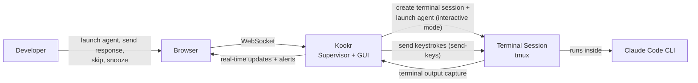

# System Context

## Purpose

Show Kookr's boundary, who interacts with it, and what external systems it depends on.

## Context Diagram

## External Actors And Systems

| Actor / System | Type | Interaction |
|---|---|---|
| **Developer** | Human actor | Views agent status, reads anomaly explanations, sends responses / skips / snoozes via browser |
| **Browser** | UI runtime | Renders SPA served by Kookr backend |
| **Terminal Session** | Managed process (tmux) | Created by Kookr; hosts the agent process; provides output capture and keystroke input |
| **Claude Code CLI** | External process | Runs in interactive mode inside a managed terminal session; monitored via terminal output capture; receives input via keystrokes (send-keys) |

## System Mission And Boundaries

**Mission:** Watch multiple AI coding agents, detect when they need human help, explain what went wrong, and route the developer to the most urgent one.

**Boundaries:**
- Kookr does NOT write code or execute tools — agents do that
- Kookr does NOT manage git, PRs, or issues — agents do that
- Kookr only manages agents it launches itself (in managed terminal sessions) — no discovery of external agents in V1
- Kookr reads agent terminal output; it writes only task metadata (`~/.kookr/tasks.json`)

## Evidence

- `README.md:49-77` — how it works diagram
- `docs/architecture.md:9-31` — system overview
- `docs/adr/004-agent-communication-protocol.md` — launch, resume mechanisms (superseded by ADR-007 for agent interaction)
- `docs/adr/007-managed-terminal-sessions.md` — managed terminal sessions replace headless mode
- `docs/adr/003-deployment-model.md` — local backend + browser

## Observed Smells

None at this level. Context boundary is clean: Kookr launches and manages agents, no external discovery.

### Design Decision: No Agent Discovery in V1

Agent discovery via `~/.claude/sessions/` was removed from V1 scope because:
- Kookr-managed agents run in managed terminal sessions (ADR-007) — Kookr has full control over their I/O
- External interactive sessions found via session files are metadata-only (PID, cwd, start time) — Kookr cannot monitor their output or send them input
- The only forward-looking justification was "take over" (resume under Kookr control), which is deferred
- Net: implementation cost for near-zero user value in V1

Discovery can be re-added if/when take-over is implemented.
