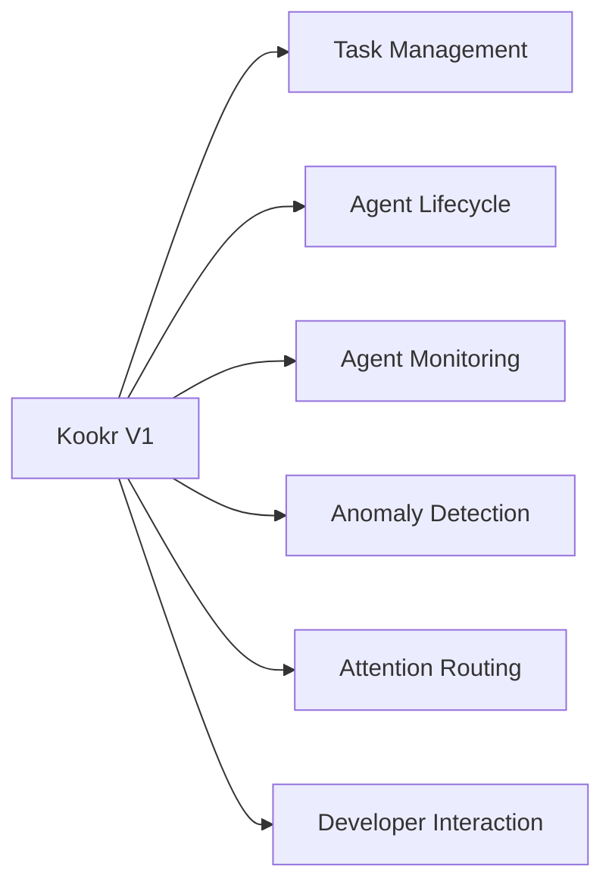
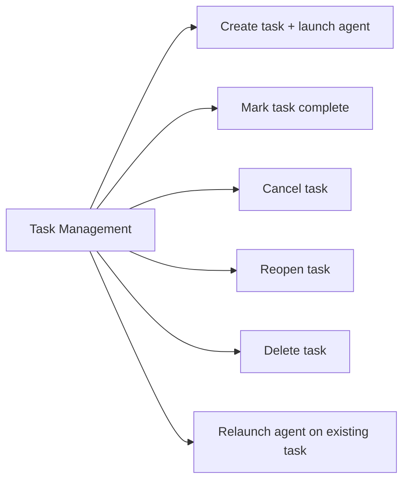
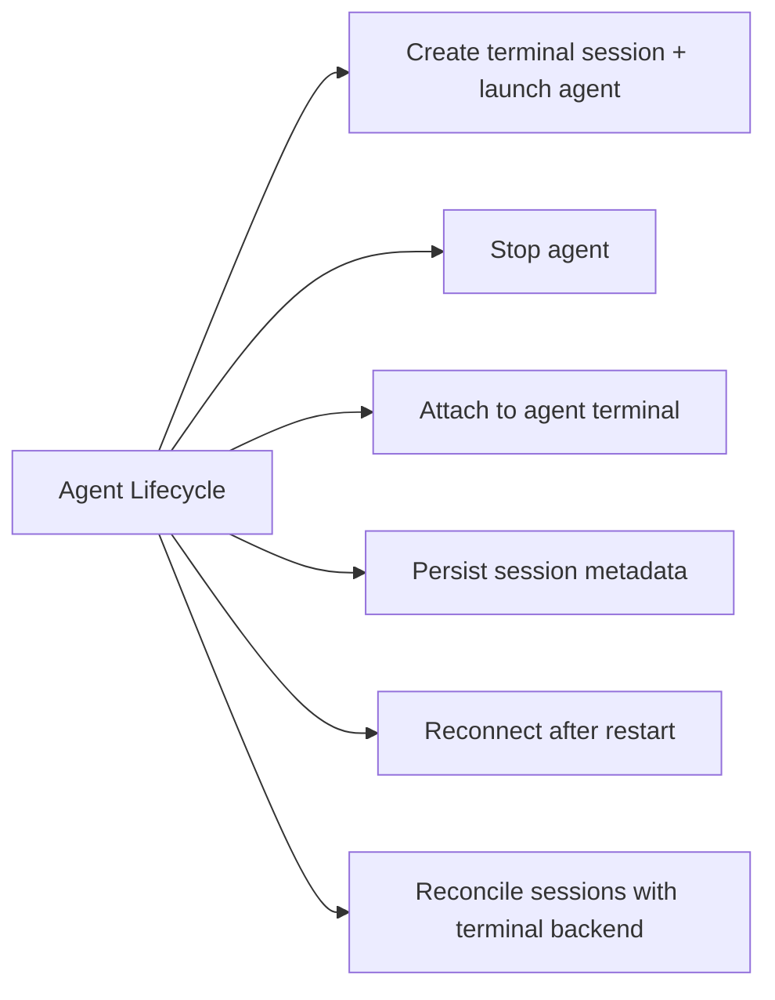
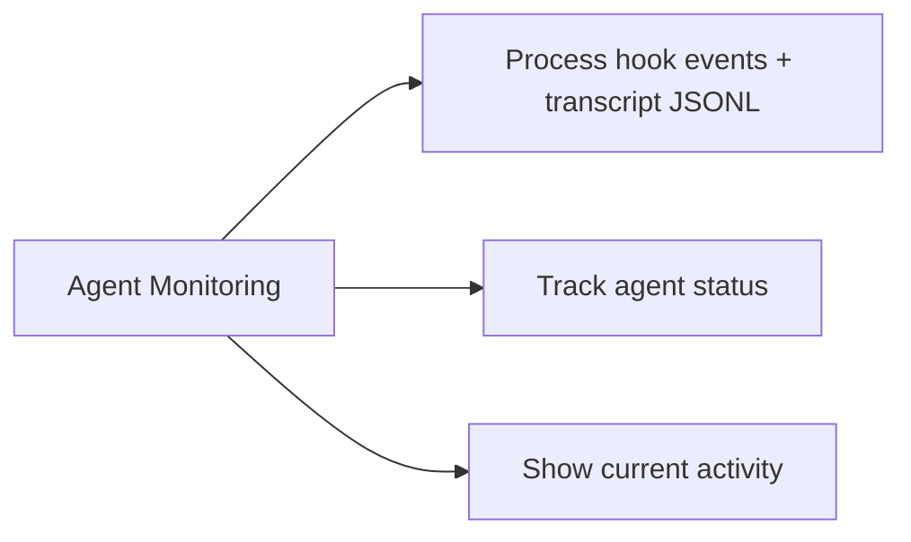
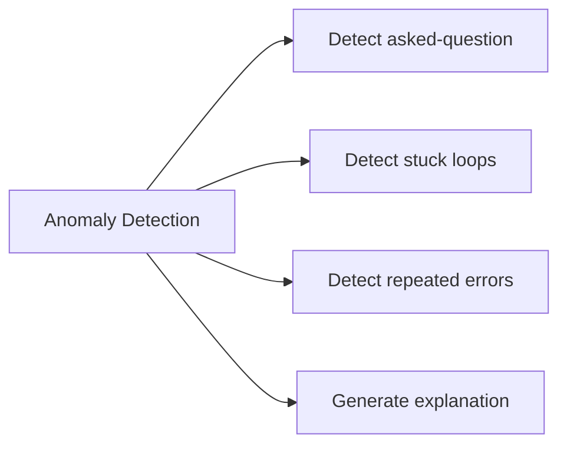
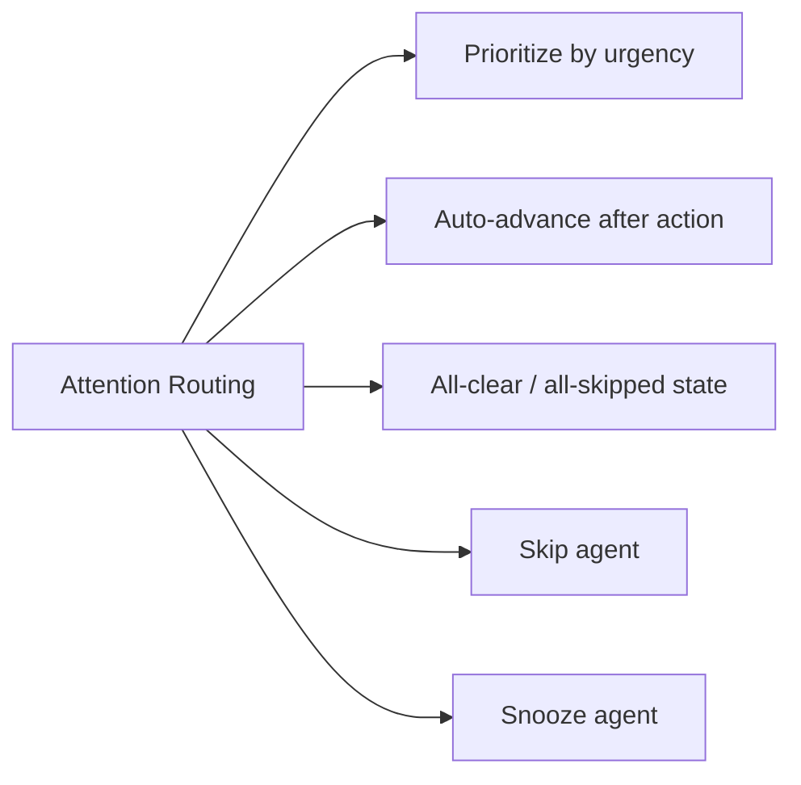
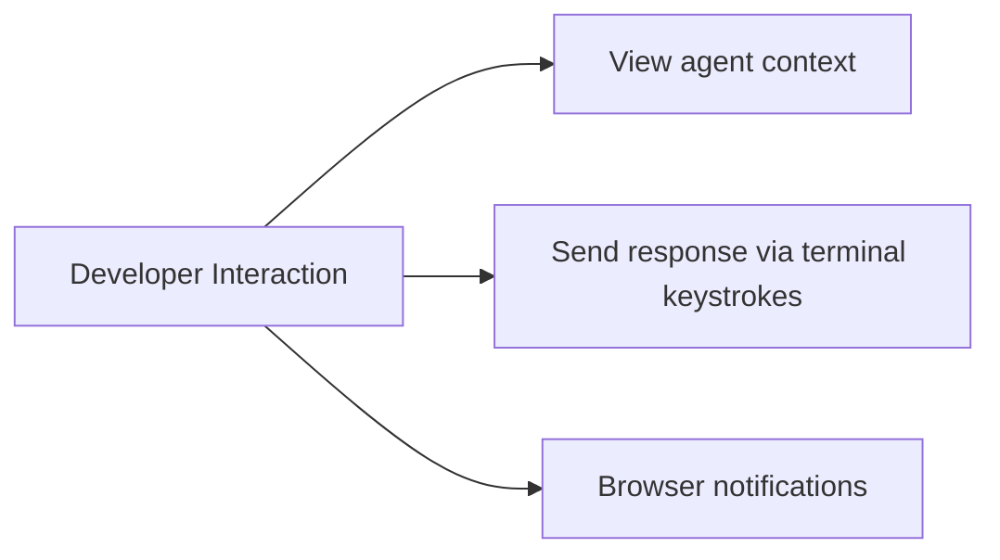

# Capability Map

## Purpose

Decompose what Kookr can do into discrete capabilities and map them to subsystems.

## Capability Overview

### Task Management

### Agent Lifecycle

### Agent Monitoring

### Anomaly Detection

### Attention Routing

### Developer Interaction

## Capability To Subsystem Table

| Capability | Subsystem | V1 Priority |
|---|---|---|
| Create task + launch agent | core (tasks.ts) + agent-adapter | Must |
| Mark task complete | core (tasks.ts) | Must |
| Cancel task (kill agent if running) | core (tasks.ts) + agent-adapter | Must |
| Reopen task | core (tasks.ts) | Must |
| Delete task | core (tasks.ts) | Must |
| Relaunch agent on existing task | core (tasks.ts) + agent-adapter | Must |
| Create terminal session + launch agent | agent-adapter | Must |
| Stop agent | agent-adapter | Nice-to-have |
| Process hook events + transcript JSONL | agent-adapter | Must |
| Attach to agent terminal | agent-adapter | Nice-to-have |
| Persist session metadata | core (tasks.ts) | Must |
| Reconnect after restart | core (tasks.ts) + agent-adapter | Must |
| Reconcile sessions with terminal backend (dtach + tmux) | core (tasks.ts) + server (reconciliation.ts) | Must |
| Track agent status | agent-adapter + supervisor | Must |
| Show current activity | agent-adapter | Nice-to-have |
| Detect asked-question | supervisor-agent | Must |
| Detect stuck loops | supervisor-agent | Nice-to-have |
| Detect repeated errors | supervisor-agent | Nice-to-have |
| Generate explanation | supervisor-agent | Must |
| Prioritize by urgency | attention-router | Must |
| Auto-advance after action | attention-router | Must |
| All-clear / all-skipped state | attention-router | Must |
| Skip agent (deprioritize, back of queue) | attention-router | Must |
| Snooze agent (pause monitoring + timer) | attention-router + supervisor-agent | Must |
| View agent context | frontend (SPA) | Must |
| Send response via terminal keystrokes | agent-adapter | Must |
| Browser notifications | frontend (SPA) | Nice-to-have |

## Overlap And Ambiguity Notes

- **Status tracking** spans both agent-adapter (raw events from hooks/transcripts) and supervisor-agent (derived anomaly state). The adapter owns raw `AgentEvent` emission; the supervisor owns anomaly detection and attention queue state.
- **Task vs agent session lifecycle** — tasks are managed by core (tasks.ts), agent sessions by the adapter. The boundary is: tasks own the *goal* and its status; agent sessions own the *execution* and its process. Task completion is a developer decision, not an automatic consequence of an agent session ending.
- **Explanation generation** is currently part of the supervisor but could split into its own concern if V2 adds LLM-powered explanations.

## Evidence

- `docs/features.md` — F1 through F5 feature tables
- `docs/architecture.md:108-135` — component descriptions
- `docs/adr/008-tmux-session-management.md` — session persistence and reconnection (ADR-008)

## Observed Smells

1. (Updated 2026-03-29) Status derivation ownership partially resolved: adapter emits raw `AgentEvent` (facts); supervisor owns anomaly detection. However, `AgentStatus` is not used as a live state machine — agent state is expressed through `AgentState.anomaly` and `AgentState.snoozedUntil` instead. See `06-boundary-and-responsibility-smells.md` #1.
