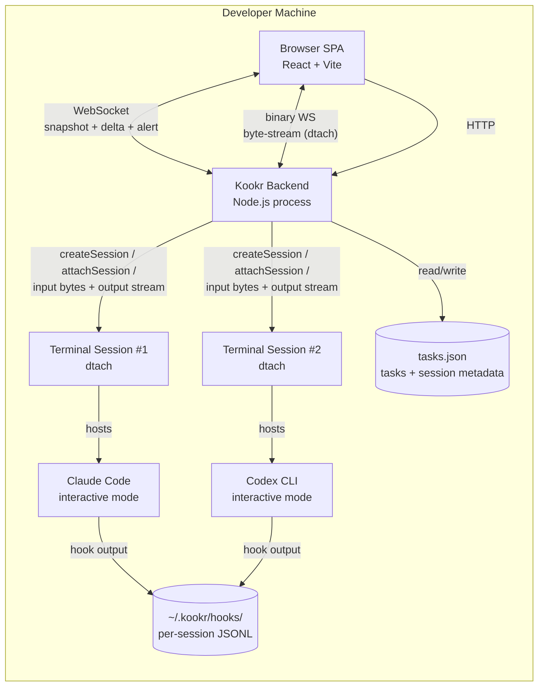

# Container View

## Purpose

Show the runtime processes and their responsibilities. Containers = running processes, not code packages.

## Container Diagram

> Updated 2026-04-10: Added Codex CLI alongside Claude Code to reflect `RoutingAgentAdapter` dispatching to `claude-code-adapter.ts` or `codex-cli-adapter.ts` per task.
> Updated 2026-04-22: Terminal session persistence layer moved to dtach by default (ADR-014, Main B.b). The browser↔backend terminal stream is now a binary WebSocket served by `SessionBridge` against the backend's `LocalDtachBackend`.
> Updated 2026-04-24: V8 removed the tmux escape hatch entirely. `src/server/start.ts` hard-rejects `KOOKR_BACKEND` values other than `dtach` (see `docs/rfc/rfc-v8-tmux-removal.md`). The `tmuxSession` field on `Task.sessions[]` is a historical name that now holds a dtach session ID.

## Container Responsibility Table

| Container | Technology | Responsibility |
|---|---|---|
| **Kookr Backend** | Node.js (TypeScript) | HTTP server, WebSocket server, terminal session management, supervisor logic, task storage |
| **Browser SPA** | React + Vite (ADR-002) | Findings panel, terminal panel, input box, status bar, notifications |
| **Terminal Session** | dtach (ADR-014, sole backend post-V8) | Managed terminal hosting a single agent process. A persistent dtach master owns the child PTY; `SessionBridge` attaches a byte-transparent `dtach -a -E` client per browser viewer. One session per agent |
| **Claude Code (managed)** | External CLI process | Interactive agent execution inside a managed terminal session. Selected by `agentType: 'claude-code'` |
| **Codex CLI (managed)** | External CLI process (forked, see project `CLAUDE.md`) | Interactive agent execution inside a managed terminal session. Selected by `agentType: 'codex-cli'`. Advertises its supported hook subset via `codexHookCapabilities` on `session_start` |
| **tasks.json** | JSON file on disk | Task lifecycle state, description, completion criteria, and inline agent session metadata (dtach session name — field still historically named `tmuxSession`, agent type, transcript path, hook output path, last known status) per task (ADR-008 — persistence layer now dtach per ADR-014) |
| **hooks/** | Per-session JSONL files (`~/.kookr/hooks/`) | Append-only hook output from the active agent (Claude Code or Codex CLI). Full `HookEventName` set — see `src/core/types.ts:2-14` — one file per agent session (ADR-008) |

## Data And Control Ownership Notes

- **Backend owns** all agent lifecycle operations (create terminal session, send keystrokes, kill) and supervisor logic
- **Backend serves** the SPA as static files and pushes updates via WebSocket
- **SPA owns** UI state and rendering; sends commands (respond, skip, snooze, navigate, getNext) to backend
- **No database** in V1 — task and session metadata share a single JSON file (tasks.json, ADR-008); supervisor state (snooze timers, attention events) is in-memory
- **Core (tasks.ts) owns** tasks.json including inline session metadata; adapter writes hook output to `~/.kookr/hooks/` (ADR-008)
- **No discovery** in V1 — Kookr only shows agents it launched itself

## Evidence

- `docs/architecture.md` — Components section (backend, frontend, adapter layer descriptions)
- `docs/adr/003-deployment-model.md` — local backend + browser decision
- `docs/adr/007-managed-terminal-sessions.md` — managed terminal sessions (ADR-007)
- `docs/adr/008-tmux-session-management.md` — session persistence and startup reconnection (ADR-008)
- `docs/architecture.md` — Module Structure section

## Observed Smells

None remaining. The single-process backend is an accepted V1 simplification — the code is modular (`server/`, `core/`, `adapters/`) even though the process is one. See `06-boundary-and-responsibility-smells.md` Mixed Abstraction #1.
