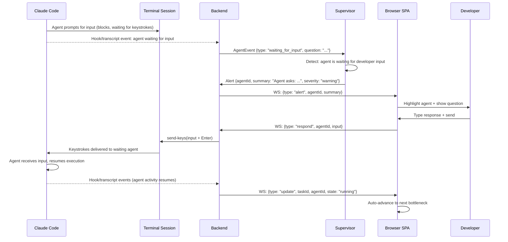
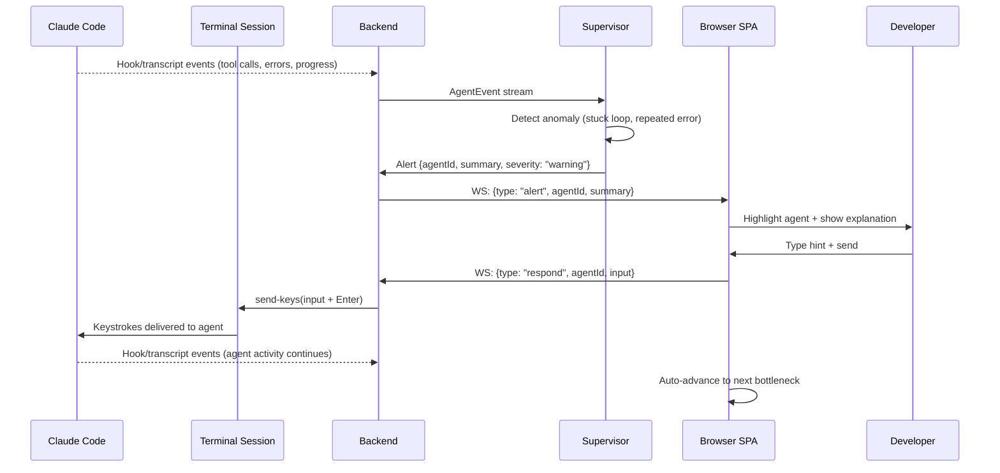
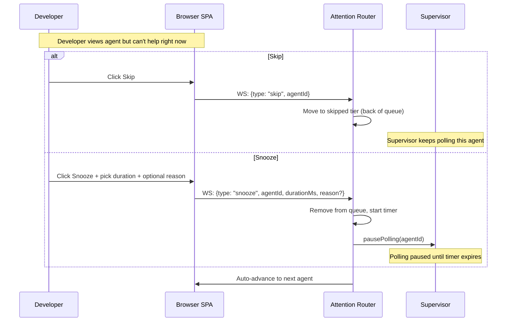
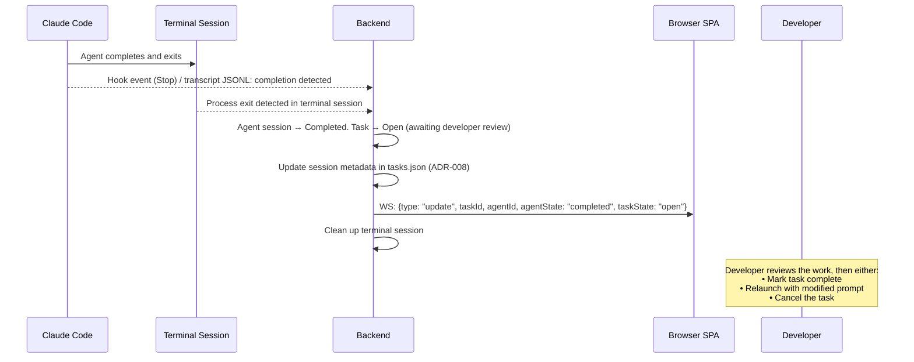
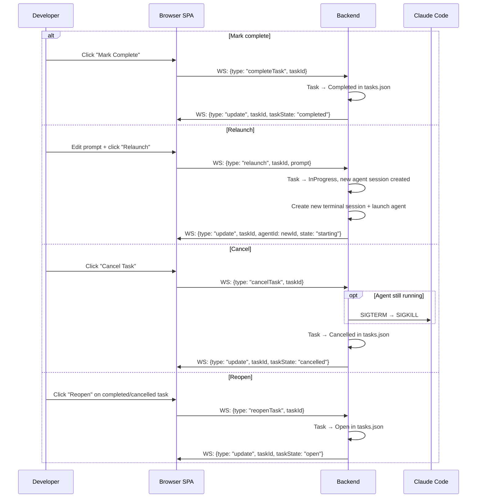
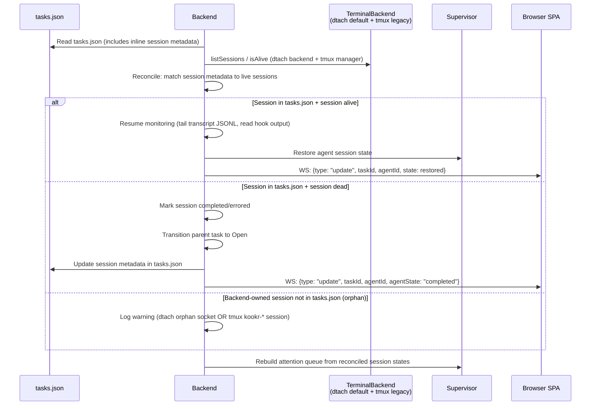

# Runtime Interactions

## Purpose

Show how the major runtime sequences actually flow between containers.

## Key Sequences

### Sequence 1: Create Task + Launch Agent

```mermaid
sequenceDiagram
  participant Dev as Developer
  participant SPA as Browser SPA
  participant BE as Backend
  participant Term as Terminal Session
  participant CC as Claude Code

  Dev->>SPA: Click "New Task" + enter prompt + cwd + optional completion criteria
  SPA->>BE: WS: {type: "launch", prompt, cwd, criteria?}
  BE->>BE: Create task (Open) in tasks.json
  BE->>BE: Transition task to InProgress
  BE->>Term: createSession via terminal backend (dtach default, ADR-014; tmux legacy)
  BE->>Term: launch claude in interactive mode with prompt (argv under dtach; send-keys under tmux)
  Term->>CC: Agent starts in interactive mode
  BE->>BE: Write session metadata to tasks.json (ADR-008)
  BE->>SPA: WS: {type: "update", taskId, agentId, state: "starting"}
  CC-->>BE: Hook events + transcript JSONL (structured agent activity)
  BE->>BE: Map structured events into AgentEvents
  BE->>SPA: WS: {type: "update", taskId, agentId, state: "running"}
```

### Sequence 2: Agent Asks Question + Developer Responds ("The Loop")

In interactive mode (ADR-007), agents natively block when waiting for user input. There is no need for a behavioral contract or session exit/resume cycle. The agent simply waits, and Kookr detects the "waiting for input" state via structured hook events and transcript JSONL.



### Sequence 2b: Anomaly Detection (Stuck / Error)

The supervisor continuously analyzes the agent's execution trace via structured hook events and transcript JSONL. When the agent is stuck (looping, repeated errors), the supervisor surfaces an alert and the developer can intervene by sending keystrokes to the agent's terminal session.



### Sequence 3: Skip & Snooze



### Sequence 4: Agent Session Ends → Task Returns to Open



### Sequence 5: Task Lifecycle Actions



### Sequence 6: Startup Reconnection (ADR-008, ADR-014)

When Kookr restarts, it reconciles session metadata in `tasks.json` with live terminal-backend sessions to recover state. Reconciliation queries both the `TerminalBackend` (dtach default) and the tmux manager — commit `a42ccfd` / `src/server/reconciliation.ts` — so legacy tmux-backed tasks running after an upgrade are still reattached.



> Updated 2026-04-22 for ADR-014. After Main B.b, dtach is the default persistence layer; tmux remains reachable via `KOOKR_BACKEND=tmux`. On a dtach-first upgrade, any surviving `kookr-*` tmux sessions are unreachable under the dtach backend and are surfaced via the startup cutover warning in `src/server/start.ts` — see ADR-014 "Implementation phases" for the rollback / confirmation env vars.

## Interaction Summary Table

| Sequence | Trigger | Key Actors | Outcome |
|---|---|---|---|
| Create task + launch | Developer clicks "New Task" | SPA -> BE -> Terminal Session -> Claude Code | Task created (InProgress), agent running in terminal session |
| The Loop (question) | Agent blocks waiting for input (interactive mode) | Hooks/Transcript -> Supervisor -> SPA -> Developer | Developer responds via keystrokes (send-keys); agent resumes |
| The Loop (anomaly) | Agent stuck in loop or repeated error | Hooks/Transcript -> Supervisor -> SPA -> Developer | Developer sends hint via keystrokes (send-keys) |
| Skip / Snooze | Developer can't act on agent now | SPA -> Router (-> Supervisor for snooze) | Agent deprioritized (skip) or paused (snooze); auto-advance |
| Agent session ends | Process exits in terminal session | Hook (Stop) / Terminal Session -> BE -> SPA | Agent session done; task returns to Open for review |
| Task lifecycle | Developer marks complete / relaunches / cancels / reopens | SPA -> BE | Task state updated in tasks.json |
| Startup reconnection | Kookr restarts | BE -> tasks.json + terminal backend (dtach default / tmux legacy) -> Supervisor | Alive sessions reconnected, dead sessions marked, orphans logged (ADR-008 + ADR-014) |

## Cross-Cutting Bottlenecks

- **~~Terminal output parsing fidelity~~** — resolved by PoC: Claude Code provides structured data via hooks (PreToolUse, PostToolUse, Stop) and transcript JSONL in interactive mode. No ANSI terminal parsing needed. capture-pane is used only for display snapshots.
- **~~Session resume serialization~~ (issue #9)** — resolved by ADR-007. No more resume subprocess; input is delivered via terminal keystrokes (send-keys) to the running agent process. No serialization needed.
- **~~Resume cost accumulation~~ (issue #6)** — resolved by ADR-007. No more `--resume` calls with growing context. The agent runs continuously in a single interactive session.

## Evidence

- `docs/architecture.md:145-201` — lifecycle diagram, communication types
- `docs/adr/004-agent-communication-protocol.md:154-188` — spawn and resume code patterns (superseded by ADR-007)
- `docs/adr/007-managed-terminal-sessions.md` — managed terminal sessions replace headless mode
- `docs/adr/008-tmux-session-management.md` — session persistence and startup reconnection (ADR-008)
- `docs/features.md:76-85` — F3 "The Loop"
- GitHub issues #3, #5, #6, #9 — issues #3, #5, #6, #9 resolved by ADR-007 (managed terminal sessions)

## Observed Smells

None. Issues #3 (AskUserQuestion non-blocking) and #9 (resume serialization) are resolved by ADR-007: agents run in interactive mode where input blocking is native, and developer input is delivered via terminal keystrokes without subprocess spawning. Terminal output parsing fidelity concern is resolved by PoC: structured hooks + transcript JSONL eliminate the need for ANSI parsing.
