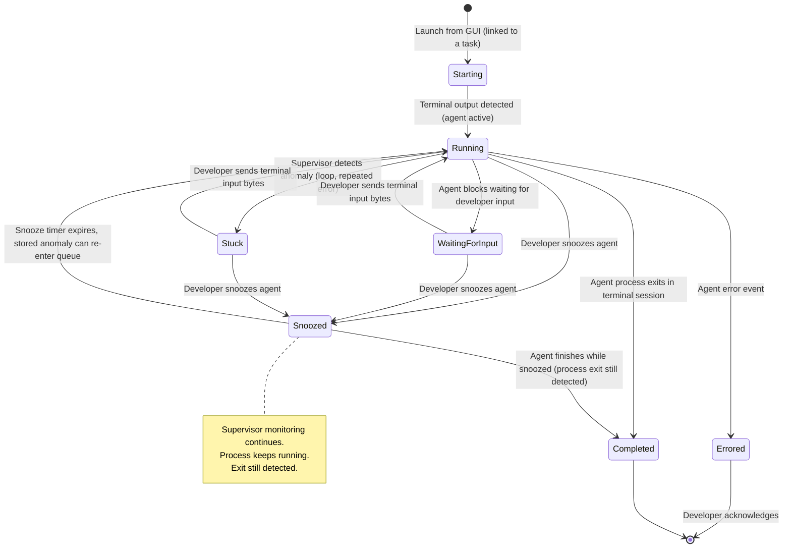
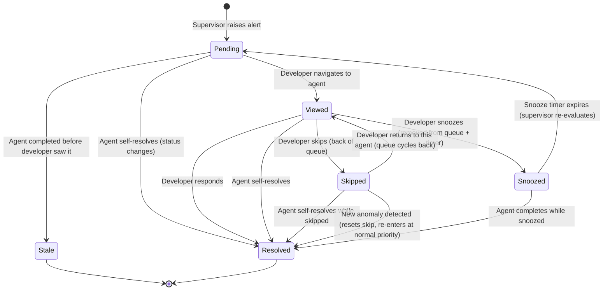
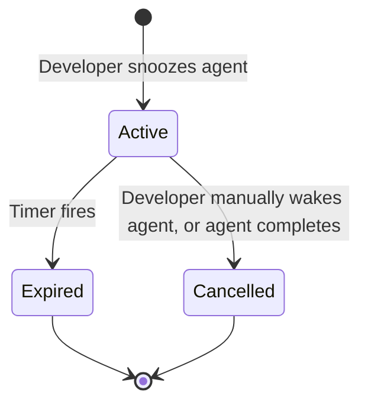

# State Machine Catalog

## Purpose

Document the major stateful entities in Kookr V1 and their legal state transitions.

## Major Stateful Entities

Core attention-loop stateful entities: **Task**, **Agent Session**, **Attention Event**, and **Snooze Timer**.

> Updated 2026-05-09: The original catalog covered the V1 attention loop. The implemented codebase now also contains operational state machines for Ralph loops, schedules, workspace attempts, quota polling, and watchdog verdicts. Those are summarized in the "Additional Operational State Machines" section below.

**Key distinction:** A Task is the *goal* ("fix the auth bug"). An Agent Session is one *attempt* at that goal. A task may go through multiple agent sessions — an agent can error out, get stuck, or only partially complete the work, and the developer relaunches with a new or modified prompt. This is analogous to GitHub/GitLab issues: the issue exists independently of any branch or PR attempt.

### 1. Task Lifecycle

A task represents a unit of work the developer wants accomplished. It is created when the developer launches an agent, and it persists beyond any individual agent session.

```mermaid
stateDiagram-v2
  [*] --> Open: Developer creates task (launches first agent)
  [*] --> Pending: Confirmed dependency degradation (parked; no session)

  Open --> InProgress: Agent session started (slot available)
  Open --> Pending: Launch queued at capacity (no session)
  Pending --> InProgress: Slot opens and dependency admission permits
  Pending --> InProgress: Exclusive half-open probe session attaches
  InProgress --> Pending: Recovery probe fails [task remains non-terminal]
  Pending --> Cancelled: Launch failure
  InProgress --> Open: Agent session ended without completing the task
  InProgress --> Completed: Developer marks task as done
  InProgress --> Completed: System auto-completes (auto-close on signal / delivered PR / terminal-success verdict)
  InProgress --> Terminated: Silent provider-failure reclassification (provider_transient, #1712)
  InProgress --> Terminated: Reconciliation detects all sessions dead without user ack
  InProgress --> Cancelled: Developer cancels task

  Open --> Terminated: Reconciliation backfill (open task, all sessions dead)
  Open --> Cancelled: Developer cancels before any agent runs

  Terminated --> Completed: Developer acknowledges (ackTerminatedTask)
  Terminated --> Open: Developer reopens task
  Terminated --> Cancelled: Developer cancels

  Completed --> Open: Developer reopens task
  Cancelled --> Open: Developer reopens task
```

**Transition table:**

| From | Event | To | Triggered By | Notes |
|---|---|---|---|---|
| - | create_task | Open | Developer via GUI (launch agent dialog) | Task = prompt + cwd + optional completion criteria |
| - | create_task_dependency_degraded | Pending | Launch admission | Durable original launch intent is parked; no worker slot or session is created |
| Open | agent_launched | InProgress | Agent adapter (agent session starts, slot available) | Task now has an active agent working on it |
| Open | launch_queued_at_capacity | Pending | Server (concurrency limit `MAX_ACTIVE_TASKS` reached) | No session starts; promote when capacity opens and dependency admission permits |
| Pending | slot_opens_and_admission_permits | InProgress | Server (`promotePendingTasks` after a task completes/cancels) | Pending task promoted to active |
| Pending | dependency_recovery_probe_session_attaches | InProgress | Server launch admission | Exactly one half-open probe owns the promotion; `launchAdmission` is durably `probing` before adapter launch, and task status changes when its session attaches |
| Pending/InProgress | recovery_probe_failure [task remains non-terminal] | Pending | Server launch admission | Any partial session is stopped and the same task is re-parked with its original replay/idempotency identity. Startup keeps an interrupted probe half-open/busy until its exact terminal is reaped; reap failure preserves that fail-closed state. If completion, cancellation, or termination races cleanup, that terminal state wins: release the fence to an unclaimed half-open circuit, clear admission metadata, ignore stale circuit failure, and do not re-park or launch. |
| Pending | launch_failure | Cancelled | Server (agent launch fails during promotion) | |
| InProgress | agent_session_ended | Open | Agent adapter (session completed/errored) | Task reverts to Open; developer decides next step |
| InProgress | all_sessions_dead | Terminated | Reconciliation (all sessions dead; no user ack yet) | Since rfc-task-loss-prevention the auto-path lands in `terminated`, not `completed`. `reconciliation.ts:147-157` |
| Open | all_sessions_dead | Terminated | Reconciliation backfill (`open` task with only dead sessions is transitioned via `startTask` then `terminateTask` in one pass — `reconciliation.ts:152-156`) | Covers the edge case where a task reverted to Open but all sessions subsequently died. Updated 2026-04-22 |
| InProgress | mark_complete | Completed | Developer via GUI (`completeTask`) | Developer reviewed the work and is satisfied |
| InProgress | provider_transient_reclassify | Terminated | Server completion path (`completeTask`, issue #1712) | The terminal turn made zero tool calls and its final message was a provider/transport error (529 / `API Error` / 429 / 5xx / rate limit); reclassified from a would-be completion so a silent no-op never masks a failure. Schedule-provenance failures get a bounded auto-retry (≤2) in the completion path and, once exhausted, raise an operator alert; non-recoverable so crash-recovery does not resume it. |
| InProgress | system_auto_complete | Completed | Server liveness tick, without developer action | Family of system-driven completions on the liveness tick: (a) **auto-close on signal** / **TTL escalation** — a pending `completion_ready` signal past its delay/TTL (`autoCloseStaleCompletionReadyTasks`, issue #1526); (b) **delivery-aware completion** (issue #1560) — an `autoCloseOnSignal` task whose own (agent-authored) PR merged but which never signaled, once the post-merge cleanup budget (`postMergeCleanupBudgetMinutes`, default 10m) is exceeded: the sweep raises `completion_ready` through the #1541 outbox, then `completeTask` (`src/server/delivered-task-completion-sweep.ts`); (c) **terminal-success verdict auto-complete** (issue #2532) — a task parked in `needs_input` (subType `stop`, no concrete question) whose final clean-turn message is an unambiguous success verdict (e.g. a Deploy Convergence run that resolved to `converged`) is completed via `completeTask` (reason `terminal_success_auto_complete`, `src/server/terminal-verdict-completion-sweep.ts`), so a successful terminal outcome releases its slot instead of holding it awaiting input; non-success parks (drift, divergent, verification failure) and genuine questions keep parking. The hung-task reaper (→ `Terminated`) remains the backstop. |
| InProgress | cancel | Cancelled | Developer via GUI | Kills active agent if running |
| Terminated | ack_terminated | Completed | Developer via GUI (`ackTerminatedTask`) | User has seen the terminated task and accepts it as done |
| Terminated | reopen | Open | Developer via GUI | User wants to continue — a new session can be launched |
| Terminated | cancel | Cancelled | Developer via GUI | User discards a terminated task outright |
| Open | cancel | Cancelled | Developer via GUI | No agent running; just close the task |
| Completed | reopen | Open | Developer via GUI, **or** crash-recovery (`src/server/crash-recovery.ts`) auto-reopens a `completed` / `terminated` task when a surviving session is discovered after a Kookr restart | Work wasn't right; needs another attempt |
| Cancelled | reopen | Open | Developer via GUI | Changed mind; task is needed after all |

**Key design notes:**

- **Pending state** (added 2026-03-29): When the concurrency limit is reached, new tasks enter `Pending` instead of `InProgress`. They are promoted automatically when a slot opens. This prevents resource exhaustion when many tasks are launched simultaneously.
- **Launch reservation** (added 2026-07-02, issue #700): the `Pending → InProgress` promotion is guarded by a synchronous, in-memory launch reservation (`TaskStore.beginLaunch`/`endLaunch`, 10-minute TTL, not persisted — see `docs/reports/issue-700-multi-session-attach-audit.md` §4). Exactly one concurrent promoter wins a pending task; while reserved the task is skipped by `getNextPending` and counts against `MAX_ACTIVE_TASKS` in `getActiveCount`. Not a new TaskStatus — a reservation dies with the server process.
- **Dependency admission marker** (issue #2841): dependency-degraded/probe-busy `parked` is a durable no-slot wait, `half_open_waiting_for_capacity` is a launchable capacity queue marker, and `probing` records a claimed half-open worker attempt. On restart, a probe with a reconciled live session clears its task marker; only an interrupted/dead probe is converted back to degraded parked work, while confirmed degradation recorded at or after a live probe began still keeps the circuit degraded. Unknown collection evidence is fail-open only without stronger confirmed state and cannot erase a degraded/half-open gate. Dependency-blocked parked tasks are excluded from the ordinary pending TTL and launchable `pendingQueueDepth`; capacity-wait probes remain in both.
- **InProgress → Open (not Completed)** when an agent session ends. The agent finishing its process does not mean the task is done — the developer must explicitly mark the task as complete. This avoids false positives where the agent ran to completion but produced wrong results.
- **Terminated state** (added 2026-04-22 to this catalog to match long-standing code; state itself introduced by `rfc-task-loss-prevention.md`). When reconciliation finds every session for an `InProgress` / `Open` task dead, the task transitions to `Terminated` — *not* `Completed`. This split exists so silent tmux/dtach deaths (WSL glitches, OOM kills, external `tmux kill-server`) cannot propagate through "Clear completed" and permanently delete work the user never saw. The user then `ackTerminatedTask`s (→ `Completed`), reopens (→ `Open`), or cancels (→ `Cancelled`). See `docs/architecture.md` § "Task lifecycle — `completed` vs `terminated`" and `VALID_TRANSITIONS` in `src/core/tasks.ts` for the allowed transitions.
- **Multiple agent sessions per task.** A task in Open state can have a new agent launched against it (retry with modified prompt, different approach, etc.). The task tracks its history of agent sessions.
- **Completion criteria** are optional hints. When provided, the supervisor can flag "agent completed but criteria not met" as an attention event. But the developer always has final say.
- **Cleanup:** "Clear completed" sweeps `Completed` and `Cancelled` tasks. `Terminated` tasks are NOT swept by default — the user must opt in via the confirmation checkbox — for the same data-loss reason the state was introduced.
- **Resolved 2026-04-10:** the previously-documented `Pending → InProgress` promotion bug is fixed. `addSession()` auto-transitions both `'open'` and `'pending'` tasks to `'inProgress'`, and `promotePendingTasks` in `src/server/agent-lifecycle.ts` drives the promotion loop up to `MAX_ACTIVE_TASKS`.

### 2. Agent Session Lifecycle

An agent session is one execution attempt against a task. Launched by Kookr in a managed terminal session (ADR-007).

**Transition table:**

| From | Event | To | Triggered By | Notes |
|---|---|---|---|---|
| - | launch | Starting | Developer via GUI | Always linked to a task; creates terminal session |
| Starting | terminal_output_detected | Running | Agent adapter (first terminal output) | |
| Running | waiting_for_input | WaitingForInput | Agent adapter (agent blocks for input) | Interactive mode: agent natively blocks |
| Running | anomaly_detected | Stuck | Supervisor (rule-based check) | |
| Running | error_event | Errored | Agent adapter (terminal error output) | |
| Running | process_exit | Completed | Agent adapter (process exits in terminal) | |
| Running | snooze | Snoozed | Developer via GUI | Optional reason + duration |
| WaitingForInput | input_sent | Running | Developer via GUI -> `AgentAdapter.sendInput()` | Input delivered to running agent via terminal backend byte write |
| WaitingForInput | snooze | Snoozed | Developer via GUI | |
| Stuck | input_sent | Running | Developer via GUI -> `AgentAdapter.sendInput()` | Input delivered to running agent via terminal backend byte write |
| Stuck | snooze | Snoozed | Developer via GUI | |
| Snoozed | snooze_expired | Running | Snooze timer | Stored anomaly can re-enter the active queue; supervisor monitoring was already running |
| Snoozed | process_exit | Completed | Agent adapter (process exit in terminal) | Terminal session still monitored during snooze |

**Implementation note (updated 2026-05-09):** The diagram above is conceptual only. The `AgentStatus` type exists in `src/core/types.ts` but is **not used as a live state machine** in the current implementation. The supervisor's actual agent state is expressed through:
1. `AgentState.anomaly` in `monitor.ts` — presence/absence and type of the current anomaly
2. `AgentState.snoozedUntil` — set via `AttentionQueue.getSnoozedUntil()`
3. `SessionInfo.lastStatus` in `tasks.ts` — used only for terminal session states (`'completed'`, `'aborted'`)

The documented state machine above represents historical **conceptual design**, not executable transition logic. In practice, `WaitingForInput` is not a member of the `AgentStatus` union — the `needs_input` anomaly type serves this role instead. `Snoozed` is tracked as a queue-level property (`snoozedUntil`), not as an `AgentStatus` value. The `Starting → Running` transition has no code path — agents are registered directly with the monitor. See `subsystems/supervisor-agent/03-state-machines.md` for the implementation state model.

**Key design implications:**
- **Snooze** is managed at the attention queue level, not as an agent status transition. The agent process continues running in its terminal session. Process exit is still detected because the adapter monitors the terminal session independently.
- The distinction between `WaitingForInput` and `Errored` is expressed through anomaly types (`repeated_error`, `needs_input`, `permission_blocked`) rather than `AgentStatus` transitions. Stuck-loop detection is deferred to V2 AI supervisor.
- **`'aborted'` is a production `SessionInfo.lastStatus` value** written by task cancellation/cleanup paths. Reconciliation and task store helpers branch on it to avoid treating cancelled sessions as live. It is NOT in the `AgentStatus` union; it exists in the extended `SessionInfo.lastStatus` type in `src/core/session-read-model.ts`. Treat the session-level lifecycle as `{'completed' | 'aborted'}` in `lastStatus`, independently of the conceptual `AgentStatus` transitions above.

**Relationship to tasks:**
- Every agent session belongs to exactly one task.
- When an agent session ends normally, lifecycle code can return the parent task to `Open` so the developer can mark complete, relaunch, or cancel.
- When reconciliation finds every session for an `Open` or `InProgress` task dead without user acknowledgement, the task transitions to `Terminated`.
- Killing an agent (via stop or task cancel) marks the session `aborted` and prevents reconciliation from treating that session as live.

### 3. Attention Event Lifecycle

An anomaly detected by the supervisor that requires developer attention. The developer can respond, skip, or snooze.

**Transition table:**

| From | Event | To | Triggered By |
|---|---|---|---|
| - | anomaly_detected | Pending | Supervisor |
| Pending | developer_navigates | Viewed | SPA navigation |
| Pending | agent_status_change | Resolved | Agent moved on |
| Pending | agent_completed | Stale | Agent finished before developer saw alert |
| Viewed | response_sent | Resolved | Developer responds via terminal backend byte write |
| Viewed | developer_skips | Skipped | Developer clicks Skip; auto-advance to next |
| Viewed | developer_snoozes | Snoozed | Developer clicks Snooze + picks duration; auto-advance |
| Viewed | agent_status_change | Resolved | Agent self-resolves |
| Skipped | queue_cycles_back | Viewed | All higher-priority alerts handled; this one resurfaces |
| Skipped | agent_status_change | Resolved | Agent state changed while skipped |
| Skipped | new_anomaly | Resolved | New anomaly replaces old one (skip count resets) |
| Snoozed | snooze_expired | Pending | Timer fires; supervisor re-polls and decides if alert is still valid |
| Snoozed | agent_completed | Resolved | Process exited while snoozed |

**Implementation note (updated 2026-03-29):** The `Viewed` and `Stale` states are **not implemented** in the current code. In practice:
- **Viewed** has no tracking — `navigate` messages log to the interaction log but do not change queue state. Skip/snooze/respond work from any state, not just Viewed.
- **Stale** has no distinct representation — when an agent completes before the developer sees the alert, `queue.remove()` is called (same as Resolved). The distinction exists only in this documentation.
- Both `Pending` and `Skipped` are implicit states: `Pending` = entry in queue with `skipped: false`; `Skipped` = entry with `skipped: true`.

### 4. Snooze Timer

Lightweight entity managed by the attention router. In current code it is a `SnoozeEntry` keyed by task ID when the agent has an owning task, otherwise by agent ID. The stored fields include `agentId`, `key`, `kind` (`finding` or `task`), optional `anomaly`, `expiresAt`, `createdAt`, optional `expiredPendingRestore`, and optional `reason`. Task-keying lets a snooze survive session rotation such as Ralph iterations or crash-recovery relaunches.

**Implementation note (updated 2026-05-19):** The `Active → Cancelled` transition via "developer manually wakes agent" is implemented end-to-end. The `cancelSnooze` WebSocket message is handled in `src/server/ws.ts` and calls `AttentionQueue.cancelSnooze(agentId)`. A snooze can therefore be cancelled by (a) the developer manually, (b) task cleanup via `purgeTask`, or (c) the timer firing.

**Implementation note (updated 2026-05-19):** Snooze does **not** pause supervisor monitoring. Hook events and watchdog verdicts continue flowing through `Monitor`; `AttentionQueue.enqueue()` updates the stored snoozed anomaly and keeps it out of the active queue until expiry/manual wake/purge. Production snoozes are task-keyed when possible, so `purge(agentId)` intentionally preserves snooze state while `purgeTask(taskId)` removes it when the task lifecycle ends.

### 5. Turn State

A third stateful dimension on the agent, deliberately orthogonal to `TaskStatus` and `AgentStatus` (issue #358). Defined at `src/shared/contracts/task-status.ts:105-110`; it is a **pure derivation** over the agent's recent event window (`src/core/turn-state.ts`, `deriveTurnStateDetails`), not a stored/mutated field — so there is no "illegal transition", only a mapping from the last effective event.

States: `running`, `waiting_for_input`, `completed_turn`, `blocked`, `unknown`.

It is load-bearing for correctness: `reconciliation.ts` treats a dead session whose `lastTurnState === 'completed_turn'` as a clean-finish auto-complete candidate; `crash-recovery.ts`, `session-health-service.ts`, `event-pipeline.ts`, and the frontend consume it for live status.

Derivation (trailing `notification`/`subagent_stop` events are trimmed first so they don't mask the real last state):

| Last effective event | → TurnState |
|---|---|
| `stop` with active background tasks/crons | `running` (parked on its own background work) |
| `stop` otherwise | `completed_turn` |
| `stop_failure` | `blocked` (API error killed the turn) |
| `permission_request` where tool is `AskUserQuestion` | `waiting_for_input` |
| `permission_request` otherwise | `blocked` |
| `tool_use` where tool is `AskUserQuestion` | `waiting_for_input` |
| `tool_use` otherwise, and most other events | `running` |
| `session_end`, or no events | `unknown` |

### Additional Operational State Machines

| Entity | States | Owner | Notes |
|---|---|---|---|
| Ralph loop | `running`, `paused`, `completed`, `failed`, `cancelled` | `src/core/ralph-cycler.ts`, `src/server/ralph-loop-service.ts` | Terminal states prevent further iteration injection. `paused` preserves the loop but does not launch a fresh runtime until explicitly resumed. On a terminal exit the relaunch policy (`src/core/ralph-terminal-relaunch-policy.ts`, issue #1901) either re-arms a capped/stalled loop back to `running` (arbiter-gated via `RelaunchArbiter`) or stamps a `needsHuman` marker on budget exhaustion (`cost_cap`/`iteration_cost_cap`), surfaced through the task snapshot |
| Schedule execution receipt | `reserved`, `accepted`, `terminal`, `unknown_after_restart` | `src/core/schedule.ts`, `src/server/schedule-runner.ts` | Latest execution outcomes further classify running, capacity-queued, dependency-parked, completed/cancelled, deduplicated, dispatch-failed, skipped, and unknown-after-restart states for the UI |
| Workspace attempt | `running`, `passed`, `blocked`, `timed_out`, `cancelled`, `superseded`, `completed` | `src/core/workspace-attempt-repository.ts` | Durable cleanup/preflight/diagnostic attempt records, separate from task lifecycle |
| Quota poller | `idle`, `polling`, `healthy`, `backoff`, `auth_failed`, `disabled` | `src/adapters/quota-adapter.ts` | Polling state for Anthropic OAuth usage quota, with backoff on 429/network/schema failures |
| Watchdog verdict | `healthy`, `grace_period`, `needs_input`, `permission_blocked`, `tool_running`, `quiet_working`, `mcp_starting`, `stale_agent`, `hook_disconnected` | `src/core/watchdog.ts` | Verdict union is converted into queue anomalies by `Monitor.applyWatchdogVerdict()` when actionable |
| Delivery watchdog | `unflagged`, `flagged` (hysteresis: N consecutive no-progress samples to engage, M consecutive progress samples to clear) | `src/core/loop-delivery-watchdog.ts`, sampled per iteration in `src/server/ralph-loop-service.ts` | Judges a Ralph loop on positive delivery progress (branch commits / PRs opened / PRs merged), not liveness — silence never flags. Observability-only (one warn line per transition); disabled at threshold 0 (issue #1902) |
| Provider-reset resume | per issue-claim `ProviderResetEvent`: `record` → `resume` → `{ resume_failed \| (success) }`, or `deduped` / `dropped` | `src/server/provider-reset-scheduler.ts`, recorded by the reaper's `provider_paused` branch in `src/server/lifecycle-timers.ts`, swept once per schedule-runner tick | Auto-resumes a `provider_paused` issue at its quota reset instead of requiring manual re-dispatch (issue #1896 / #1699 WS1.4). Emitted events are `record` (tracked), `resume` (launch replayed), `resume_failed` (replay rejected — the operationally distinct outcome), `deduped`, `dropped` (`ProviderResetEvent` union, `provider-reset-scheduler.ts:193-198`); `deferred`/`rate-limited` are sweep-level *summary counters*, not per-claim events. Jittered + token-bucket-bounded; dedup keyed on the issue-claim relaunch lease (not the 24h launch ledger). The reaper stops holding the paused slot at reset and reaps it, freeing the lease so the resume hands off to a fresh task |
| Circuit breaker | `closed`, `open`, `half-open` | `src/core/circuit-breaker.ts`, `src/shared/contracts/circuit-breaker.ts` | Generic breaker gating the LLM, STT, TTS, and GitHub-fetcher adapters. `closed → open` at the failure threshold; `open → half-open` when the reset timer fires; `half-open → closed` after enough consecutive successes; `half-open → open` on any failure; `* → closed` via manual `rearm()` (dashboard action). While `open`, `call()` short-circuits and throws |
| Launch dependency admission | `healthy`, `degraded`, `unknown`, `half_open` plus durable task `parked` / `probing` | `src/core/launch-dependency-admission.ts`, `src/server/launch-service.ts`, `src/server/agent-lifecycle.ts` | Confirmed degradation parks required work before slot consumption. Clean evidence moves to half-open and one probe may launch. Unknown is fail-open only before confirmed degradation. Startup interruption remains half-open/busy until exact terminal cleanup; cleanup failure is fail-closed. A non-terminal task is then re-parked, while a concurrent terminal transition wins and releases the fence to unclaimed half-open. Newer confirmed evidence supersedes an older live-probe success. |
| Relay connection | `localOnly`, `configured`, `connecting`, `connected`, `backingOff`, `stopped`, `authFailed`, `error` | `src/shared/contracts/relay-connection.ts`, `src/server/relay-connection-manager.ts` | Hosted-relay session-sharing link state. Nested: the manager's own `state` is authoritative only while no runtime exists; once a runtime is attached, the published `connectionState` is whatever the runtime's `RemoteNodeStatus` reports (mapped via `statusFromNodeState()`) — a known footgun when debugging status changes not triggered by this module. `authFailed`/`error` split by whether credential validation failed with an auth code; `forget()` returns to `localOnly` |

## Transition Ownership Table

| Entity | Owner of transitions | Persistence |
|---|---|---|
| Task | Core (tasks.ts) — developer actions + agent session events | Persisted (tasks.json) |
| Launch dependency admission | Process-local `LaunchDependencyAdmission` owns circuit transitions; launch/promotion/recovery paths own task markers | Circuit is in-memory; `Task.launchIntent` and `Task.launchAdmission` are durable. On restart, live reconciled `probing` clears its task marker. Interrupted/dead `probing` stays half-open/busy through exact-terminal cleanup, then restores as degraded `parked` only for non-terminal owners; cleanup failure keeps the fence busy, and terminal owners release it to unclaimed half-open. Confirmed evidence at or after a live probe's start keeps the circuit degraded. Terminal task transitions clear every admission marker. |
| Agent Session | Agent adapter (raw events) + Supervisor (derived states) | Persisted (inline in tasks.json) — ADR-008 |
| Attention Event | Supervisor (creation) + Attention Router (skip/snooze/resolution) | In-memory |
| Snooze Timer | Attention Router | In-memory queue state, serialized in the task-file envelope by `task-persistence.ts` |

**Startup reconciliation (ADR-008, updated for ADR-014 on 2026-04-22; tmux removed 2026-04-24):** On startup, session state is reconciled from tasks.json (which includes inline session metadata) + `TerminalBackend` liveness queries. Reconciliation queries only `LocalDtachBackend` (see `src/server/reconciliation.ts`) — V8 removed the tmux backend and `src/server/start.ts` hard-rejects `KOOKR_BACKEND=tmux`. Sessions with a live dtach socket are reconnected; sessions without one are marked `terminated` (per rfc-task-loss-prevention). Snooze timers and attention events are ephemeral and rebuilt from reconciled session states.

## Illegal Or Ambiguous Transitions

| Transition | Why Illegal/Ambiguous |
|---|---|
| Agent Session: Completed -> Running | Final state for a session. To retry, launch a new session against the same task |
| Task: InProgress -> Completed (automatic) | Not allowed. Reconciliation transitions to `Terminated`, not `Completed`, when every session dies without user ack — see the transition table and the "Terminated state" design note. The only auto-completion is the `Terminated → Completed` user-driven `ackTerminatedTask` |
| Task: Completed/Cancelled/Terminated -> InProgress | Must reopen first (-> Open), then launch agent (Open -> InProgress) |
| Task: Terminated -> Pending / InProgress directly | Not allowed. `Terminated` exits via `ackTerminatedTask`, `reopen`, or `cancel` only — see `VALID_TRANSITIONS` in `src/core/tasks.ts` |
| Snoozed -> Stuck | Not allowed directly. Snooze expiry restores a stored anomaly or leaves the agent unqueued; later hook/watchdog processing may detect a fresh anomaly |
| Skip while Snoozed | Not applicable — snoozed agents are not in the queue |

## Deferred Edge Cases

| Edge Case | Why Deferred |
|---|---|
| Developer skips all agents without snoozing | Skipped agents cycle after the active tier is empty. No distinct `AllSkipped` state is implemented; automatic dampening deferred to later |
| Auto-complete tasks based on completion criteria | V1 always requires explicit developer confirmation. Auto-complete based on criteria matching is a V2 supervisor feature |

## Known Issues Affecting This Model

| Issue | Impact | Status |
|---|---|---|
| **#3** AskUserQuestion is non-blocking | **Resolved by ADR-007.** Interactive mode is natively blocking — agent waits for input. WaitingForInput is now a first-class state | Resolved (ADR-007) |
| **#5** Session ID mismatch on error | **Resolved by ADR-007.** No more session resume; agents run continuously in terminal sessions | Resolved (ADR-007) |
| **#6** Resume cost accumulation | **Resolved by ADR-007.** No more `--resume` calls — agent runs in a single continuous interactive session | Resolved (ADR-007) |
| **#9** Resume race conditions | **Resolved by ADR-007.** No more resume subprocess — input delivered through the terminal backend's byte-write path to the running process | Resolved (ADR-007) |

## Evidence

- `docs/architecture.md` — Agent Session Lifecycle section (state diagram)
- `docs/architecture.md` — AgentStatus type definition (Backend ↔ Coding Agents section)
- `docs/architecture.md` — Backend section (task storage design)
- `docs/features.md:60-73` — F2 anomaly detection features
- `docs/features.md:76-85` — F3 respond & advance
- `docs/features.md:88-95` — F4 agent lifecycle, task storage, completion criteria
- `docs/adr/006-permission-mode-feasibility.md` — AskUserQuestion behavior (superseded by ADR-007 for interaction model)
- `docs/adr/007-managed-terminal-sessions.md` — managed terminal sessions (ADR-007)
- `docs/adr/008-tmux-session-management.md` — session persistence and startup reconnection (ADR-008)
- GitHub issues #3, #5, #6, #9 — resolved by ADR-007

## Observed Smells

1. **AgentStatus type exists but is not used as a live state machine** (updated 2026-03-29). The supervisor expresses agent state through `AgentState.anomaly` and `AgentState.snoozedUntil` rather than transitioning `AgentStatus` values. The type serves only as metadata on persisted sessions. Either implement `AgentStatus` transitions or simplify the type to match its actual role.
2. ~~**Archived state was a permanent tombstone**~~ — Removed 2026-03-31. The `archived` status had no distinct behavior from completed/cancelled and was removed entirely.
3. **Viewed/Stale attention event states are design-only** (updated 2026-03-29). Neither state is tracked in code. The queue operates with simpler Pending/Skipped/Snoozed/Resolved semantics.
4. ~~**Archive unreachable from frontend**~~ — Resolved 2026-03-31. The `archived` status was removed entirely (no distinct behavior from completed/cancelled).
5. ~~**`Pending → InProgress` promotion broken**~~ — Resolved 2026-04-10. `addSession()` now auto-transitions both `'open'` and `'pending'` tasks to `'inProgress'`, so `promotePendingTasks` drives the concurrency limit correctly.
6. ~~**`stuck_loop` anomaly type is dead code**~~ — Fixed 2026-03-31. Removed from `AnomalyType` and all references. Stuck-loop detection deferred to V2 AI supervisor.
