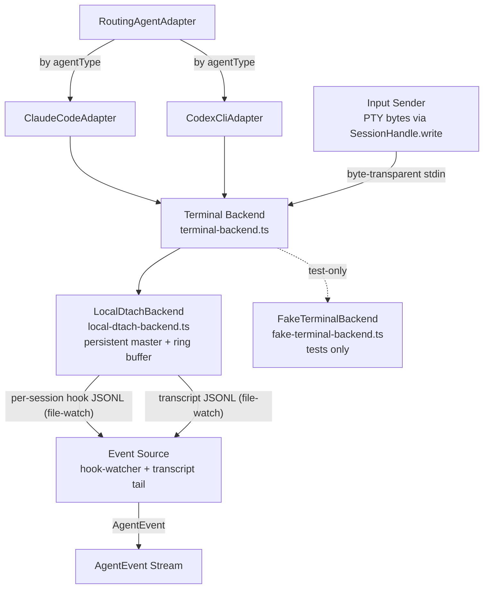

# Agent Adapter — Component View

## Purpose

Show the internal structure of the adapter layer.

## Component Diagram

> Updated 2026-04-10: Added `RoutingAgentAdapter` dispatch to per-agent-type adapters and expanded the hook list to match `HookEventName` in `src/core/types.ts`.
> Updated 2026-04-22: Split `SessionMgr` into the `TerminalBackend` abstraction (`terminal-backend.ts`) with `LocalDtachBackend` as the default per ADR-014 (Main B.b flip).
> Updated 2026-04-24: Removed the `TmuxTerminalManager` / `SessionMonitor` nodes. V8 deleted the tmux backend (`src/server/start.ts` hard-rejects `KOOKR_BACKEND=tmux`); no `tmux-terminal-manager.ts` or `session-monitor.ts` files exist. The persistent-`dtach -a` client and ring buffer live inside `LocalDtachBackend` itself (see `src/adapters/local-dtach-backend.ts`). `FakeTerminalBackend` is included as the in-memory test double.
> Updated 2026-05-19: `TerminalBackend` is now the broader session I/O hub, not a 5-method interface. It includes byte writes, atomic write sequences, ring-buffer capture, data/error subscriptions, resize, and health stats.

## Component Responsibility Table

| Component | Responsibility |
|---|---|
| **RoutingAgentAdapter** (`routing-agent-adapter.ts`) | Selects the concrete adapter per `agentType` (`claude-code` or `codex-cli`) and forwards `AgentAdapter` calls. Lets the rest of the server treat agents uniformly |
| **ClaudeCodeAdapter / CodexCliAdapter** | Concrete implementations. Own the per-agent `--settings`/config file, hook command wiring, and transcript path discovery |
| **Terminal Backend** (`terminal-backend.ts`) | Session I/O abstraction over the dtach persistence layer. It owns lifecycle (`createSession` / `listSessions` / `isAlive` / `killSession`), input (`write` / `writeSequence`), output (`captureBytes` / `onData`), transport errors (`onBackendError`), resize, and health stats. `LocalDtachBackend` is the sole production implementation (ADR-014); `FakeTerminalBackend` is used by tests. Selected in `src/server/start.ts`. Launches the agent binary in interactive mode, monitors process exit, cleans up sessions on shutdown. No circuit-breaker wrapper on the dtach path at present |
| **Persistent dtach attach + ring buffer** (inside `local-dtach-backend.ts`) | One persistent `dtach -a` client per session, shared by all viewers. Owns a ring buffer of recent bytes so every reconnecting xterm.js viewer (and the attention-router UI) sees the last rendered screen synchronously, not just newly-emitted bytes. Replaces the V7-era `SessionMonitor` module — the functionality now lives inside the backend itself |
| **Event Source** | Consumes four structured data channels: (1) **Hooks** — per-session JSONL files (`~/.kookr/hooks/<session>.jsonl`) covering the full `HookEventName` set (SessionStart, PreToolUse, PostToolUse, PostToolUseFailure, Stop, StopFailure, PermissionRequest, Notification, UserPromptSubmit, SubagentStart, SubagentStop, SessionEnd); (2) **Transcript JSONL** — file-watched transcript for full structured history; (3) **GitHub state** — PR/issue status, review comments, CI checks via periodic `gh` CLI polling ([ADR-012](../../../adr/012-github-pr-awareness.md)); (4) **Interaction log** — developer actions (inputs, skips, snoozes) for reflection ([ADR-010](../../../adr/010-session-reflection-workflow.md)). Maps to `AgentEvent` union. No ANSI terminal parsing needed |
| **Input Sender** | Delivers developer input to the agent. Bytes are written verbatim to the child PTY's stdin via `SessionHandle.write()` — byte-transparent, no terminal multiplexer command layer. No queuing needed — input goes directly to the running interactive process. `keystroke.ts` provides encoding helpers for agent-specific control sequences |
| **AgentEvent Stream** | The normalized event interface consumed by the supervisor. Codex CLI signals its supported subset via `codexHookCapabilities` on `session_start` so the monitor can downgrade missing-hook expectations |

## Interaction And Ownership Notes

- Each managed agent runs in its own terminal session with exactly one active process. The agent runs continuously in interactive mode — no exit/resume cycle.
- The Event Source consumes structured data from hooks and transcript JSONL — no ANSI terminal parsing or pattern recognition needed. PoC validated that Claude Code provides structured JSON via the hooks listed above and transcript JSONL in interactive mode.
- Codex CLI is supported via a separate adapter (`codex-cli-adapter.ts`) that writes its own settings file and advertises its hook subset through `codexHookCapabilities` on the `session_start` event, so the monitor's hook-missing detection can adapt at runtime.
- Input delivery is immediate via terminal-backend byte writes — no subprocess spawning, no serialization needed (ADR-007 resolves issue #9).

## Evidence

- `docs/adr/004-agent-communication-protocol.md:122-188` — spawn and resume code patterns (superseded by ADR-007)
- `docs/adr/007-managed-terminal-sessions.md` — managed terminal sessions (ADR-007)
- `docs/architecture.md:434-442` — reuse map from aegiscore

## Observed Smells

None.
