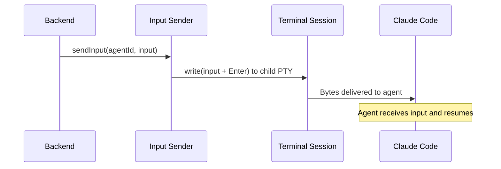
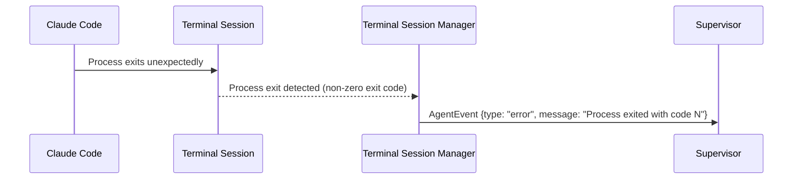

# Agent Adapter — Key Sequences

## Purpose

Show the key interactions within the adapter layer.

## Primary Sequence: Create Terminal Session + Monitor

```mermaid
sequenceDiagram
  participant BE as Backend
  participant SessionMgr as TerminalBackend / AgentAdapter
  participant Term as Terminal Session
  participant CC as Claude Code
  participant ES as Event Source
  participant Sup as Supervisor

  BE->>SessionMgr: launch(prompt, cwd)
  SessionMgr->>Term: Create dtach-backed terminal session
  SessionMgr->>Term: Launch agent in interactive mode with prompt + hooks configured
  Term->>CC: Agent starts in interactive mode
  SessionMgr->>SessionMgr: Store terminal session handle + start transcript JSONL file-watch
  SessionMgr->>SessionMgr: Call tasks.addSession() to persist session metadata in tasks.json (ADR-008)
  CC-->>ES: Hook event (PreToolUse/PostToolUse) via stdin JSON
  ES-->>ES: Map structured JSON to AgentEvent
  ES-->>Sup: AgentEvent {type: "tool_use" | ...}
  Note over CC,ES: Hooks provide real-time events; transcript JSONL provides full history
  CC->>Term: Agent completes
  CC-->>ES: Hook event (Stop) via stdin JSON
  ES-->>Sup: AgentEvent {type: "stop"}
  Term-->>SessionMgr: Process exit detected
  SessionMgr->>SessionMgr: Call tasks.updateSession() to update session metadata in tasks.json (ADR-008)
  SessionMgr->>SessionMgr: Clean up terminal session
```

## Secondary Sequence: Send Input to Agent



## Failure Or Recovery Variant: Process Crash



## Handoff Notes

- The adapter never interprets events. It produces a flat stream of `AgentEvent` objects. The supervisor decides what they mean.
- Terminal session IDs are managed internally by the adapter. Unlike the previous headless approach, there is no session ID mismatch issue (issue #5, resolved by ADR-007).
- **~~Resume serialization~~ (issue #9, resolved by ADR-007):** No longer needed. Input is delivered through the terminal backend's byte-write path to the running agent process — no subprocess spawning, no serialization required.

## Evidence

- `docs/adr/004-agent-communication-protocol.md:154-170` — spawn code pattern (superseded by ADR-007)
- `docs/adr/007-managed-terminal-sessions.md` — managed terminal sessions (ADR-007)
- `docs/adr/008-tmux-session-management.md` — session persistence inline in tasks.json; adapter calls tasks.addSession()/updateSession() (ADR-008)
- GitHub issues #5, #9 — resolved by ADR-007

## Observed Smells

None.
