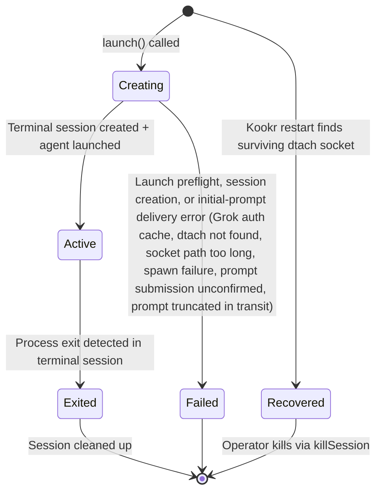

# Agent Adapter — State Machines

## Purpose

The adapter tracks process-level state (not agent-logical state — the supervisor owns that).

## State Diagram: Managed Terminal Session

> Updated 2026-04-24: Added `Recovered` state to reflect the LocalDtachBackend manifest status union (`'pending' | 'active' | 'recovered'`).

## Transition Ownership

| Transition | Trigger |
|---|---|
| -> Creating | Backend calls `adapter.launch()` (manifest status = `'pending'`) |
| Creating -> Active | Terminal session created, agent process started, manifest status flipped to `'active'` (`local-dtach-backend.ts:296-304`) |
| Active -> Exited | Process exit detected in terminal session |
| Any -> Failed | Launch preflight (including Grok auth-cache validation), terminal session creation, or system error (no manifest status for this; entry is deleted and an error is thrown). Also covers a post-creation initial-prompt failure — submission unconfirmed, or a prompt truncated in transit (#2977) — where the session exists and the agent is running, and is reaped before the throw |
| -> Recovered | Startup scan (`local-dtach-backend.ts:882-933`) finds an existing dtach socket but cannot verify pid ownership; manifest entry is promoted to `'recovered'`. `listSessions()` and `isAlive()` treat `Recovered` as live. No transition back to `Active` exists — the session runs in `Recovered` until it exits or is killed |

## Edge-Case Transitions

| Edge Case | Resolution |
|---|---|
| Process killed externally (SIGKILL) | Process exit detected in terminal session. Adapter transitions to Exited. Supervisor detects error |
| Terminal session crashes (dtach master SIGKILL'd) | Adapter detects lost session via `TerminalBackend.isAlive()` returning false. All agents in affected sessions transition to Exited/Failed |
| Orphan terminal session after Kookr crash | Dtach master persists detached. On Kookr restart, `reconciliation.ts` queries `LocalDtachBackend` (tmux removed in V8) and either reattaches (manifest → `'recovered'` if pid ownership cannot be verified) or cleans up |
| ~~Resume called while still streaming (issue #9)~~ | Resolved by ADR-007. No more resume — input delivered through the terminal backend's byte-write path to the running process |
| ~~Resume fails with wrong session ID (issue #5)~~ | Resolved by ADR-007. No more resume subprocess |

## Evidence

- `docs/adr/004-agent-communication-protocol.md:35-38` — one-shot headless pattern (superseded by ADR-007)
- `docs/adr/007-managed-terminal-sessions.md` — managed terminal sessions (ADR-007)
- GitHub issues #5, #9 — resolved by ADR-007

## Observed Smells

None. The state machine is significantly simplified by ADR-007 — no more Resuming state, no resume serialization concern (issues #5, #9 resolved).
