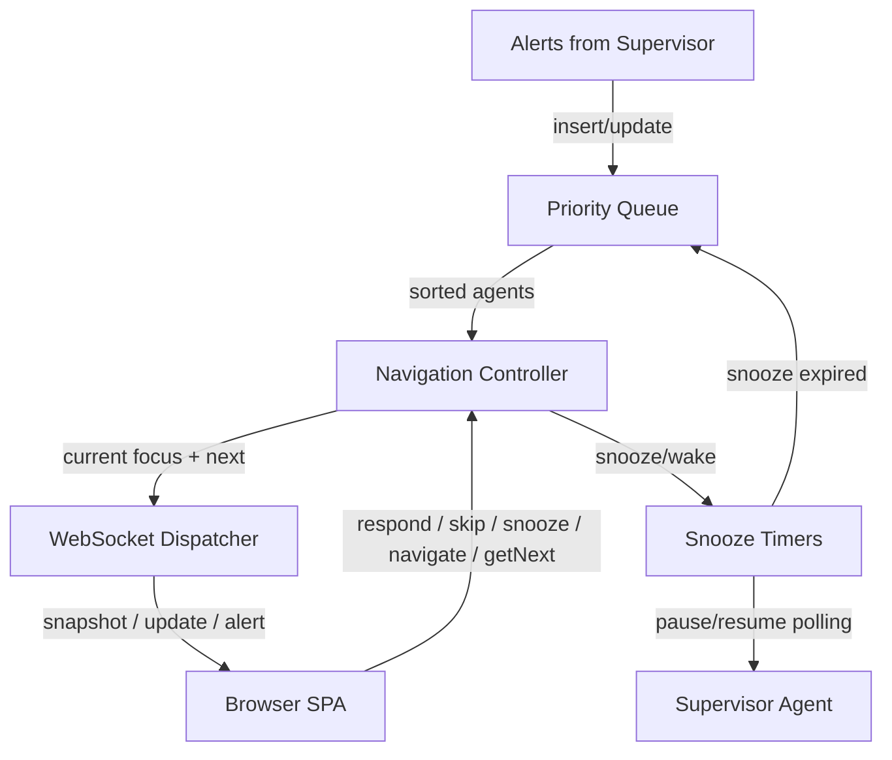

# Attention Router — Component View

## Purpose

Show the internal structure of the attention routing subsystem.

## Component Diagram

## Component Responsibility Table

| Component | Responsibility |
|---|---|
| **Priority Queue** | Maintains agents in two tiers: **active** (sorted by urgency) and **skipped** (back of queue, FIFO). Inserts/removes as alerts arrive or resolve. Skipped agents only surface when active tier is empty |
| **Navigation Controller** | Tracks which agent the developer is viewing. Handles `respond` (send + remove from queue + advance), `skip` (move to back + advance), `snooze` (remove from queue + start timer + advance), `getNext`, and `navigate` |
| **Snooze Timers** | Manages `(agentId, expiresAt, reason?)` tuples. On expiry, restores the agent to the active queue via `restoreExpiredSnoozes()`. On agent completion, cancels the timer |
| **WebSocket Dispatcher** | Serializes state into WS messages (`snapshot`, `update`, `alert`). Handles inbound client messages |

## Interaction And Ownership Notes

- The priority queue is ephemeral (in-memory). It rebuilds from current agent states on startup.
- Auto-advance after any action: when the Navigation Controller processes `respond`, `skip`, or `snooze`, it automatically calls `getNext` and pushes the result to the SPA.
- **Skip monitoring:** skipped agents are still monitored by the supervisor. If their state changes (new anomaly, completion, error), they exit the skipped tier and re-enter the active tier at normal priority.
- **Snooze monitoring:** snoozed agents are removed from the active queue. Process exit is still detected by the adapter. On snooze expiry, `restoreExpiredSnoozes()` moves the agent back to the active queue if an anomaly is still present.
- **Future learning value:** skip and snooze actions produce implicit pairwise preferences ("user chose agent Y over agent X") that could feed a future priority learning system. This is a natural consequence of Option C's deprioritization model — no extra instrumentation needed.

## Evidence

- `docs/features.md:71-72` — F2.8 urgency ranking
- `docs/features.md:81-84` — F3.3 auto-advance, F3.4 all-clear
- `docs/architecture.md:205-238` — ServerMessage / ClientMessage types

## Observed Smells

None.
