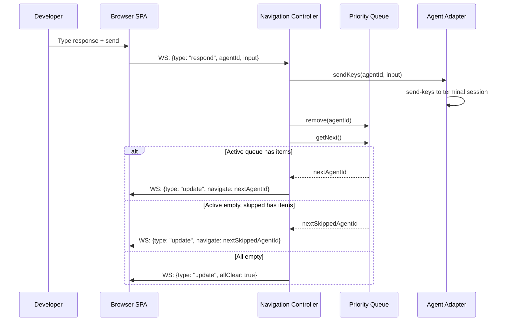
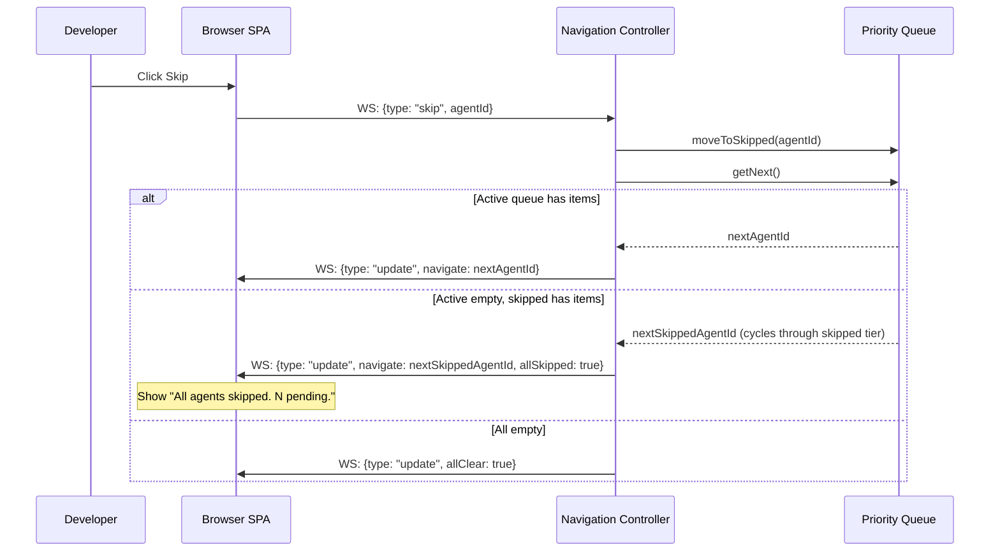
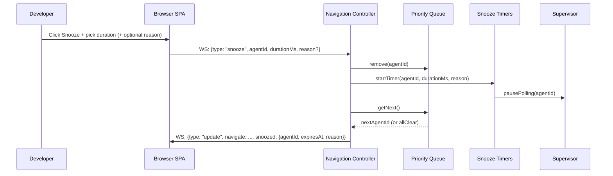
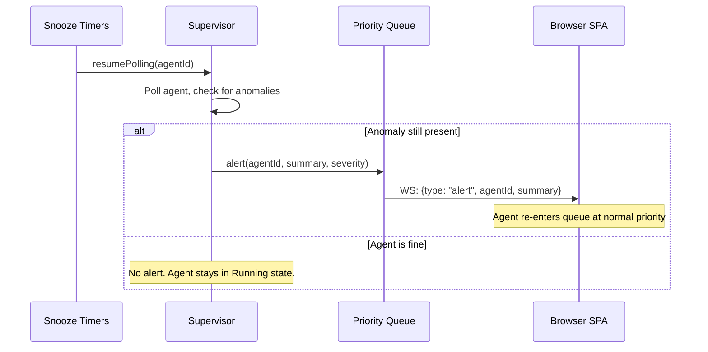
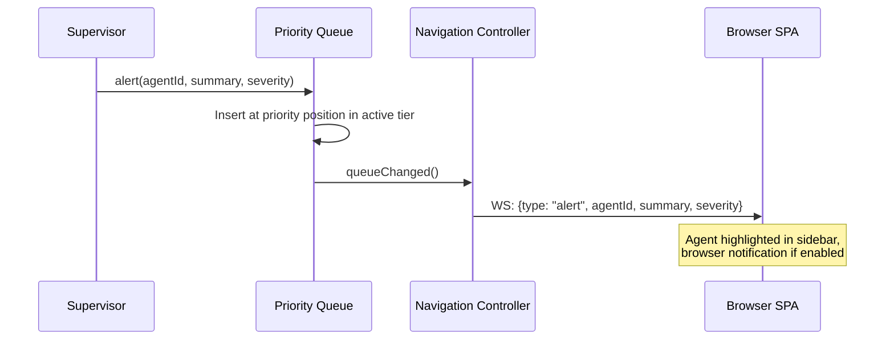
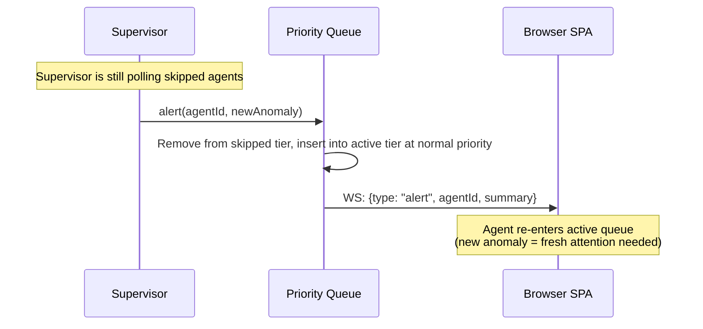
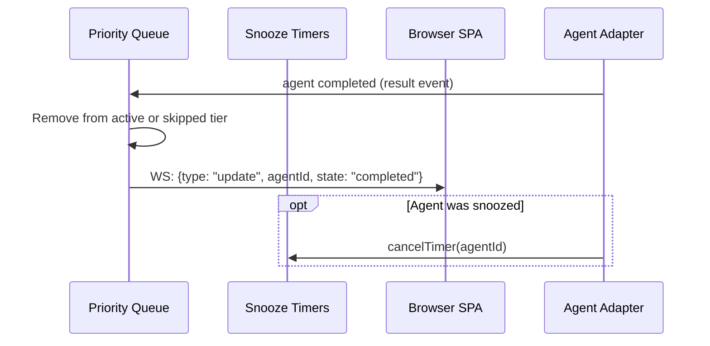

# Attention Router — Key Sequences

## Purpose

Show the "respond, skip, snooze & advance" loop and the "all clear" / "all skipped" detection.

## Primary Sequence: Respond & Auto-Advance

## Sequence: Skip & Auto-Advance

## Sequence: Snooze & Auto-Advance

## Sequence: Snooze Expires

## Sequence: Alert Arrives While Developer Is Idle

## Variant: Skipped Agent's State Changes

## Variant: Agent Completes Before Developer Responds (Issue #3)

## Failure Or Recovery Variant

If the developer sends a response but the terminal keystroke delivery fails (e.g., terminal session crashed), the adapter reports an error. The Navigation Controller keeps the agent in the queue (now as `errored`) and does not auto-advance.

## Handoff Notes

- The attention router does not block on the keystroke delivery completing. It fires the `sendKeys` and immediately advances. The adapter handles the delivery.
- **~~Resume serialization~~ (issue #9, resolved by ADR-007):** No longer applicable. Input is delivered via terminal keystrokes (send-keys) — no subprocess spawning, no serialization needed.
- **Waiting for input (ADR-007, replaces issue #3):** agents natively block in interactive mode. The alert ("agent asks: ...") is actionable — the developer responds via terminal keystrokes. If the agent completes while waiting, the router handles the stale alert gracefully — remove from queue, show "completed" status.
- **Skip vs Snooze monitoring:** skipped agents are still polled by the supervisor (state changes un-skip them). Snoozed agents are NOT polled (saves resources; timer handles re-entry).

## Evidence

- `docs/features.md:76-85` — F3 features
- `docs/architecture.md:170-183` — WebSocket protocol

## Observed Smells

None.
