# Attention Router — State Machines

## Purpose

The attention router has a routing mode state, and the priority queue has ordering rules with two tiers.

## State Diagram: Router Mode

```mermaid
stateDiagram-v2
  [*] --> AllClear: No alerts pending

  AllClear --> Routing: First alert arrives
  Routing --> Routing: New alert / respond / skip / snooze + advance
  Routing --> Routing: Last active alert skipped; skipped entry can cycle back
  Routing --> AllClear: Last alert resolved or snoozed, queue empty

  AllClear --> [*]
```



**Implemented modes:**
- **AllClear** — no agents need attention. Nothing in active queue, nothing skipped. `AttentionQueue.isAllClear()` at `src/core/attention-queue.ts:178` is the code-level equivalent.
- **Routing** — at least one agent in the active tier needs attention.

> Updated 2026-05-09: `AllSkipped` is not an implemented mode. `AttentionQueue.next()` sorts skipped entries after active entries and returns a skipped entry when all queued entries are skipped. There is no `isAllSkipped()` predicate and no FIFO skipped-tier timestamp.

## Priority Queue: Two-Tier Model

The queue has two tiers: **active** and **skipped**.

```
Active tier (sorted by AnomalySeverity):
  1. critical  (e.g., permission_blocked — agent is blocked, needs immediate response)
  2. warning   (e.g., repeated_error, needs_input)
  3. info      (informational anomalies)

Skipped tier:
  Agents the developer has seen and deferred; sorted by the same severity comparator after active entries.
```

> Updated 2026-03-29: Priority sorting uses `AnomalySeverity` (`critical > warning > info`) via `SEVERITY_ORDER` in `attention-queue.ts`, not anomaly-type-based ordering.

**Rules:**
- `getNext()` always returns from the active tier first.
- When the active tier is empty, `getNext()` returns skipped entries ordered by severity.
- Only agents with active anomalies appear in either tier. Agents without anomalies are not queued.
- Within the same severity level, insertion order is preserved by JavaScript's stable array sort in current runtimes; no explicit FIFO timestamp is stored.

**Note on needs_input (replaces WaitingForInput):** In interactive mode, agents natively block when waiting for input. The supervisor detects this via the `needs_input` anomaly type and raises an alert. `WaitingForInput` was originally designed as a first-class `AgentStatus` state but is not in the current `AgentStatus` union — the `needs_input` anomaly serves this role instead.

## Skip Behavior

| Aspect | Behavior |
|---|---|
| Queue effect | Mark the existing queue entry as `skipped: true`; skipped entries sort after active entries |
| Monitoring | **Continues** — supervisor keeps polling the agent |
| State change while skipped | New anomaly or status change → remove from skipped, re-enter active tier at normal priority (skip resets) |
| Agent completes while skipped | Remove from skipped tier |
| All agents skipped | `next()` returns a skipped entry because skipped entries remain in the queue |

## Snooze Behavior

| Aspect | Behavior |
|---|---|
| Queue effect | Remove from queue entirely; agent moved to `snoozed` map in attention-queue.ts |
| Monitoring | Hook events and watchdog verdicts continue to be processed; `enqueue()` updates the stored snoozed anomaly without moving it into the active queue |
| Process exit while snoozed | Detected by adapter. Snooze timer cancelled. Agent marked completed |
| Timer expiry | `restoreExpiredSnoozes()` moves agent back to active queue if anomaly is still present. If not, agent remains unqueued |
| Manual wake (updated 2026-04-10) | Developer can cancel a snooze via the `cancelSnooze` WebSocket message (`src/shared/contracts/messages.ts:87`), handled in `src/server/ws.ts:375` → `AttentionQueue.cancelSnooze(agentId)` (`src/core/attention-queue.ts:74`). If the anomaly is still present the agent returns to the active tier immediately |
| Optional reason | Stored for context when snooze expires (e.g., "waiting for CI pipeline") |

## Developer Actions Summary

| Action | Queue effect | Monitoring effect | Auto-advance? | When it resurfaces |
|---|---|---|---|---|
| **Respond** | Remove from queue | N/A (resume sent) | Yes | Only if new anomaly detected |
| **Skip** | Move to skipped tier | Continues (state change un-skips) | Yes | After active tier empty, or on state change |
| **Snooze** | Remove from queue | Paused until timer expires | Yes | After timer expires + anomaly still present |

## Transition Ownership

| Transition | Trigger |
|---|---|
| AllClear -> Routing | Supervisor emits first alert |
| Routing -> Routing | New alert, or developer acts (respond/skip/snooze) + advance |
| Routing -> AllClear | Last alert resolved or snoozed, queues empty |

## Edge-Case Transitions

| Edge Case | Resolution |
|---|---|
| Multiple alerts arrive simultaneously | All inserted into active tier; highest priority shown first |
| Developer manually navigates to a non-queued agent | Navigation Controller allows it; auto-advance returns to the queue |
| Agent self-resolves while developer is viewing it | Remove from queue. Auto-advance to next |
| Developer skips all agents | Skipped entries remain queued; `next()` cycles to a skipped entry because the active tier is empty |
| Developer skips the same agent repeatedly | Allowed in V1. Deferred: automatic dampening (e.g., escalating skip → auto-snooze) |

## Future: Learning From Skip/Snooze Patterns

Each skip produces an implicit pairwise preference: "developer chose to attend agent Y instead of agent X." Over time, these pairs could train a priority model that surfaces agents in the order the developer naturally prefers. This is a natural property of the deprioritization approach (Option C) — no extra instrumentation needed beyond logging the skip/snooze events.

## Evidence

- `docs/features.md:71-72` — F2.8 priority ranking
- `docs/features.md:81-84` — F3.3 auto-advance, F3.4 all-clear

## Observed Smells

None. The two-tier queue is simple and deterministic. A separate "all skipped" UI mode would require additional state that does not exist in `AttentionQueue` today.
