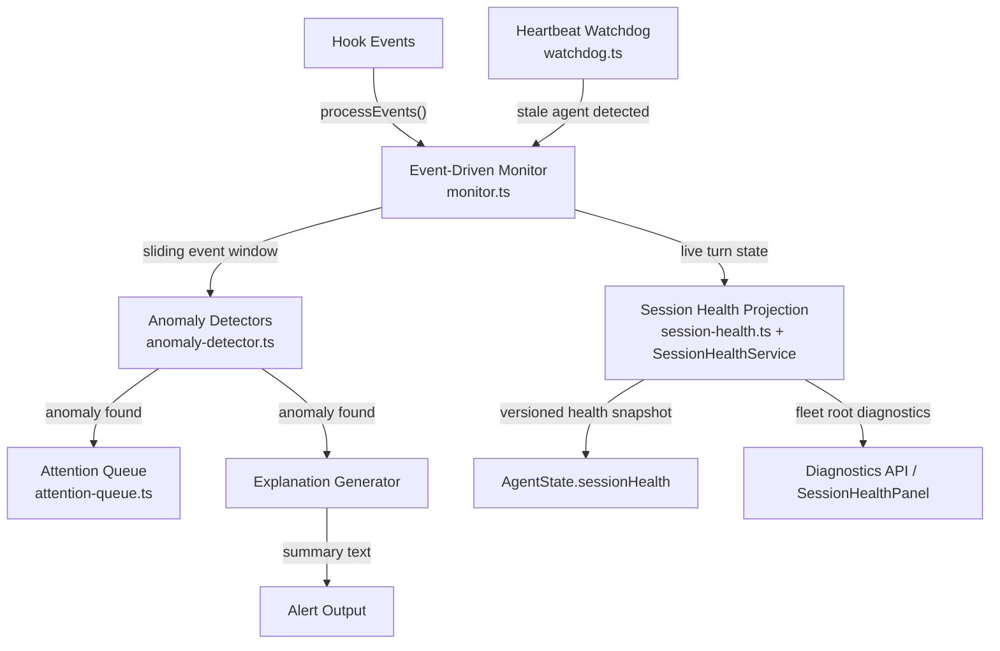

# Supervisor Agent — Component View

## Purpose

Show the internal modules of the supervisor agent subsystem.

## Component Diagram

> Updated 2026-03-29: Replaced "Round-Robin Poller" with event-driven model to match implementation.

## Component Responsibility Table

| Component | Responsibility |
|---|---|
| **Event-Driven Monitor** (`monitor.ts`) | Orchestrates the supervisor: receives hook events, maintains per-agent sliding event windows, invokes detectors, manages agent registration/unregistration. Builds snapshots for the frontend |
| **Anomaly Detectors** (`anomaly-detector.ts`) | Pure-function pattern matchers for implemented event-derived anomalies: `needs_input` (Stop / AskUserQuestion), `permission_blocked`, `merge_conflict`, `repeated_error`, and `api_error`. Each reads recent events, returns an `Anomaly` or nothing |
| **Budget Checker** (`budget-checker.ts`) | Emits `budget_exceeded` anomalies when a session crosses configured token/cost thresholds. Sits alongside `anomaly-detector.ts` in the detection stage |
| **Snooze Suppression** (`snooze-suppression.ts`) | Gates re-alert emission so a snoozed agent does not re-enter the attention queue with the same anomaly before snooze expiry |
| **Attention Queue** (`attention-queue.ts`) | Priority queue with active/skipped tiers, snooze management, auto-advance. Sorts by `AnomalySeverity` (`critical > warning > info`) |
| **Explanation Generator** | Fills templates with context from the anomaly: tool name, count, error message, duration |
| **Heartbeat Watchdog** (`watchdog.ts`) | Detects agents that have stopped producing events (stale heartbeat). Fires callback when an agent exceeds the heartbeat threshold |
| **Session Health Projection** (`session-health.ts`, `session-health-service.ts`) | Joins PTY/ring, hook, transcript, task-turn, dtach attach, browser bridge, and restart signals into explainable per-session classifications; groups correlated stalls into one fleet diagnostic for the diagnostics endpoint and agent snapshots |
| **Alert Output** | The `Alert` object emitted to the attention-router: `{agentId, summary, details, severity}`. Enters the priority queue |

## Interaction And Ownership Notes

- Detectors are pure functions in `anomaly-detector.ts`, co-located with tests. The SKILL.md approach (community-contributable patterns) remains a V2 direction.
- Agent state is expressed through `AgentState.anomaly` (presence/type of current anomaly) and `AgentState.snoozedUntil`, not through `AgentStatus` transitions. The `AgentStatus` type in `types.ts` serves as metadata on persisted sessions only.
- **Alerts:** Detectors, watchdog, and budget checker produce alerts when they detect an actionable condition (needs input, permission block, repeated error, merge conflict, stale/hook-disconnected state, API error, budget exceeded). Alerts enter the priority queue. The `needs_input` anomaly type serves the role of the documented `WaitingForInput` state.
- **Event-driven monitoring:** `HookFileWatcher` uses `fs.watch()` on per-agent JSONL hook files. Periodic lifecycle timers apply watchdog verdicts and reconcile `LocalDtachBackend` liveness. No round-robin terminal-output polling.
- **Parallel to this subsystem — the task coordinator (added 2026-08-13 note):** a *second*, separate detection pipeline in `src/server/coordinator/` (`detectors.ts`, `suppression-store.ts`) operates across **tasks** rather than per-agent events. Its detectors — `declared_edge`, `stale`, `duplicate`, `done_not_cleared` — produce `CoordinatorFinding`s surfaced via the dedicated `coordinator.snapshot` WS message and `CoordinatorSurfaces.tsx`, with its own durable suppression store. It is *not* part of the supervisor-agent subsystem and does not flow through `monitor.ts`/`anomaly-detector.ts`; a reader tracing "what decides what surfaces to the user" must account for both pipelines. (No dedicated subsystem model exists for it yet.)

## Evidence

- `docs/architecture.md:78-103` — anomaly detection patterns as skill files
- `docs/architecture.md:36-66` — supervisor behavior description

## Observed Smells

None at this level.
