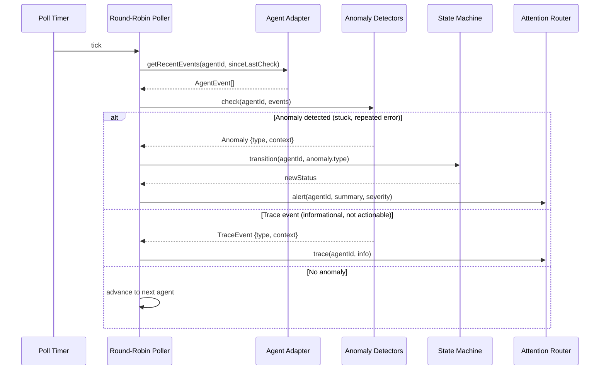
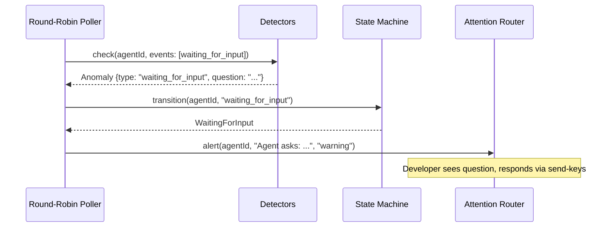

# Supervisor Agent — Key Sequences

## Purpose

Show how the supervisor analyzes agent execution traces and decides what warrants developer attention.

## Primary Sequence: Round-Robin Check Cycle

## Variant: Agent Waiting for Input (ADR-007)

In interactive mode (ADR-007), when the agent needs developer input it natively blocks. The supervisor detects the "waiting for input" state via terminal output analysis and raises an alert. The developer responds via terminal keystrokes (send-keys), and the agent resumes immediately.

This is significantly simpler than the previous approach (issue #3) where `AskUserQuestion` was non-blocking in headless mode and required a behavioral contract. With managed terminal sessions, blocking is native and the "waiting for input" state is directly observable.

## Failure Or Recovery Variant

If an agent's process exits unexpectedly in the terminal session, the adapter detects the process exit and emits an `error` event. The poller picks this up on the next cycle and transitions the agent to `Errored`.

## Handoff Notes

- The supervisor never directly communicates with the SPA. It hands alerts and trace events to the attention-router, which decides what to show the developer.
- The polling interval is configurable (default: a few seconds). Each tick checks one agent and advances to the next.
- **Alerts:** With ADR-007, most supervisor outputs are alerts (waiting for input, stuck, errored). The previous "trace event" concept for non-blocking questions is no longer needed — interactive mode makes blocking native.

## Evidence

- `docs/architecture.md:55-65` — round-robin monitoring policy
- `docs/architecture.md:68-73` — tier 1 rule-based detection

## Observed Smells

None.
