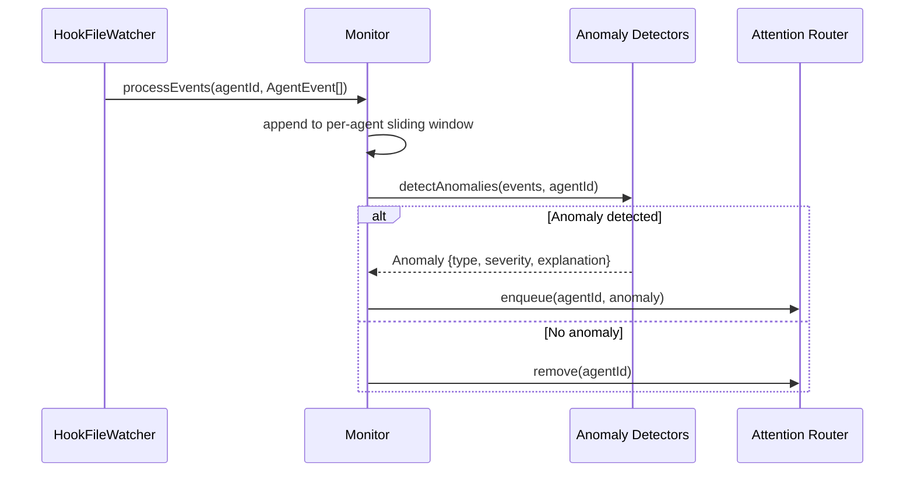
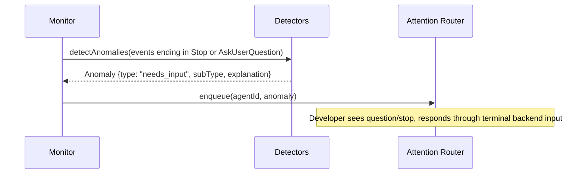

# Supervisor Agent — Key Sequences

## Purpose

Show how the supervisor analyzes agent execution traces and decides what warrants developer attention.

## Primary Sequence: Event-Driven Detection

## Variant: Agent Waiting for Input (ADR-007)

In interactive mode (ADR-007), when the agent needs developer input it natively blocks or emits an AskUserQuestion tool call. The supervisor represents this as a `needs_input` anomaly, not a live `AgentStatus` transition. The developer responds through the terminal backend's byte-write path, and the agent resumes immediately.

This is significantly simpler than the previous approach (issue #3) where `AskUserQuestion` was non-blocking in headless mode and required a behavioral contract. With managed terminal sessions, blocking is native, and Kookr treats Stop / AskUserQuestion as actionable `needs_input` signals.

## Failure Or Recovery Variant

If an agent's process exits unexpectedly in the terminal session, lifecycle/reconciliation code updates session metadata and may transition the task to `terminated` if all sessions are dead without user acknowledgement. The supervisor unregisters the agent and purges any queued/snoozed finding.

## Handoff Notes

- The supervisor never directly communicates with the SPA. It enqueues anomalies in the attention-router; the server/websocket layer serializes snapshots and alerts.
- Hook processing is event-driven. Periodic lifecycle timers still run watchdog/liveness checks, but there is no round-robin terminal-output poller.
- **Alerts:** With ADR-007, most supervisor outputs are anomalies (`needs_input`, `permission_blocked`, `repeated_error`, `merge_conflict`, liveness findings, etc.). The previous "trace event" concept for non-blocking questions is no longer needed — interactive mode makes blocking native.

## Evidence

- `src/core/monitor.ts` — event-window and queue ownership
- `src/core/anomaly-detector.ts` — event-derived anomaly detection
- `src/core/watchdog.ts` — lifecycle/liveness verdicts
- `docs/architecture.md:68-73` — tier 1 rule-based detection

## Observed Smells

None.
