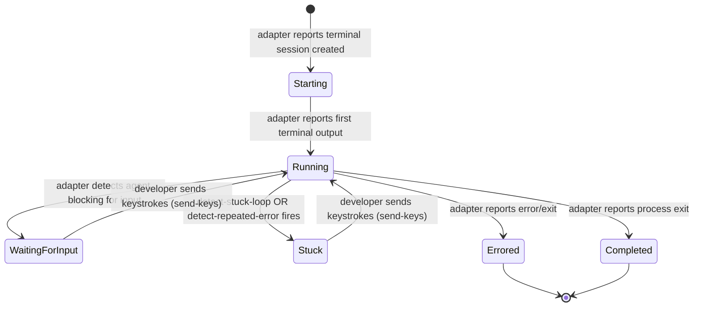

# Supervisor Agent — State Machines

## Purpose

Detail the agent status state machine owned by the supervisor.

## State Diagram

The supervisor tracks agent status based on the full execution trace from terminal output (ADR-007). In interactive mode, `WaitingForInput` is a first-class state — the agent natively blocks when it needs developer input.

**Note:** `WaitingForInput` is a first-class state (ADR-007). In interactive mode, the agent natively blocks when it needs developer input. The supervisor detects this via terminal output analysis and raises an alert. This replaces the previous trace-event approach where `AskUserQuestion` was non-blocking in headless mode (issue #3, resolved).

**Implementation note (updated 2026-03-31):** The `AgentStatus` type exists in `src/core/types.ts` but is **not used as a live state machine** in the current implementation. The supervisor's actual agent state is expressed through `AgentState.anomaly` in `monitor.ts` (presence/absence and type of the current anomaly), `AgentState.snoozedUntil` (set via `AttentionQueue.getSnoozedUntil()`), and `SessionInfo.lastStatus` in `tasks.ts` (used only for terminal session states). `WaitingForInput` is not a member of the `AgentStatus` union — the `needs_input` anomaly type serves this role instead. `Snoozed` is tracked as a queue-level property, not as an `AgentStatus` value. The `Starting → Running` transition has no code path — agents are registered directly with the monitor. The state machine above represents the **conceptual design**; see `docs/system-models/05-state-machine-catalog.md` § Agent Session Lifecycle for the full implementation notes.

## Transition Ownership

| Transition | Detector / Source | Notes |
|---|---|---|
| -> Starting | Agent adapter (terminal session created) | Supervisor initializes agent entry |
| Starting -> Running | Agent adapter (first terminal output) | |
| Running -> WaitingForInput | `detect-waiting-for-input` | Agent natively blocks for input (interactive mode) |
| Running -> Stuck | `detect-stuck-loop` | Same tool N times without progress |
| Running -> Stuck | `detect-repeated-error` | Same error repeated without approach change |
| Running -> Errored | Agent adapter (process error/exit in terminal) | |
| Running -> Completed | Agent adapter (process exit in terminal) | |
| WaitingForInput -> Running | Agent adapter (keystrokes delivered, agent resumes) | Developer sent response via send-keys |
| Stuck -> Running | Agent adapter (keystrokes delivered, agent resumes) | Developer sent hint via send-keys |

## WaitingForInput Handling (ADR-007, replaces issue #3)

**ADR-007 simplifies this entirely.** In interactive mode, agents natively block when they need input. The supervisor detects the "waiting for input" state via terminal output analysis and transitions the agent to `WaitingForInput`. This is a first-class state, not a trace event.

The developer responds via terminal keystrokes (send-keys), and the agent resumes immediately within the same session. No session exit/resume cycle, no behavioral contract needed.

The previous approach (issue #3) where `AskUserQuestion` was non-blocking in headless mode and required agents to exit after asking is fully superseded.

## Edge-Case Transitions

| Edge Case | Resolution |
|---|---|
| Agent blocks waiting for input | Transition to WaitingForInput. Alert: "Agent asks: ..." Developer responds via send-keys |
| Agent stops looping on its own | On next poll cycle, no anomaly detected — agent stays Running |
| Developer sends input while agent is stuck (not waiting) | Input delivered via send-keys. Agent may or may not use it depending on its current state |
| Terminal output parsing ambiguity | If the parser cannot distinguish "waiting for input" from "idle processing", the supervisor may need heuristics (e.g., timeout without output change) |

## Evidence

- `docs/architecture.md:190-201` — `AgentStatus` type
- `docs/features.md:71-72` — F2.8 priority ranking
- `docs/adr/006-permission-mode-feasibility.md` — AskUserQuestion non-blocking in headless mode (superseded by ADR-007)
- `docs/adr/007-managed-terminal-sessions.md` — managed terminal sessions (ADR-007)
- GitHub issue #3 — resolved by ADR-007

## Implementation Note (Updated 2026-03-29)

The state machine above represents the **design intent**, not the current implementation. In practice, `AgentStatus` in `src/core/types.ts` is used only as persisted metadata on `SessionInfo.lastStatus`, not as a live state machine with transition logic. The supervisor's live agent state is expressed through:

- `AgentState.anomaly` (anomaly type/severity) in `src/core/monitor.ts` — replaces `Stuck`, `Errored`
- `AgentState.snoozedUntil` in `src/core/monitor.ts` — replaces `Snoozed`
- `needs_input` anomaly type in `src/core/attention-queue.ts` — replaces `WaitingForInput`

The `Starting → Running` transition has no code path; agents are registered directly as running. The `Running → WaitingForInput` and `Running → Snoozed` transitions are handled through the anomaly queue, not `AgentStatus` field updates. See `docs/system-models/05-state-machine-catalog.md` lines 125-135 for the authoritative discussion of this divergence.

## Observed Smells

The documented state machine does not match the implementation pattern. The design uses a status enum while the implementation uses a combination of anomaly presence and queue position. This is acknowledged as a design smell in the state machine catalog but does not cause correctness issues — the code's approach is functionally equivalent.
