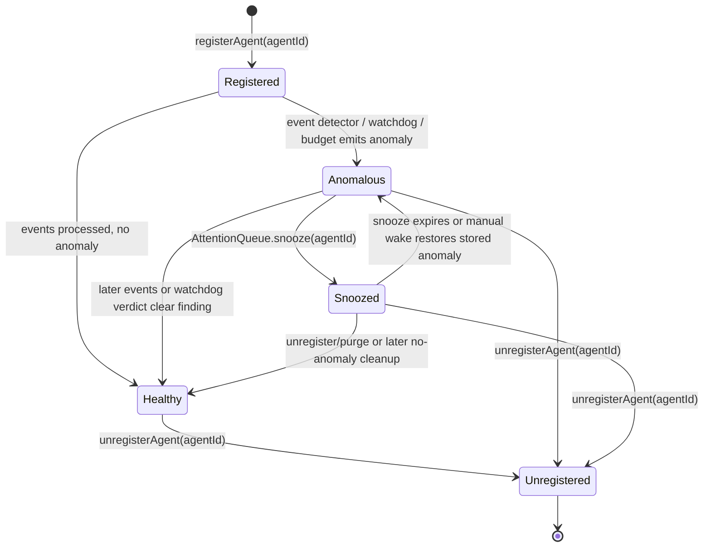

# Supervisor Agent — State Machines

## Purpose

Detail the state model the supervisor actually owns.

> Updated 2026-05-09: Replaced the old conceptual `AgentStatus` diagram with the implemented monitor/anomaly model. `AgentStatus` still exists in `src/core/types.ts`, but it is metadata on persisted sessions, not a live supervisor transition machine.

## State Diagram: Monitor Entry

## Transition Ownership

| Transition | Source | Notes |
|---|---|---|
| -> Registered | `Monitor.registerAgent()` | Clears explicit stopped state and creates an empty event window |
| Registered/Healthy -> Anomalous | `Monitor.processEvents()` + `detectAnomalies()` | Event-derived anomalies include `needs_input`, `permission_blocked`, `merge_conflict`, `repeated_error`, and `api_error` |
| Healthy -> Anomalous | `Monitor.applyWatchdogVerdict()` | Watchdog can enqueue `needs_input`, `permission_blocked`, `stale_agent`, or `hook_disconnected` |
| Healthy -> Anomalous | `BudgetChecker` via lifecycle timers | Emits `budget_exceeded` when task spend crosses its configured threshold |
| Anomalous -> Healthy | `processEvents()` with no anomaly, or non-actionable watchdog verdict with successful pane capture | Removes or purges queue entries when no event-derived anomaly remains |
| Anomalous -> Snoozed | `AttentionQueue.snooze()` | Moves stored anomaly from active entries to `snoozed` map; monitoring continues |
| Snoozed -> Anomalous | `restoreExpiredSnoozes()` / `cancelSnooze()` | Restores the stored anomaly to active queue with `skipped: false` |
| Any -> Unregistered | `Monitor.unregisterAgent()` | Deletes event window, event counters, outstanding subagent state, queued entries, and snoozes; late events are dropped via `stoppedAgents` |

## Implementation Notes

- The supervisor's live state is distributed across `Monitor.agentEvents`, derived `AgentState.anomaly`, `AttentionQueue` entries/snoozes/skips, `SnoozeSuppressionTracker`, and persisted `SessionInfo.lastStatus`.
- `WaitingForInput` is not a state. The implemented signal is `AnomalyType: 'needs_input'` with `subType: 'stop' | 'ask_user_question'`.
- `Stuck` is not a state. `stuck_loop` was removed from `AnomalyType`; the implemented related signal is `repeated_error`, with liveness issues handled by watchdog verdicts.
- `Snoozed` is queue state, not process state. The agent process keeps running and hook/watchdog processing continues.
- `SessionInfo.lastStatus` supports production values outside `AgentStatus` (`completed`, `aborted`) and is used by lifecycle/reconciliation code, not by the supervisor state machine.

## Edge-Case Transitions

| Edge Case | Resolution |
|---|---|
| Stop fires while background subagents are still running | `Monitor` suppresses `needs_input` while outstanding subagents exist, with TTL eviction for lost `SubagentStop` |
| User responds to a `needs_input` finding | `markInputReceived()` injects a synthetic `input_received` event so the detector clears the finding before the next real hook event |
| Stale watchdog finding becomes healthy | `applyWatchdogVerdict()` purges queue-only watchdog anomalies only when pane capture succeeded and no event-derived anomaly remains |
| Late hook event after explicit stop | Dropped by `stoppedAgents` guard so stopped sessions are not resurrected |

## Evidence

- `src/core/monitor.ts` — implemented state owner
- `src/core/anomaly-detector.ts` — event-derived anomaly detection
- `src/core/attention-queue.ts` — active/skipped/snoozed queue state
- `src/core/watchdog.ts` — liveness verdict union
- `src/core/tasks.ts` and `src/core/types.ts` — persisted session/task metadata types

## Observed Smells

The `AgentStatus` type name still suggests a live state machine even though it is persisted session metadata. This is an acknowledged naming smell; behavior is otherwise explicit in `Monitor`, `AttentionQueue`, and lifecycle/reconciliation code.
