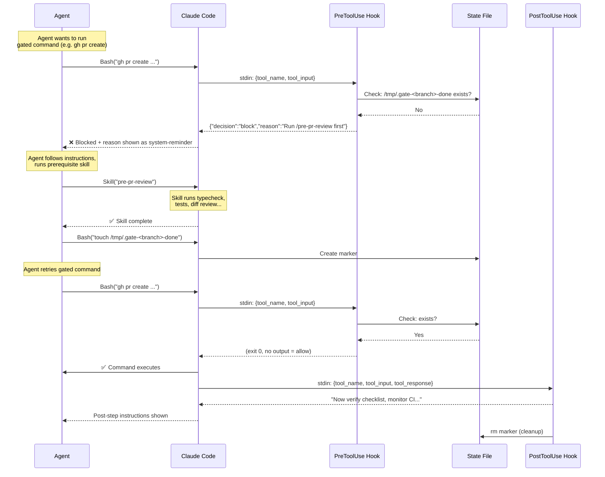
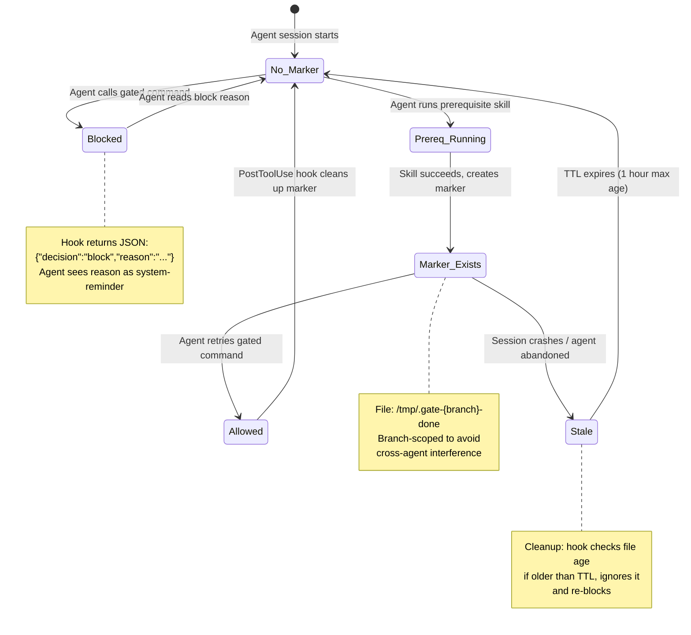
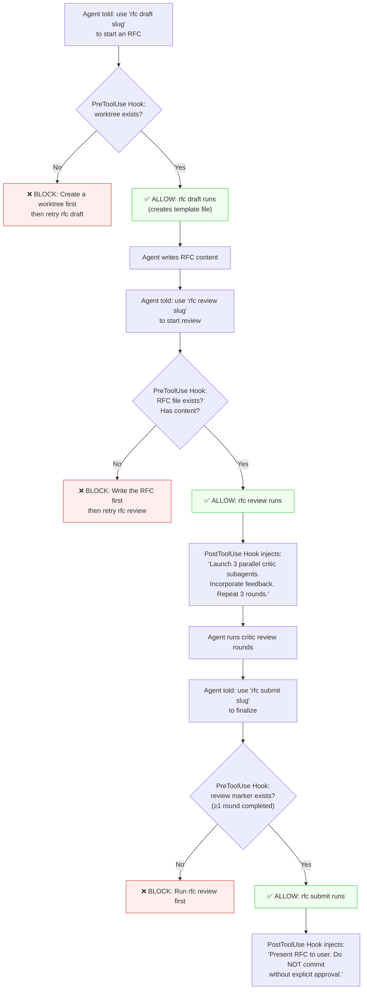

# Hook-Driven Workflow Enforcement

## Core Insight

There are two fundamentally different ways to influence agent behavior:

| Mechanism | Determinism | How it works | Failure mode |
|-----------|-------------|--------------|--------------|
| CLAUDE.md / memory / skills | **Non-deterministic** | Agent reads instructions, may or may not follow | Agent skips, forgets, or deprioritizes |
| Hooks (PreToolUse / PostToolUse) | **Deterministic** | System intercepts tool calls, blocks or injects feedback | Cannot be bypassed — the hook runs regardless of agent intent |

**Rule of thumb:** If an agent must *always* do X before Y, use a hook. If it *should* do X, use CLAUDE.md. Hooks are for invariants, instructions are for guidelines.

## How It Works



## State Lifecycle



## Pattern 1: Block-Then-Instruct

The most powerful pattern for enforcing pre-step workflows.

### Critical: Hook Blocking API

Two JSON formats are validated for blocking PreToolUse commands. Both exit 0.

```bash
# ✅ Format A — short form (used by oss-contribution-gate)
echo '{"decision":"block","reason":"Must run prereq first."}'
exit 0

# ✅ Format B — hookSpecificOutput (used by pr-workflow-gate)
echo '{"hookSpecificOutput":{"hookEventName":"PreToolUse","permissionDecision":"deny","permissionDecisionReason":"Must run prereq first."}}'
exit 0

# ✅ Allow — no output, exit 0
exit 0

# ❌ WRONG — exit non-zero causes a hook error, not a clean block
echo "Must run prereq first."
exit 2
```

Both formats produce the same result: the command is blocked and the reason text appears to the agent as a `<system-reminder>` that cannot be ignored.

Empirically validated on 2026-04-01 (both formats tested live).

### Implementation skeleton

```json
// In settings.json hooks section
{
  "hooks": {
    "PreToolUse": [
      {
        "matcher": "Bash",
        "hooks": [{ "type": "command", "command": "/path/to/gate.sh" }]
      }
    ],
    "PostToolUse": [
      {
        "matcher": "Bash",
        "hooks": [{ "type": "command", "command": "/path/to/post.sh" }]
      }
    ]
  }
}
```

### State marker management

- **Create marker**: The pre-step skill/command creates it on success: `touch /tmp/.gate-$(git branch --show-current)-done`
- **Scope per branch**: Include branch name to avoid cross-agent interference
- **Cleanup**: Remove after command succeeds (in PostToolUse hook): `rm -f "$STATE_FILE"`
- **TTL**: Ignore markers older than 1 hour to prevent stale state from crashed sessions:
  ```bash
  if [ -f "$STATE_FILE" ]; then
    AGE=$(( $(date +%s) - $(stat -c %Y "$STATE_FILE" 2>/dev/null || echo 0) ))
    if [ "$AGE" -gt 3600 ]; then
      rm -f "$STATE_FILE"  # stale — re-gate
    else
      exit 0  # valid — allow
    fi
  fi
  ```

---

## Example 1: Pre-PR Review Gate (Simple)

The most common use case — ensure agents run quality checks before creating pull requests.

**Problem**: Agents skip type-checking, tests, and diff review before `gh pr create` despite CLAUDE.md saying to do it.

**Solution**: A PreToolUse hook blocks `gh pr create` until the `/pre-pr-review` skill has run.

### Hook script: `~/.claude/hooks/pr-review-gate.sh`

```bash
#!/bin/bash
# PreToolUse hook — blocks gh pr create until pre-PR review is done
set -uo pipefail

INPUT=$(cat)
COMMAND=$(echo "$INPUT" | jq -r '.tool_input.command // empty' 2>/dev/null) || exit 0

# Only intercept gh pr create
echo "$COMMAND" | grep -qE '\bgh\s+pr\s+create\b' || exit 0

# State marker scoped to branch
CWD=$(echo "$INPUT" | jq -r '.cwd // empty' 2>/dev/null) || exit 0
BRANCH=$(git -C "$CWD" branch --show-current 2>/dev/null) || exit 0
STATE_FILE="/tmp/.pr-gate-${BRANCH}-pre-done"

# Check marker with TTL (1 hour)
if [ -f "$STATE_FILE" ]; then
  AGE=$(( $(date +%s) - $(stat -c %Y "$STATE_FILE" 2>/dev/null || echo 0) ))
  [ "$AGE" -le 3600 ] && exit 0  # valid marker — allow
  rm -f "$STATE_FILE"  # stale marker — re-gate
fi

# Block with instructions
cat <<'EOF'
{"decision":"block","reason":"Pre-PR review required. Run the /pre-pr-review skill first (type-check, tests, diff review, secret scan). The skill will create the gate marker when it passes. Then retry gh pr create."}
EOF
exit 0
```

### Post-hook script: `~/.claude/hooks/pr-post-checklist.sh`

```bash
#!/bin/bash
# PostToolUse hook — injects post-PR instructions after successful creation
INPUT=$(cat)
COMMAND=$(echo "$INPUT" | jq -r '.tool_input.command // empty' 2>/dev/null) || exit 0
echo "$COMMAND" | grep -qE '\bgh\s+pr\s+create\b' || exit 0

# Clean up gate marker
CWD=$(echo "$INPUT" | jq -r '.cwd // empty' 2>/dev/null) || exit 0
BRANCH=$(git -C "$CWD" branch --show-current 2>/dev/null) || true
rm -f "/tmp/.pr-gate-${BRANCH}-pre-done" 2>/dev/null

# Inject follow-up instructions (stdout shown to agent)
echo "PR created. Now: (1) verify all checklist items are checked, (2) wait for first CI results, (3) if OSS — check bot comments for CLA/triagebot warnings and fix immediately."
exit 0
```

### Settings entry

```json
{
  "PreToolUse": [
    {
      "matcher": "Bash",
      "hooks": [{ "type": "command", "command": "~/.claude/hooks/pr-review-gate.sh" }]
    }
  ],
  "PostToolUse": [
    {
      "matcher": "Bash",
      "hooks": [{ "type": "command", "command": "~/.claude/hooks/pr-post-checklist.sh" }]
    }
  ]
}
```

### What the agent experiences

```
Agent: Bash("gh pr create --title 'Fix widget' --body-file .tmp/pr-body.md")
  → ❌ BLOCKED: "Pre-PR review required. Run /pre-pr-review first..."

Agent: Skill("pre-pr-review")          # runs typecheck, tests, diff review
  → ✅ All checks passed
  → touch /tmp/.pr-gate-fix-widget-pre-done

Agent: Bash("gh pr create --title 'Fix widget' --body-file .tmp/pr-body.md")
  → ✅ PR created: https://github.com/org/repo/pull/42
  → "PR created. Now: verify checklist, wait for CI, check bot comments..."
  → rm /tmp/.pr-gate-fix-widget-pre-done
```

---

## Example 2: RFC Lifecycle with CLI Command Surface (Advanced)

A multi-stage workflow where each stage has its own gate. Uses custom CLI commands as hookable surfaces.

**Problem**: RFC drafting has multiple stages (draft → review → revise → present) but agents jump straight to committing without iterative critic review. There's no natural command to intercept — agents just use `Write` and `git commit`.

**Solution**: Create `rfc` CLI commands that agents are told to use. Each command is a thin wrapper — the hooks enforce the real workflow.



### CLI commands: `~/.local/bin/rfc`

```bash
#!/bin/bash
# Thin CLI surface — real enforcement is in hooks, real work is done by the agent
SLUG="$2"
RFC_DIR="docs/rfc"

case "$1" in
  draft)
    # Create template if it doesn't exist
    FILE="$RFC_DIR/rfc-${SLUG}.md"
    if [ ! -f "$FILE" ]; then
      mkdir -p "$RFC_DIR"
      cat > "$FILE" <<TEMPLATE
# RFC: ${SLUG}

**Status**: Draft
**Author**: $(git config user.name)
**Date**: $(date +%Y-%m-%d)

## Problem

## Proposed Solution

## Alternatives Considered

## Open Questions
TEMPLATE
      echo "Created $FILE"
    else
      echo "RFC already exists: $FILE"
    fi
    ;;
  review)
    echo "RFC review cycle starting for: rfc-${SLUG}.md"
    # Marker: review was initiated (hook will inject critic instructions)
    touch "/tmp/.rfc-${SLUG}-reviewed"
    ;;
  submit)
    echo "RFC ready for presentation: rfc-${SLUG}.md"
    ;;
  *)
    echo "Usage: rfc {draft|review|submit} <slug>"
    exit 1
    ;;
esac
```

### Hook script: `~/.claude/hooks/rfc-gate.sh`

```bash
#!/bin/bash
# PreToolUse hook — enforces RFC workflow stages
set -uo pipefail

INPUT=$(cat)
COMMAND=$(echo "$INPUT" | jq -r '.tool_input.command // empty' 2>/dev/null) || exit 0

# Only intercept rfc commands
echo "$COMMAND" | grep -qE '^\s*rfc\s+(draft|review|submit)\b' || exit 0

SUBCOMMAND=$(echo "$COMMAND" | grep -oP '(?<=rfc\s)(draft|review|submit)')
SLUG=$(echo "$COMMAND" | grep -oP '(?<='"$SUBCOMMAND"'\s)\S+')
CWD=$(echo "$INPUT" | jq -r '.cwd // empty' 2>/dev/null) || exit 0

case "$SUBCOMMAND" in
  draft)
    # Gate: must be in a worktree (not main checkout)
    if ! git -C "$CWD" rev-parse --is-inside-work-tree &>/dev/null; then
      exit 0  # not in git — allow (edge case)
    fi
    TOPLEVEL=$(git -C "$CWD" rev-parse --show-toplevel 2>/dev/null)
    if [ -z "$(git -C "$CWD" worktree list --porcelain 2>/dev/null | grep -c 'worktree')" ]; then
      echo '{"decision":"block","reason":"Create a git worktree before drafting an RFC. Run: git worktree add .claude/worktrees/rfc-'"$SLUG"' -b worktree-rfc-'"$SLUG"'. Then cd into it and retry."}'
      exit 0
    fi
    ;;
  review)
    # Gate: RFC file must exist and have content beyond template
    RFC_FILE="$CWD/docs/rfc/rfc-${SLUG}.md"
    if [ ! -f "$RFC_FILE" ]; then
      echo '{"decision":"block","reason":"RFC file not found at docs/rfc/rfc-'"$SLUG"'.md. Run `rfc draft '"$SLUG"'` first to create it, then write the content."}'
      exit 0
    fi
    LINES=$(wc -l < "$RFC_FILE")
    if [ "$LINES" -lt 20 ]; then
      echo '{"decision":"block","reason":"RFC is too short ('"$LINES"' lines). Write substantive content in all sections before starting review. Aim for at least 30 lines."}'
      exit 0
    fi
    ;;
  submit)
    # Gate: review must have been run at least once
    if [ ! -f "/tmp/.rfc-${SLUG}-reviewed" ]; then
      echo '{"decision":"block","reason":"RFC has not been reviewed. Run `rfc review '"$SLUG"'` first to trigger critic subagent review (3 rounds). Then retry submit."}'
      exit 0
    fi
    ;;
esac

exit 0  # allow
```

### Post-hook script: `~/.claude/hooks/rfc-post.sh`

```bash
#!/bin/bash
# PostToolUse hook — injects stage-specific follow-up instructions
INPUT=$(cat)
COMMAND=$(echo "$INPUT" | jq -r '.tool_input.command // empty' 2>/dev/null) || exit 0
echo "$COMMAND" | grep -qE '^\s*rfc\s+(draft|review|submit)\b' || exit 0

SUBCOMMAND=$(echo "$COMMAND" | grep -oP '(?<=rfc\s)(draft|review|submit)')

case "$SUBCOMMAND" in
  draft)
    echo "RFC template created. Now write substantive content in every section. When done, run \`rfc review <slug>\` to start the critic review cycle."
    ;;
  review)
    echo "Review cycle started. Launch 3 parallel critic subagents (boundary-critic, design-minimalist, delivery-pragmatist). Incorporate their feedback. Repeat for 3 rounds total. When satisfied, run \`rfc submit <slug>\`."
    ;;
  submit)
    echo "RFC is ready. Present the final RFC to the user and wait for explicit approval before committing or implementing. Do NOT auto-commit."
    # Clean up all markers for this slug
    SLUG=$(echo "$COMMAND" | grep -oP '(?<=submit\s)\S+')
    rm -f "/tmp/.rfc-${SLUG}-reviewed" 2>/dev/null
    ;;
esac
exit 0
```

### What the agent experiences

```
Agent: Bash("rfc draft input-guard")
  → [if not in worktree] ❌ BLOCK: "Create a worktree first..."
  → [in worktree] ✅ "Created docs/rfc/rfc-input-guard.md"
  → PostToolUse: "Now write substantive content. When done, run rfc review..."

  (Agent writes the RFC)

Agent: Bash("rfc review input-guard")
  → [if RFC < 20 lines] ❌ BLOCK: "RFC too short, write more content first"
  → [if RFC ready] ✅ "Review cycle starting"
  → PostToolUse: "Launch 3 parallel critics. 3 rounds. Then rfc submit..."

  (Agent runs 3 critic rounds)

Agent: Bash("rfc submit input-guard")
  → [if no review marker] ❌ BLOCK: "Run rfc review first"
  → [if reviewed] ✅ "RFC ready for presentation"
  → PostToolUse: "Present to user. Do NOT commit without approval."
  → Cleanup: rm /tmp/.rfc-input-guard-reviewed
```

---

## Pattern 2: CLI Command Surfaces

Sometimes you want to enforce workflows around actions that don't naturally map to a hookable tool call. The solution: **create a lightweight CLI command whose sole purpose is to give hooks a surface to intercept.**

### The idea

Instead of telling agents "use `gh pr create`" (which is a real command), tell them "use `rfc write <title>`" (which is your custom command). The command itself can be trivial — even a no-op — but it gives you:

1. A **PreToolUse hook point** to enforce prerequisites
2. A **PostToolUse hook point** to inject follow-up instructions
3. A **named workflow step** that's easy to match in hook config
4. An **audit trail** for free (every Bash tool call is logged)

### More command surface ideas

| Workflow | Custom command | PreToolUse enforces | PostToolUse instructs |
|----------|---------------|--------------------|-----------------------|
| RFC lifecycle | `rfc draft/review/submit` | Worktree, content, review round | Next stage instructions |
| OSS contribution | `oss submit <repo>` | Run 4 reviewer specialists | Check bot comments, fix warnings |
| Deploy | `deploy prod` | Run full test suite | Monitor health endpoint for 5 min |
| Feature start | `feature start <name>` | Create issue + worktree | Run TDD workflow skill |
| Release | `release cut <version>` | Changelog updated, tests green | Tag, push, create GitHub release |

### Why this works

Agents follow natural language instructions to "use command X" very reliably — it's a concrete action, not a vague guideline. By creating a named command, you:

1. Make the workflow step **explicit** in the agent's task prompt
2. Give hooks a **reliable interception point**
3. Create a **vocabulary** for workflows that agents and hooks share

---

## When to Use Each Approach

| Signal | Use hooks | Use CLAUDE.md/skills |
|--------|-----------|---------------------|
| Agent has skipped this step multiple times | Yes | No (already failed) |
| Step is a hard invariant (must never be skipped) | Yes | Also document why |
| Step is a soft guideline (usually but not always) | No | Yes |
| You need an audit trail | Yes (tool calls are logged) | No |
| The step applies to all projects | Yes (user settings.json) | Yes (~/.claude/CLAUDE.md) |
| The step is project-specific | Yes (project settings.json) | Yes (project CLAUDE.md) |
| You want to enforce ordering (A before B) | Yes (block B until A marks done) | Fragile |

## Composability

Multiple hooks on the same event run in sequence. If **any** hook blocks, the tool call is blocked. This means:

- Rate limiting hook (`oss-contribution-gate`) + pre-PR review hook can coexist on `gh pr create`
- Each hook checks its own concern independently
- Order doesn't matter for blocking decisions (any block wins)
- For PostToolUse, all hooks run and all feedback is concatenated

## Anti-Patterns

- **Don't use hooks for advice.** If the agent can reasonably skip the step in some cases, use CLAUDE.md. Hooks are for invariants.
- **Don't create commands you never hook.** CLI command surfaces only make sense if you wire them to hooks. Otherwise, just use CLAUDE.md instructions.
- **Don't over-gate.** Every blocked command costs one agent retry cycle. Gate the critical moments (PR creation, deployment), not every minor step.
- **Don't forget state cleanup.** Stale state markers from crashed sessions will block future commands. Always include TTL or cleanup logic.
